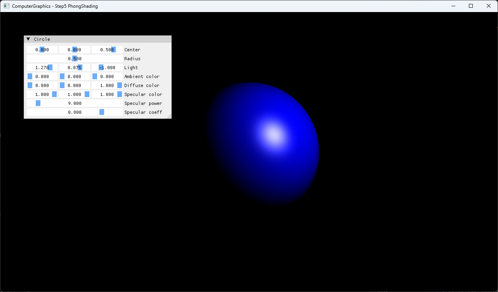

# Step5 PhongShading Demo

## 목적

Step5는 Step4의 sphere intersection 결과에 reflection-vector 기반 Phong lighting을 적용한다. Hit point와 normal이 ambient, diffuse와 specular 항을 거쳐 최종 pixel color로 변하는 흐름을 보여준다.

## 책임 범위

- Step4 대비 추가된 surface lighting 흐름과 구현 선택을 설명한다.
- CPU shading 결과와 DirectX11 presentation 경계를 설명한다.
- 일반 Phong 이론은 [Phong Shading](../../01_Topics/LightingAndShading/PhongShading.md)으로 위임한다.
- Ray와 intersection 이론은 [Ray](../../01_Topics/RayTracing/Ray.md)와 [Intersection](../../01_Topics/RayTracing/Intersection.md)으로 위임한다.
- Build/run/capture 사실은 [Verification Index](../../02_Verification/Part1_Chapter03/verification-index.md)로 위임한다.

## 결과 미리보기

### 기본 파라미터


Blue diffuse surface 위에 white specular highlight가 나타난다. Step4의 hit-distance diagnostic color와 달리 surface normal, light와 view 방향이 밝기 분포를 만든다.

### Light 위치 조정



`Light (1.270, 0.875, -1.000)`로 조정하면 highlight와 밝은 영역이 sphere의 오른쪽 위로 이동한다. Sphere와 material 값은 유지하므로 light position이 diffuse와 specular 분포를 바꾸는 효과를 기본 결과와 직접 비교할 수 있다.

## 입력과 출력

| 구분 | 내용 |
| --- | --- |
| 입력 | 1280×720 pixel coordinate와 sphere·light·lighting parameter |
| 중간 결과 | orthographic primary ray, sphere hit point·normal과 Phong 항 |
| CPU 출력 | clamp된 RGBA32F pixel buffer |
| 화면 출력 | dynamic texture를 sampling한 full-screen quad |

## 구현 흐름

1. 각 pixel을 camera-plane position으로 변환해 고정 `+Z` primary ray를 만든다.
2. Ray와 sphere를 교차시켜 가장 가까운 양수 hit와 point, normal을 구한다.
3. Hit point에서 light로 향하는 방향으로 diffuse 항을 계산한다.
4. Reflection vector와 view direction으로 specular 항을 계산한다.
5. Ambient, diffuse와 specular color를 합성하고 `0~1`로 clamp한다.
6. CPU pixel buffer를 DirectX11 dynamic texture로 복사한다.
7. Pixel shader가 texture를 sampling해 full-screen quad에 표시한다.

## 핵심 구현

### Hit에서 Phong Color로 변환

Step5는 Step4의 diagnostic color를 surface lighting으로 교체한다. Point light 방향은 hit point마다 달라지고, normal과의 내적으로 diffuse 밝기를 만든다. Specular는 reflection vector와 고정 orthographic view 방향의 정렬 정도를 shininess exponent로 조절한다.

#### Phong lighting 의사코드

```cpp
// Pseudo C++: sphere hit를 ambient, diffuse와 specular color로 변환
Color TraceRay(Ray ray)
{
    auto hit = IntersectSphere(ray);
    if (!hit)
    {
        return Black;
    }

    auto lightDirection = Normalize(light.position - hit.point);
    auto diffuse = Max(Dot(hit.normal, lightDirection), 0.0f);

    auto reflection = Normalize(
        2.0f * Dot(hit.normal, lightDirection) * hit.normal
        - lightDirection
    );
    auto viewDirection = -ray.direction;
    auto specular = Pow(
        Max(Dot(reflection, viewDirection), 0.0f),
        material.shininess
    );

    return material.ambient
        + material.diffuse * diffuse
        + material.specular * specular * material.specularCoefficient;
}
```

- [Material과 light 기본값](../../../Part1_Chapter03/03_Raytracing_Step5_PhongShading/Raytracer.h#L22-L33)
- [Hit 판정과 Phong 항 합성](../../../Part1_Chapter03/03_Raytracing_Step5_PhongShading/Raytracer.h#L35-L52)
- [Intersection point와 normal 계산](../../../Part1_Chapter03/03_Raytracing_Step5_PhongShading/Sphere.h#L27-L64)
- [Lighting parameter UI](../../../Part1_Chapter03/03_Raytracing_Step5_PhongShading/main.cpp#L79-L87)

### Pixel 순회와 화면 표시

Primary ray 구조는 Step4와 같다. 각 pixel의 결과를 clamp해 CPU buffer에 기록하고 dynamic texture로 전달한다. HLSL은 Step4와 동일한 presentation shader이며 Phong 계산을 수행하지 않는다.

#### CPU render와 presentation 의사코드

```cpp
// Pseudo C++: CPU shading 결과를 texture로 전달해 화면에 표시
for (each pixel)
{
    auto origin = ScreenToWorld(pixel);
    Ray ray
    {
        origin,
        ForwardZ
    };

    pixels[pixel] = Clamp01(TraceRay(ray));
}

UploadToDynamicTexture(pixels);
DrawFullscreenQuad();
```

- [Orthographic ray와 pixel 기록](../../../Part1_Chapter03/03_Raytracing_Step5_PhongShading/Raytracer.h#L54-L77)
- [CPU buffer와 dynamic texture update](../../../Part1_Chapter03/03_Raytracing_Step5_PhongShading/Example.h#L50-L60)
- [Full-screen quad draw](../../../Part1_Chapter03/03_Raytracing_Step5_PhongShading/Example.h#L285-L307)
- [Vertex shader](../../../Part1_Chapter03/03_Raytracing_Step5_PhongShading/VS.hlsl#L13-L20)
- [Pixel shader](../../../Part1_Chapter03/03_Raytracing_Step5_PhongShading/PS.hlsl#L10-L13)

## 시각 결과

기본값은 blue diffuse color와 white specular color를 사용한다. Light는 camera plane 앞쪽의 `(0, 0, -1)`에 있어 sphere 중심 부근에 강한 highlight가 나타난다. ImGui parameter는 다음 frame의 CPU shading에 직접 반영된다.

Light 위치 조정 결과에서는 highlight와 밝기 분포가 오른쪽 위로 이동한다. 이는 point light에서 hit point로 계산되는 light direction이 pixel마다 바뀌고, diffuse와 specular 항이 같은 입력 변화에 함께 반응한다는 점을 보여준다.

Step4와 비교하면 silhouette 확인용 밝기 대신 normal과 조명 방향에 따른 smooth brightness distribution이 생긴다. 이는 intersection 결과가 surface point와 normal을 제공하고, 그 정보를 lighting 단계가 소비한다는 변화를 보여준다.

## 구현 범위와 한계

- Sphere 하나와 point light 하나만 사용한다.
- Ambient는 light와 무관한 상수이며 distance attenuation이 없다.
- Shadow, multiple light, gamma correction과 tone mapping을 포함하지 않는다.
- Reflection-vector Phong을 사용하며 Blinn half-vector를 사용하지 않는다.
- Sphere가 camera plane에 닿고 `t > 0` root만 허용해 중심 ray가 exit surface를 선택할 수 있다.
- 최종 clamp로 밝은 highlight detail이 포화될 수 있다.
- Shader는 project working directory의 파일에 의존한다.
- Dynamic texture upload는 mapped `RowPitch`를 별도로 처리하지 않는다.

## 검증

- 2026-07-30 Debug x64 build와 run을 직접 확인했다.
- 2026-07-30 Release x64 build와 run을 직접 확인했다.
- 두 configuration은 project 폴더를 working directory로 사용했다.
- 공개 application title, sphere lighting과 parameter UI를 전체 창에서 확인했다.
- 사용자가 Light 위치를 조정한 전체 창 screenshot에서 highlight 이동을 확인했다.
- 공개 visual은 metadata와 개인 식별 정보를 검사한 tracked screenshot을 사용한다.
- 상세 상태는 [Verification Index](../../02_Verification/Part1_Chapter03/verification-index.md)와 [Capture Registry](../../_assets/captures/README.md)를 기준으로 확인한다.

## 관련 코드

- [Step5 PhongShading Example README](../../../Part1_Chapter03/03_Raytracing_Step5_PhongShading/README.md)
- [Raytracer.h](../../../Part1_Chapter03/03_Raytracing_Step5_PhongShading/Raytracer.h)
- [Sphere.h](../../../Part1_Chapter03/03_Raytracing_Step5_PhongShading/Sphere.h)
- [Example.h](../../../Part1_Chapter03/03_Raytracing_Step5_PhongShading/Example.h)

## 관련 문서

- [Phong Shading Topic](../../01_Topics/LightingAndShading/PhongShading.md)
- [Ray Topic](../../01_Topics/RayTracing/Ray.md)
- [Intersection Topic](../../01_Topics/RayTracing/Intersection.md)
- [Verification Index](../../02_Verification/Part1_Chapter03/verification-index.md)
- [Demo Index](demo-index.md)
