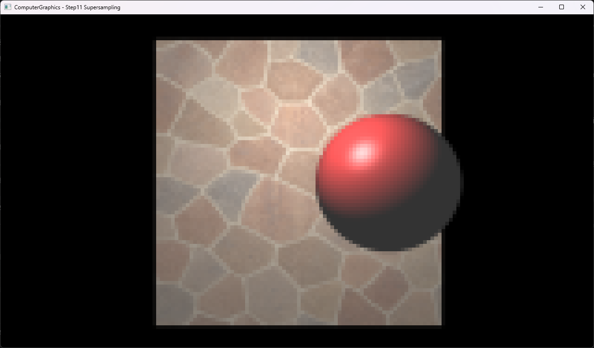

# Step11 Supersampling Demo

## 목적

한 output cell의 화면 영역을 재귀적으로 2×2 분할하고 64개 primary ray의 shading 결과를 평균하는 CPU supersampling 흐름을 확인한다. 160×90 결과를 1280×720 viewport에 point-upscale하는 구현을 통해 edge coverage 완화와 낮은 공간 해상도의 trade-off를 함께 확인한다.

## 책임 범위

- Depth 3의 deterministic recursive 2×2 subdivision과 box average를 실제 코드 근거에 연결한다.
- Step10과의 순차 변화는 설명하지만 sampling만 바꾼 통제 비교로 표현하지 않는다.
- 일반적인 aliasing, sample pattern과 reconstruction은 [Sampling And Anti Aliasing](../../01_Topics/RayTracing/SamplingAndAntiAliasing.md)으로 위임한다.
- Texture filter는 [Texture Sampling](../../01_Topics/TexturingAndMapping/TextureSampling.md)으로 위임한다.
- build/run/capture 사실은 [Verification Index](../../02_Verification/Part1_Chapter03/verification-index.md)로 위임한다.

## 결과 미리보기



## 입력과 출력

- 입력: 160×90 output grid, sphere와 textured Square, 사용자 직접 생성 석재 PNG, point light
- Sample: output cell마다 depth 3의 재귀 2×2 분할로 생성한 8×8 leaf 위치
- 출력: 64개 leaf shading 결과의 box average
- 표시 경로: 160×90 CPU RGBA32F texture를 point sampler로 1280×720 viewport에 확대

## Step10 대비 변화

Step10은 1280×720 pixel마다 primary ray 하나를 계산한다. Step11은 각 축의 output resolution을 8로 낮춘 160×90 cell마다 64개 leaf ray를 평가하므로 총 primary ray 수는 두 Step 모두 921,600개다. Step11은 sample을 한 cell 안에 집중해 평균하지만 최종 160×90 color texture를 8배 point-upscale한다.

두 Step은 sampling 외에도 sphere radius, Square ambient와 scene resolution이 다르다. 입력 texture는 비교 흐름과 공개 안전성을 위해 Step10에서 검증한 동일 석재 PNG로 정렬했지만, 두 capture를 순수한 supersampling 적용 전·후로 사용하지 않는다.

## 구현 흐름

```cpp
// Pseudo C++: supersampled scene 렌더 흐름
RenderSupersampledScene()
{
    for each output cell in 160x90
    {
        center = TransformCellToImagePlane(cell);
        color = SupersampleRegion(center, cellSize, depth = 3);
        output[cell] = Clamp(color);
    }

    UploadCpuBufferToTexture(output);
    DrawPointUpscaledFullscreenQuad();
}
```

- [Supersampled scene render](../../../Part1_Chapter03/03_Raytracing_Step11_Supersampling/Raytracer.h#L139-L155)

## 핵심 구현

### 재귀 2×2 subdivision

```cpp
// Pseudo C++: 한 영역의 64-sample 평균
Color SupersampleRegion(Eye eye, Point center, float size, int depth)
{
    if (depth == 0)
    {
        Ray ray = MakeRay(center, Normalize(center - eye));
        return ShadeClosestHit(ray);
    }

    Color sum = 0;
    float childSize = size * 0.5;

    for (int y = 0; y < 2; ++y)
    {
        for (int x = 0; x < 2; ++x)
        {
            Point child = ChildCenter(center, childSize, x, y);
            sum += SupersampleRegion(eye, child, childSize, depth - 1);
        }
    }

    return sum * 0.25;
}
```

각 단계는 현재 영역을 같은 크기의 child 네 개로 나누고 child center에서 재귀 평가한다. Depth 3은 축마다 8개 위치와 전체 64개 leaf ray를 만들며, 매 단계의 `0.25` 평균이 최종 box average를 구성한다.

- [재귀 2×2 영역 분할과 평균](../../../Part1_Chapter03/03_Raytracing_Step11_Supersampling/Raytracer.h#L115-L137)

### Output grid와 sample 수

`Raytracer`의 width와 height는 client 크기의 1/8인 160×90이다. `Render`는 고정 depth 3으로 각 output cell을 평가한다. 따라서 output은 14,400개 cell이고 primary ray는 `14,400 × 64 = 921,600`개다.

- [160×90 output grid 구성](../../../Part1_Chapter03/03_Raytracing_Step11_Supersampling/Raytracer.h#L24-L35)
- [고정 depth와 output cell render](../../../Part1_Chapter03/03_Raytracing_Step11_Supersampling/Raytracer.h#L139-L155)

### Leaf ray shading

Leaf 위치마다 sphere와 Square child triangle의 closest hit를 다시 찾는다. Hit가 있으면 ambient, diffuse texture와 specular lighting을 계산하고, geometry silhouette와 texture 경계를 가로지르는 leaf color가 최종 평균에 함께 들어간다.

- [Leaf closest-hit와 texture shading](../../../Part1_Chapter03/03_Raytracing_Step11_Supersampling/Raytracer.h#L55-L112)
- [Bilinear texture sampling](../../../Part1_Chapter03/03_Raytracing_Step11_Supersampling/Texture.h#L53-L68)

### CPU 결과 표시

Ray tracing과 supersampling은 CPU에서 최초 frame에 한 번 수행한다. 160×90 RGBA32F canvas texture는 point sampler와 full-screen quad로 1280×720 viewport에 표시된다. DirectX11 sample count는 1이므로 GPU MSAA 경로가 아니다.

- [CPU render와 dynamic texture upload](../../../Part1_Chapter03/03_Raytracing_Step11_Supersampling/Example.h#L51-L64)
- [저해상도 canvas texture와 point sampler](../../../Part1_Chapter03/03_Raytracing_Step11_Supersampling/Example.h#L173-L199)
- [Full-screen presentation](../../../Part1_Chapter03/03_Raytracing_Step11_Supersampling/Example.h#L291-L314)

## 시각 결과

- Square와 sphere는 160×90 color grid를 8배 확대한 큰 pixel block으로 표시된다.
- Sphere silhouette와 Square·background 경계의 일부 cell은 여러 leaf hit를 평균한 중간 color를 가진다.
- 석재와 줄눈의 세부 변화도 한 output cell 안에서 평균되어 Step10보다 낮은 spatial detail로 나타난다.
- 결과는 supersampling의 coverage average를 보여주지만 native 1280×720 해상도의 선명한 anti-aliased output은 아니다.

## 입력 asset

- 파일: `part1_chapter03_stone_mosaic.png`
- 출처 상태: 사용자 직접 생성
- 규격: 1024×1024, RGB PNG
- Input SHA-256: `D0960C2380D0D4432BECEA77A579ACAB2C6A04EDCD8AC0BFA15B1756866348D9`
- Capture SHA-256: `DF8EB0B18C91FFDB2011DED9E123D5A2DC3B48ED4A19A83BE9470B7DAA8C6D08`
- 관계: Step10 검증 input의 동일 바이트 사본을 Step11 project CWD에 둔다.

## 구현 범위와 한계

- Sampling depth 3, deterministic 8×8 grid와 box average를 고정 사용한다.
- Jitter, adaptive sampling, error threshold와 다른 reconstruction filter는 포함하지 않는다.
- Output texture가 160×90이고 point-upscale되므로 최종 공간 해상도가 낮다.
- Step10 대비 scene parameter도 달라 capture 간 차이를 sampling 하나의 영향으로 분리할 수 없다.
- Texture와 shader runtime load는 project working directory에 의존한다.
- Dynamic texture upload는 mapped `RowPitch`를 별도로 처리하지 않는다.

## 검증

- Debug x64 build/run 성공
- Release x64 build/run 성공
- Project 폴더 working directory에서 PNG와 shader load 확인
- `ComputerGraphics - Step11 Supersampling` application title 확인
- Release x64 전체 application window capture 확인
- 입력과 capture PNG에 text, EXIF, XMP metadata와 개인 식별자 없음
- 자세한 상태는 [Verification Index](../../02_Verification/Part1_Chapter03/verification-index.md)에서 관리한다.

## 관련 코드

- [석재 texture와 scene 구성](../../../Part1_Chapter03/03_Raytracing_Step11_Supersampling/Raytracer.h#L24-L52)
- [재귀 2×2 supersampling](../../../Part1_Chapter03/03_Raytracing_Step11_Supersampling/Raytracer.h#L115-L137)
- [Output cell render](../../../Part1_Chapter03/03_Raytracing_Step11_Supersampling/Raytracer.h#L139-L155)
- [Leaf shading과 texture 적용](../../../Part1_Chapter03/03_Raytracing_Step11_Supersampling/Raytracer.h#L82-L112)
- [CPU texture upload](../../../Part1_Chapter03/03_Raytracing_Step11_Supersampling/Example.h#L51-L64)
- [Point-upscaled presentation](../../../Part1_Chapter03/03_Raytracing_Step11_Supersampling/Example.h#L173-L199)
- [Application title](../../../Part1_Chapter03/03_Raytracing_Step11_Supersampling/main.cpp#L38-L40)

## 관련 문서

- [Step11 Example README](../../../Part1_Chapter03/03_Raytracing_Step11_Supersampling/README.md)
- [Sampling And Anti Aliasing](../../01_Topics/RayTracing/SamplingAndAntiAliasing.md)
- [Texture Sampling](../../01_Topics/TexturingAndMapping/TextureSampling.md)
- [Intersection](../../01_Topics/RayTracing/Intersection.md)
- [Verification Index](../../02_Verification/Part1_Chapter03/verification-index.md)
- [Demo Index](demo-index.md)
