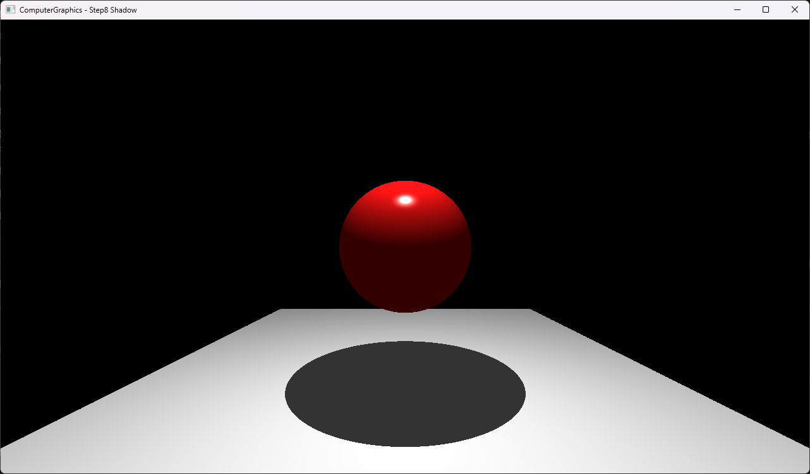

# Step8 Shadow Demo

## 목적

Step7의 primary ray와 closest-hit 이후에 point light visibility를 검사하여 sphere가 바닥에 만드는 cast shadow를 확인한다.

## 책임 범위

- Step7 대비 추가된 shadow ray와 lighting 분기를 설명한다.
- Square composite primitive와 shadow 결과를 연결한다.
- 일반적인 visibility ray와 epsilon 이론은 [Shadow Ray](../../01_Topics/Shadows/ShadowRay.md)로 위임한다.
- build/run/capture 사실은 [Verification Index](../../02_Verification/Part1_Chapter03/verification-index.md)로 위임한다.

## 결과 미리보기



## 입력과 출력

- 입력: camera에서 생성한 perspective primary ray, sphere와 Square 바닥, point light
- 출력: 직접광을 받는 sphere와 바닥, sphere가 light를 가려 생기는 hard shadow
- 표시 경로: CPU RGBA32F buffer를 DirectX11 dynamic texture에 올리고 full-screen quad로 표시

## Step7 대비 변화

Step7은 sphere와 triangle을 같은 closest-hit query로 처리한다. Step8은 두 child triangle을 `Square : Object` 하나로 묶은 바닥을 추가하고, primary hit 이후 같은 closest-hit 함수를 shadow ray에도 사용하여 light visibility를 판정한다.

## 구현 흐름

```text
perspective primary ray
→ Square 내부의 child triangle intersection
→ scene closest-hit가 parent Square 연결
→ hit point에서 light 방향과 거리 계산
→ normal offset을 적용한 shadow ray 생성
→ light 이전의 closest blocker 검사
→ shadow면 ambient만 반환
→ visible이면 diffuse와 specular 계산
→ CPU buffer를 DirectX11 texture로 표시
```

## 핵심 구현

### Sphere와 Square 바닥 scene

```cpp
CreateScene()
{
    AddSphere(center, radius, sphereMaterial);
    AddSquare(v0, v1, v2, v3, floorMaterial);
    SetPointLight(position);
}
```

Sphere 아래에 `Square` 하나를 scene object로 등록한다. Square는 네 vertex를 공용 대각선 기준의 child triangle 두 개로 나누지만, material과 scene object identity는 parent Square가 소유한다. Point light는 sphere 위쪽에 있어 sphere가 바닥으로 향하는 light path 일부를 막는다.

- [Sphere, Square 바닥과 point light 배치](../../../Part1_Chapter03/03_Raytracing_Step8_Shadow/Raytracer.h#L27-L45)

### Child intersection과 parent identity

```cpp
Hit Square::CheckRayCollision(ray)
{
    hit1 = triangle1.CheckRayCollision(ray);
    hit2 = triangle2.CheckRayCollision(ray);
    return SelectClosestValidHit(hit1, hit2);
}
```

Square는 두 child hit 가운데 가까운 유효 결과를 반환한다. Scene의 closest-hit는 선택된 top-level object를 `hit.obj`에 저장하므로 child triangle의 기본 material이 아니라 parent Square의 ambient, diffuse, specular와 alpha를 사용한다.

- [Square child 구성과 closest-hit 선택](../../../Part1_Chapter03/03_Raytracing_Step8_Shadow/Square.h#L7-L33)
- [Scene closest-hit의 parent object 연결](../../../Part1_Chapter03/03_Raytracing_Step8_Shadow/Raytracer.h#L48-L63)

### Shadow ray와 light 구간

```cpp
bool IsInShadow(hit, light)
{
    direction = Normalize(light.position - hit.point);
    distanceToLight = Length(light.position - hit.point);
    shadowRay = Ray(hit.point + hit.normal * epsilon, direction);
    blocker = FindClosestCollision(shadowRay);

    return blocker.IsValid()
        && blocker.distance < distanceToLight;
}
```

Shadow ray는 normalized light 방향을 사용하므로 hit distance를 실제 light 거리와 비교할 수 있다. Light보다 가까운 교점만 blocker로 인정하고 light 뒤의 object는 제외한다. Origin은 normal 방향으로 `1e-4` 이동하여 원래 surface와의 수치 오차 교차를 줄인다.

- [Shadow ray 생성과 blocker 거리 판정](../../../Part1_Chapter03/03_Raytracing_Step8_Shadow/Raytracer.h#L65-L73)
- [Primary ray와 shadow ray의 공통 closest-hit](../../../Part1_Chapter03/03_Raytracing_Step8_Shadow/Raytracer.h#L48-L63)

### Visibility에 따른 lighting

```cpp
Color Shade(ray)
{
    hit = FindClosestCollision(ray);
    if (hit.IsMiss())
    {
        return Background;
    }

    if (IsInShadow(hit))
    {
        return hit.material.ambient;
    }

    return Ambient(hit)
        + Diffuse(hit)
        + Specular(hit);
}
```

Blocker가 있으면 ambient만 반환하여 direct diffuse와 specular를 차단한다. Visible surface는 Step7의 Phong 계산을 그대로 사용한다.

- [Shadow와 direct lighting 분기](../../../Part1_Chapter03/03_Raytracing_Step8_Shadow/Raytracer.h#L75-L96)

### CPU 결과 표시

```cpp
UpdateOnce()
{
    RenderCpuPixels();
    MapDynamicTexture();
    CopyPixels();
    UnmapDynamicTexture();
}
```

Ray tracing은 CPU에서 최초 frame에 한 번 실행한다. DirectX11과 HLSL은 계산된 texture를 화면에 표시하며 shadow 교차를 계산하지 않는다.

- [CPU render와 dynamic texture upload](../../../Part1_Chapter03/03_Raytracing_Step8_Shadow/Example.h#L51-L65)

## 시각 결과

- Red sphere 위쪽에는 point light에 의한 밝은 highlight가 나타난다.
- 바닥의 직접광 영역은 회색으로 밝게 보인다.
- Square의 두 child triangle 사이에는 seam이나 material 차이가 보이지 않는다.
- Sphere 아래에는 light 방향과 sphere silhouette에 대응하는 타원형 hard shadow가 나타난다.
- Shadow 내부는 ambient만 남아 직접광 영역보다 균일하게 어둡다.
- 확인한 기본 장면에서는 shadow acne나 분리된 shadow가 관찰되지 않는다.

## 구현 범위와 한계

- Point light 하나와 binary visibility를 사용하므로 soft shadow와 penumbra를 만들지 않는다.
- 고정 `1e-4` offset은 현재 scene scale에서만 직접 확인한다.
- Shadow surface는 ambient만 반환하며 다른 간접광 모델을 포함하지 않는다.
- CPU render가 완료되기 전에 창을 capture하면 초기 흰 화면이나 부분 결과가 기록될 수 있다.
- Shader runtime compile은 project working directory에 의존한다.
- Dynamic texture upload는 mapped `RowPitch`를 별도로 처리하지 않는다.
- Square는 planar convex quad를 두 triangle으로 고정 분할한다.
- Child material은 사용하지 않고 parent Square가 scene material을 소유한다.

## 검증

- Debug x64 build/run 성공
- Release x64 build/run 성공
- Project 폴더 working directory에서 `VS.hlsl`, `PS.hlsl` load 확인
- `ComputerGraphics - Step8 Shadow` application title 확인
- Release x64 최종 frame과 전체 창 capture 확인
- 자세한 상태는 [Verification Index](../../02_Verification/Part1_Chapter03/verification-index.md)에서 관리한다.

## 관련 코드

- [Scene과 light](../../../Part1_Chapter03/03_Raytracing_Step8_Shadow/Raytracer.h#L27-L45)
- [Square child intersection](../../../Part1_Chapter03/03_Raytracing_Step8_Shadow/Square.h#L7-L33)
- [Parent object closest-hit](../../../Part1_Chapter03/03_Raytracing_Step8_Shadow/Raytracer.h#L48-L63)
- [Shadow visibility](../../../Part1_Chapter03/03_Raytracing_Step8_Shadow/Raytracer.h#L65-L73)
- [Lighting 분기](../../../Part1_Chapter03/03_Raytracing_Step8_Shadow/Raytracer.h#L75-L96)
- [CPU texture upload](../../../Part1_Chapter03/03_Raytracing_Step8_Shadow/Example.h#L51-L65)
- [Application title](../../../Part1_Chapter03/03_Raytracing_Step8_Shadow/main.cpp#L38-L40)

## 관련 문서

- [Step8 Example README](../../../Part1_Chapter03/03_Raytracing_Step8_Shadow/README.md)
- [Shadow Ray](../../01_Topics/Shadows/ShadowRay.md)
- [Ray](../../01_Topics/RayTracing/Ray.md)
- [Intersection](../../01_Topics/RayTracing/Intersection.md)
- [Phong Shading](../../01_Topics/LightingAndShading/PhongShading.md)
- [Verification Index](../../02_Verification/Part1_Chapter03/verification-index.md)
- [Demo Index](demo-index.md)
