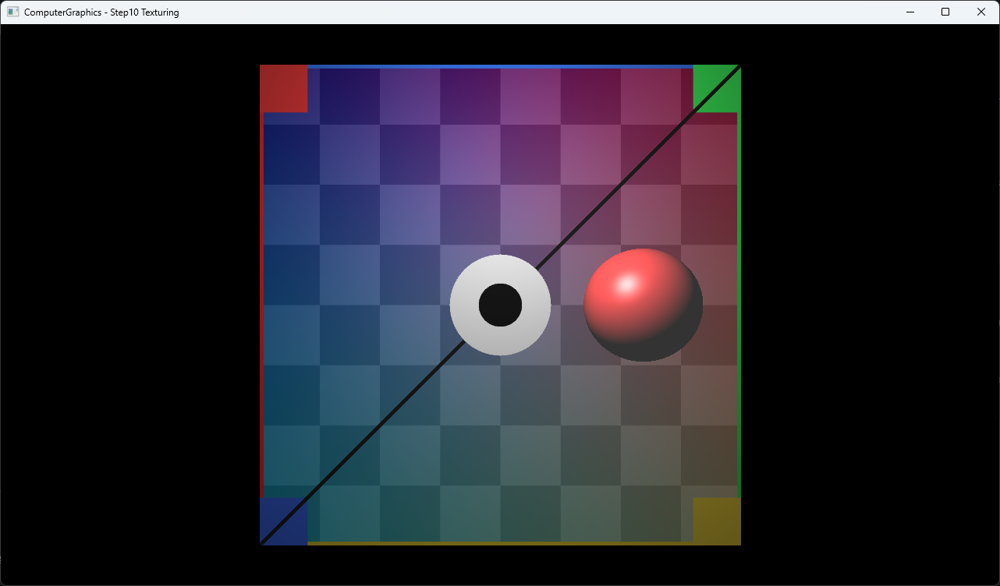

# Step10 Texturing Demo

## 목적

Triangle hit의 barycentric weight로 UV를 보간하고 CPU에서 image texture를 bilinear sampling하는 흐름을 확인한다. 방향과 경계가 명확한 자작 UV 진단 texture를 사용해 두 triangle으로 구성한 Square에서 보간이 연속되는지도 함께 확인한다.

## 책임 범위

- Step9의 barycentric weight를 RGB color가 아니라 UV attribute 보간에 사용한다.
- Image load, texel-center 좌표와 bilinear filtering을 실제 코드 근거에 연결한다.
- 일반적인 UV와 texture sampling은 [Texture Sampling](../../01_Topics/TexturingAndMapping/TextureSampling.md)으로 위임한다.
- Barycentric attribute 보간은 [Barycentric Coordinates](../../01_Topics/RayTracing/BarycentricCoordinates.md)로 위임한다.
- build/run/capture 사실은 [Verification Index](../../02_Verification/Part1_Chapter03/verification-index.md)로 위임한다.

## 결과 미리보기



## 입력과 출력

- 입력: perspective primary ray, 두 triangle으로 구성한 Square, 자작 UV 진단 PNG, 별도 sphere와 point light
- 출력: bilinear sampling한 textured Square와 Phong shading sphere
- 표시 경로: CPU RGBA32F buffer를 DirectX11 dynamic texture로 옮기고 full-screen quad로 표시

## Step9 대비 변화

Step9은 triangle vertex의 RGB color를 barycentric weight로 직접 보간한다. Step10은 같은 weight로 UV를 보간하고, 그 좌표로 image texture를 sampling해 Square의 diffuse color로 사용한다. 별도 sphere는 texture가 없는 기존 material 경로를 유지한다.

## 구현 흐름

```text
RenderTexturedScene()
{
    ray = MakePerspectivePrimaryRay(pixel);
    hit = FindClosestSceneHit(ray);

    if (hit.object has diffuseTexture)
    {
        uv = InterpolateUv(hit.barycentric);
        baseColor = SampleBilinear(diffuseTexture, uv);
    }
    else
    {
        baseColor = hit.object.diffuse;
    }

    output = ShadePhong(hit, baseColor);
    UploadCpuBufferToTexture(output);
}
```

## 핵심 구현

### Square UV와 공유 대각선

```cpp
CreateTexturedSquare()
{
    uv0 = (0, 0);
    uv1 = (1, 0);
    uv2 = (1, 1);
    uv3 = (0, 1);

    triangle0 = Triangle(v0, v1, v2, uv0, uv1, uv2);
    triangle1 = Triangle(v0, v2, v3, uv0, uv2, uv3);
}
```

네 vertex는 image의 좌상단부터 시계 방향으로 UV를 대응한다. 두 child triangle은 공용 대각선의 위치와 UV를 공유하므로 동일한 surface 좌표를 계산한다.

- [자작 texture와 Square UV 구성](../../../Part1_Chapter03/03_Raytracing_Step10_Texturing/Raytracer.h#L34-L50)
- [두 triangle의 공유 UV 구성](../../../Part1_Chapter03/03_Raytracing_Step10_Texturing/Square.h#L10-L16)

### Barycentric UV 보간

```cpp
InterpolateUv(hit)
{
    return uv0 * hit.w0
        + uv1 * hit.w1
        + uv2 * hit.w2;
}
```

Triangle intersection에서 계산한 세 weight를 같은 vertex 순서의 UV에 적용한다. Step9의 color interpolation과 계산 구조는 같지만 결과 attribute가 2D UV라는 점이 다르다.

- [Triangle hit의 UV 보간](../../../Part1_Chapter03/03_Raytracing_Step10_Texturing/Triangle.h#L26-L40)

### Image load와 bilinear sampling

```cpp
SampleLinear(uv)
{
    texel = uv * textureSize - 0.5;
    base = floor(texel);
    fraction = texel - base;

    return Bilinear(
        ReadWrapped(base),
        ReadWrapped(base + (1, 0)),
        ReadWrapped(base + (0, 1)),
        ReadWrapped(base + (1, 1)),
        fraction);
}
```

`stb_image`는 PNG를 RGB 3-channel buffer로 읽는다. `SampleLinear`는 UV를 texel center 기준으로 옮기고 네 이웃 pixel을 wrap address 방식으로 읽어 bilinear 보간한다.

- [stb_image RGB load](../../../Part1_Chapter03/03_Raytracing_Step10_Texturing/Texture.cpp#L13-L27)
- [Texel-center bilinear sampling](../../../Part1_Chapter03/03_Raytracing_Step10_Texturing/Texture.h#L53-L68)

### Diffuse texture와 Phong lighting

```cpp
SampleDiffuse(hit)
{
    if (hit.object has diffuseTexture)
    {
        return hit.object.diffuse * SampleLinear(hit.uv);
    }

    return hit.object.diffuse;
}
```

Texture가 있는 Square는 sampled color를 diffuse 항에 사용한다. Texture가 없는 sphere는 기존 material diffuse color를 사용하므로 한 장면에서 두 경로를 비교할 수 있다.

- [Texture 유무에 따른 diffuse 선택](../../../Part1_Chapter03/03_Raytracing_Step10_Texturing/Raytracer.h#L72-L80)
- [Sampled diffuse와 Phong 합성](../../../Part1_Chapter03/03_Raytracing_Step10_Texturing/Raytracer.h#L82-L102)

### CPU 결과 표시

```cpp
UpdateOnce()
{
    RenderCpuPixels();
    MapDynamicTexture();
    CopyPixels();
    UnmapDynamicTexture();
}
```

Ray tracing, UV interpolation과 image sampling은 CPU에서 수행한다. DirectX11과 HLSL은 계산된 RGBA32F texture를 화면에 표시한다.

- [CPU render와 dynamic texture upload](../../../Part1_Chapter03/03_Raytracing_Step10_Texturing/Example.h#L51-L64)

## 시각 결과

- Red, green, blue와 yellow corner marker로 UV의 상하좌우 방향을 구분할 수 있다.
- Checker와 가로·세로 gradient가 Square 전체에서 연속적으로 변한다.
- 두 child triangle의 공유 대각선에서 color나 pattern의 불연속 seam이 보이지 않는다.
- 중앙 target과 반대 대각선 표식이 bilinear filtering 후에도 연속적으로 유지된다.
- 오른쪽 sphere는 texture가 없는 기존 closest-hit와 Phong material 경로를 유지한다.

## 입력 asset

- 파일: `part1_chapter03_uv_diagnostic.png`
- 출처 상태: 저장소 도구로 직접 생성
- 생성 도구: `Docs/98_Tools/scripts/new-uv-diagnostic-texture.ps1`
- 규격: 1024×1024, RGB PNG
- SHA-256: `65A1E8E94547329BEF52F2886103B83A478FB3631AA732E5F57787187CCB4688`
- 외부 자료: 복제하거나 입력으로 사용하지 않음

## 구현 범위와 한계

- Active sampling은 bilinear filtering과 wrap address를 고정 사용한다.
- Mipmap과 anisotropic filtering은 포함하지 않는다.
- Degenerate triangle 방어와 adaptive intersection epsilon은 포함하지 않는다.
- Texture와 shader runtime load는 project working directory에 의존한다.
- CPU 결과는 최초 frame에 한 번 계산한다.
- Dynamic texture upload는 mapped `RowPitch`를 별도로 처리하지 않는다.

## 검증

- Debug x64 build/run 성공
- Release x64 build/run 성공
- Project 폴더 working directory에서 PNG와 shader load 확인
- `ComputerGraphics - Step10 Texturing` application title 확인
- Release x64 전체 application window capture 확인
- UV 방향, bilinear filtering과 Square 공유 대각선의 seam 부재 확인
- 입력과 capture PNG에 text, EXIF, XMP metadata와 개인 식별자 없음
- 자세한 상태는 [Verification Index](../../02_Verification/Part1_Chapter03/verification-index.md)에서 관리한다.

## 관련 코드

- [자작 texture와 Square UV](../../../Part1_Chapter03/03_Raytracing_Step10_Texturing/Raytracer.h#L34-L50)
- [Square child triangle 구성](../../../Part1_Chapter03/03_Raytracing_Step10_Texturing/Square.h#L10-L34)
- [Barycentric UV interpolation](../../../Part1_Chapter03/03_Raytracing_Step10_Texturing/Triangle.h#L26-L40)
- [Image load](../../../Part1_Chapter03/03_Raytracing_Step10_Texturing/Texture.cpp#L13-L27)
- [Bilinear texture sampling](../../../Part1_Chapter03/03_Raytracing_Step10_Texturing/Texture.h#L53-L68)
- [Diffuse texture와 Phong 합성](../../../Part1_Chapter03/03_Raytracing_Step10_Texturing/Raytracer.h#L72-L102)
- [CPU texture upload](../../../Part1_Chapter03/03_Raytracing_Step10_Texturing/Example.h#L51-L64)
- [Application title](../../../Part1_Chapter03/03_Raytracing_Step10_Texturing/main.cpp#L38-L40)

## 관련 문서

- [Step10 Example README](../../../Part1_Chapter03/03_Raytracing_Step10_Texturing/README.md)
- [Texture Sampling](../../01_Topics/TexturingAndMapping/TextureSampling.md)
- [Barycentric Coordinates](../../01_Topics/RayTracing/BarycentricCoordinates.md)
- [Intersection](../../01_Topics/RayTracing/Intersection.md)
- [Phong Shading](../../01_Topics/LightingAndShading/PhongShading.md)
- [Verification Index](../../02_Verification/Part1_Chapter03/verification-index.md)
- [Demo Index](demo-index.md)
