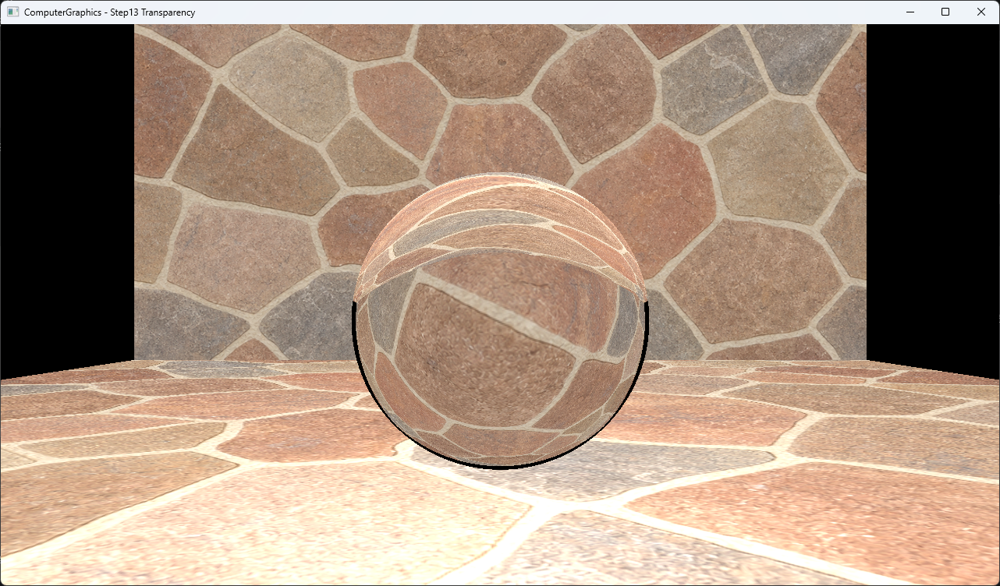

# Step13 Transparency Demo

## 목적

Recursive reflection trace에 refraction path를 추가하고, air와 glass 경계를 드나드는 secondary ray가 textured background를 왜곡하는 결과를 확인한다. Fixed IOR, enter/exit normal 전환과 total internal reflection fallback을 실제 코드에 연결한다.

## 책임 범위

- Refraction direction, IOR ratio, enter/exit 판정, secondary ray bias와 recursive color composition을 실제 코드 근거에 연결한다.
- Step12와의 순차 변화는 설명하지만 transparency만 바꾼 통제 비교로 표현하지 않는다.
- 일반적인 Snell’s law와 transparency는 [Refraction And Transparency](../../01_Topics/RayTracing/RefractionAndTransparency.md)로 위임한다.
- Reflection 공통 개념은 [Recursive Reflection](../../01_Topics/RayTracing/RecursiveReflection.md)으로 위임한다.
- build/run/capture 사실은 [Verification Index](../../02_Verification/Part1_Chapter03/verification-index.md)로 위임한다.

## 결과 미리보기



## 입력과 출력

- 입력: transparency 1.0 sphere, 석재 ground, 해수면·하늘 background Square, point light
- IOR: air 1.0과 glass 1.5
- Secondary ray: reflected 또는 refracted direction으로 생성
- 출력: local, reflected와 refracted result의 material-weighted sum
- 표시 경로: CPU RGBA32F 결과를 DirectX11 dynamic texture와 full-screen quad로 표시

## Step12 대비 변화

Step12는 reflection weight 0.5인 sphere에서 local Phong color와 reflected color를 결합한다. Step13은 transparency 1.0인 sphere를 사용하고, enter/exit 상태에 따라 IOR ratio와 normal을 바꾼 refracted ray를 재귀 추적한다. Refraction이 불가능하면 reflection path로 fallback한다.

두 Step은 sphere material 외에도 object 구성, ground 높이, background와 light가 다르다. 따라서 두 capture는 reflection에서 refraction으로 이어지는 순차 기능 발전을 보여주지만 transparency 하나만 바꾼 적용 전·후 비교는 아니다.

## 구현 흐름

```cpp
// Pseudo C++: recursive transparency scene 렌더 흐름
RenderTransparentScene()
{
    for each pixel in 1280x720
    {
        primary = MakeCameraRay(pixel);
        color = TraceRay(primary, depth = 5);
        output[pixel] = Clamp(color);
    }

    UploadCpuBufferToTexture(output);
    DrawFullscreenQuad();
}
```

- [Transparency scene render](../../../Part1_Chapter03/03_Raytracing_Step13_Transparency/Raytracer.h#L188-L204)

## 핵심 구현

### Refraction direction과 IOR 전환

```cpp
// Pseudo C++: 실제 Step13의 air/glass refraction
Color TraceRefractedRay(Hit hit, Ray ray, int depth)
{
    bool entering = IsEnteringSurface(
        ray.direction,
        hit.normal
    );
    Vector normal = entering ? hit.normal : -hit.normal;
    float eta = entering
        ? AirToGlassRatio()
        : GlassToAirRatio();

    Vector direction = Refract(
        ray.direction,
        normal,
        eta
    );

    if (IsTotalInternalReflection(direction))
    {
        return TraceReflectedRay(hit, ray, depth);
    }

    Ray refracted = OffsetAlongDirection(
        hit.point,
        direction,
        SecondaryRayEpsilon()
    );

    return TraceRay(refracted, depth - 1);
}
```

Sphere normal은 바깥쪽을 향한다. `dot(ray.dir, hit.normal)`이 음수이면 진입으로 보고 outward normal과 `1 / 1.5`를 사용한다. 이탈이면 normal을 반전하고 `1.5`를 사용한다. `glm::refract`가 zero vector를 반환하면 total internal reflection으로 보고 reflection path를 실행한다.

- [Inside/outside 판정과 IOR 선택](../../../Part1_Chapter03/03_Raytracing_Step13_Transparency/Raytracer.h#L140-L147)
- [Refraction direction과 TIR fallback](../../../Part1_Chapter03/03_Raytracing_Step13_Transparency/Raytracer.h#L147-L155)

### Recursive color composition

```cpp
// Pseudo C++: 실제 Step13의 material weight 결합
Color TraceRay(Ray ray, int depth)
{
    if (IsDepthExhausted(depth))
    {
        return Black;
    }

    Hit hit = FindClosestPositiveHit(ray);

    if (!hit)
    {
        return Black;
    }

    float localWeight = ClampLocalWeight(
        hit.reflection,
        hit.transparency
    );
    Color color = ShadePhong(hit, ray) * localWeight;

    if (HasReflection(hit))
    {
        color += TraceReflectedRay(
            hit,
            ray,
            depth
        ) * hit.reflection;
    }

    if (HasTransparency(hit))
    {
        color += TraceRefractedRay(
            hit,
            ray,
            depth
        ) * hit.transparency;
    }

    return color;
}
```

Local weight는 `clamp(1 - reflection - transparency, 0, 1)`이다. Reflection과 transparency weight 자체는 normalize하지 않으며 최종 pixel을 저장할 때 color를 0~1 범위로 clamp한다. 현재 sphere는 transparency 1.0과 reflection 0이므로 refracted result만 남는다.

- [Recursive 종료와 miss 처리](../../../Part1_Chapter03/03_Raytracing_Step13_Transparency/Raytracer.h#L158-L170)
- [Local·reflected·refracted color 결합](../../../Part1_Chapter03/03_Raytracing_Step13_Transparency/Raytracer.h#L172-L185)

### Scene background와 closest hit

Background는 miss sampler가 아니라 z=10에 둔 textured Square다. Ray가 sphere를 통과하면 이 Square나 ground를 closest hit로 선택하고 일반 ambient texture shading을 수행한다. Background Square 바깥으로 나간 ray와 depth 종료는 black을 반환한다.

- [Transparency sphere와 textured scene 구성](../../../Part1_Chapter03/03_Raytracing_Step13_Transparency/Raytracer.h#L24-L75)
- [Closest positive hit 선택](../../../Part1_Chapter03/03_Raytracing_Step13_Transparency/Raytracer.h#L78-L92)
- [Local Phong shading](../../../Part1_Chapter03/03_Raytracing_Step13_Transparency/Raytracer.h#L95-L129)

### CPU 결과 표시

Ray tracing은 CPU에서 최초 frame에 한 번 수행한다. HLSL은 ray tracing을 수행하지 않고 CPU가 만든 RGBA32F canvas texture를 full-screen quad에 표시한다.

- [CPU render와 dynamic texture upload](../../../Part1_Chapter03/03_Raytracing_Step13_Transparency/Example.h#L51-L64)
- [Canvas texture 구성](../../../Part1_Chapter03/03_Raytracing_Step13_Transparency/Example.h#L187-L203)
- [Full-screen presentation](../../../Part1_Chapter03/03_Raytracing_Step13_Transparency/Example.h#L291-L314)

## 시각 결과

- Sphere 내부에서 background의 수평선과 구름, 수면 반사가 확대되고 곡면을 따라 휘어진다.
- Sphere 상단과 하단에는 enter와 exit surface를 통과한 ray가 만든 겹친 굴절 경계가 나타난다.
- Sphere 양옆의 검은 영역은 background Square 밖으로 진행한 ray 또는 miss 결과와 연결된다.
- Ground는 검증된 석재 texture를 사용하고 background는 해수면·하늘 texture를 사용한다.
- Capture에서 NaN 형태의 무작위 black speckle이나 self-intersection acne는 관찰되지 않는다.

## 입력 asset

- 파일: `part1_chapter03_stone_mosaic.png`
- 출처 상태: 사용자 직접 생성
- 규격: 1024×1024, RGB PNG
- Input SHA-256: `D0960C2380D0D4432BECEA77A579ACAB2C6A04EDCD8AC0BFA15B1756866348D9`
- 관계: Step10~12 검증 input의 동일 바이트 사본을 Step13 ground에서 사용한다.

- 파일: `part1_chapter03_ocean_sunset.png`
- 출처 상태: 사용자 직접 생성
- 규격: 1254×1254, RGB PNG
- 생성 수단: OpenAI image generation
- 용도: Step13 background ambient/diffuse texture
- Input SHA-256: `0394847BCCD57B4C5F5A9D79576BD911F37CD6BB7BD1F725B436C2838BBCFC46`

- Capture 파일: `part1_chapter03_13_transparency.png`
- Capture SHA-256: `4AEAE58D9CF3C4EB1BE549AF174315CBD3617356CA742D9A193C420BECB70EE2`

## 구현 범위와 한계

- IOR 1.5와 air 외부 매질을 고정 사용한다.
- Material별 IOR, nested dielectric과 medium stack을 포함하지 않는다.
- TIR 판정은 `glm::refract`의 zero vector 반환에 의존한다.
- Fresnel, absorption, tint, rough transmission과 dispersion을 포함하지 않는다.
- Miss와 depth 종료는 black이며 background는 finite Square다.
- Secondary origin은 normal이 아닌 새 ray direction으로 `1e-4` 이동한다.
- Texture와 shader runtime load는 project working directory에 의존한다.
- Dynamic texture upload는 mapped `RowPitch`를 별도로 처리하지 않는다.

## 검증

- Debug x64 build/run 성공
- Release x64 build/run 성공
- Project 폴더 working directory에서 PNG와 shader load 확인
- `ComputerGraphics - Step13 Transparency` application title 확인
- Sphere 내부의 background 확대·왜곡과 enter/exit 경계 확인
- Release x64 전체 application window capture 확인
- 입력과 capture PNG에 text, EXIF, XMP metadata와 개인 식별자 없음
- 자세한 상태는 [Verification Index](../../02_Verification/Part1_Chapter03/verification-index.md)에서 관리한다.

## 관련 코드

- [Transparency sphere와 textured scene 구성](../../../Part1_Chapter03/03_Raytracing_Step13_Transparency/Raytracer.h#L24-L75)
- [Closest positive hit 선택](../../../Part1_Chapter03/03_Raytracing_Step13_Transparency/Raytracer.h#L78-L92)
- [Local Phong shading](../../../Part1_Chapter03/03_Raytracing_Step13_Transparency/Raytracer.h#L95-L129)
- [Reflection direction과 secondary ray](../../../Part1_Chapter03/03_Raytracing_Step13_Transparency/Raytracer.h#L131-L138)
- [Inside/outside 판정과 IOR 선택](../../../Part1_Chapter03/03_Raytracing_Step13_Transparency/Raytracer.h#L140-L147)
- [Refraction direction과 TIR fallback](../../../Part1_Chapter03/03_Raytracing_Step13_Transparency/Raytracer.h#L147-L155)
- [Recursive 종료와 miss 처리](../../../Part1_Chapter03/03_Raytracing_Step13_Transparency/Raytracer.h#L158-L170)
- [Local·reflected·refracted color 결합](../../../Part1_Chapter03/03_Raytracing_Step13_Transparency/Raytracer.h#L172-L185)
- [Primary ray와 recursion budget](../../../Part1_Chapter03/03_Raytracing_Step13_Transparency/Raytracer.h#L188-L204)
- [CPU texture upload](../../../Part1_Chapter03/03_Raytracing_Step13_Transparency/Example.h#L51-L64)
- [Full-screen presentation](../../../Part1_Chapter03/03_Raytracing_Step13_Transparency/Example.h#L291-L314)
- [Application title](../../../Part1_Chapter03/03_Raytracing_Step13_Transparency/main.cpp#L38-L40)

## 관련 문서

- [Step13 Example README](../../../Part1_Chapter03/03_Raytracing_Step13_Transparency/README.md)
- [Refraction And Transparency](../../01_Topics/RayTracing/RefractionAndTransparency.md)
- [Recursive Reflection](../../01_Topics/RayTracing/RecursiveReflection.md)
- [Texture Sampling](../../01_Topics/TexturingAndMapping/TextureSampling.md)
- [Verification Index](../../02_Verification/Part1_Chapter03/verification-index.md)
- [Demo Index](demo-index.md)
