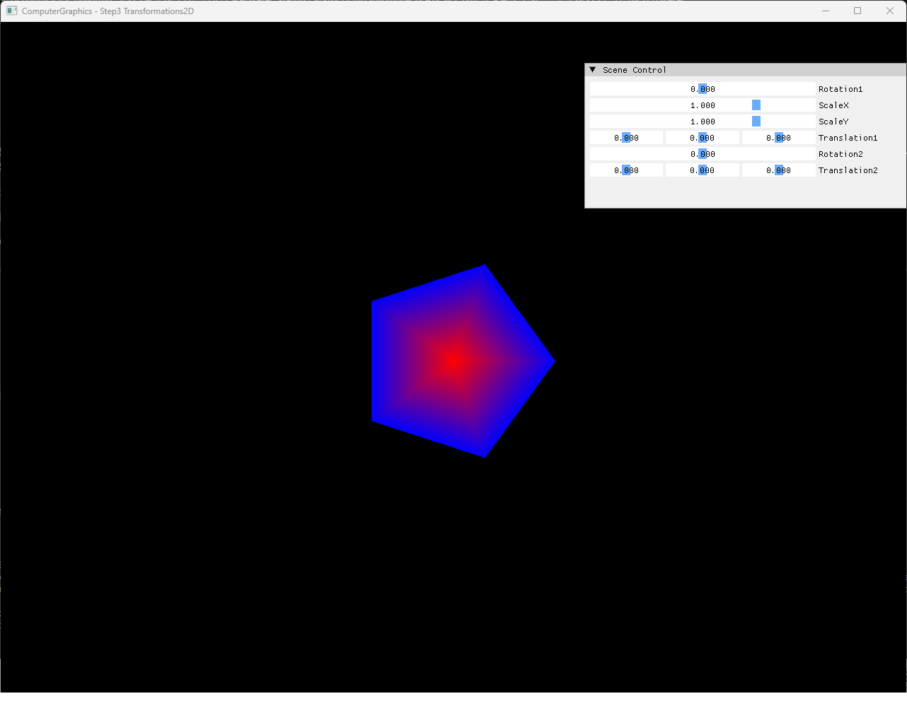
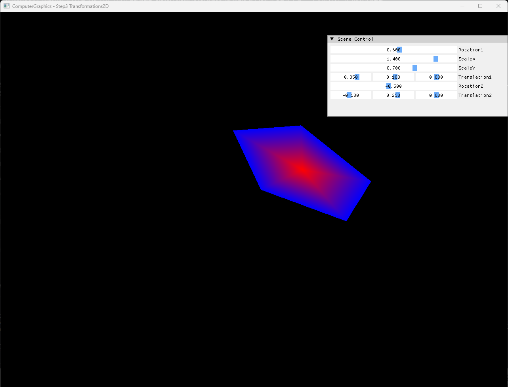

# Step3 Transformations2D Demo

## 목적

Step3은 원본 5-segment polygonal fan에 두 rotation, non-uniform scale과 두 translation을 순차 적용해 transform order가 orientation과 최종 위치에 미치는 영향을 보여준다. Identity 상태와 composed 상태를 비교해 원본 geometry 보존과 매-frame derived buffer 갱신을 설명한다.

## 책임 범위

- 실제 `Rotation1 → Scale → Translation1 → Rotation2 → Translation2` 구현 흐름을 설명한다.
- 원본 mesh와 derived vertex buffer의 책임을 구분한다.
- 두 번째 rotation이 첫 translation offset까지 회전시키는 구현 결과를 설명한다.
- 일반 translation, rotation, scale과 transform order는 [2D Transformations](../../01_Topics/Rasterization/Transformations2D.md)으로 위임한다.
- build/run/capture 사실은 [Verification Index](../../02_Verification/Part2_Chapter04/verification-index.md)로 위임한다.

## 결과 미리보기





기본 상태는 원점에 놓인 red-center, blue-boundary 5-segment fan이다. 조정 상태는 rotation과 non-uniform scale로 orientation과 aspect가 바뀌고 두 translation과 두 번째 rotation으로 최종 위치가 이동한다.

## 입력과 출력

| 구분 | 내용 |
| --- | --- |
| 원본 입력 | Center `(0, 0, 1)`, radius `0.3`, 5-segment polygonal fan |
| 기본 parameter | `R1=0`, `S=(1, 1)`, `T1=(0, 0)`, `R2=0`, `T2=(0, 0)` |
| 조정 parameter | `R1=0.6`, `S=(1.4, 0.7)`, `T1=(0.35, 0.10)`, `R2=-0.5`, `T2=(-0.10, 0.25)` |
| CPU 출력 | 변환한 vertex buffer를 rasterize한 1280×960 RGBA32F pixel buffer |
| 화면 출력 | Dynamic texture를 sampling한 full-screen quad와 transform UI |

## 구현 흐름

1. Center와 5개 outer-ring vertex로 원본 mesh를 구성한다.
2. 원본 vertex에 `Rotation1`을 적용한다.
3. X/Y non-uniform scale을 적용한다.
4. `Translation1`로 원점에서 이동한다.
5. 이동한 결과에 원점 기준 `Rotation2`를 적용한다.
6. `Translation2`로 최종 위치를 정한다.
7. Derived vertex buffer를 CPU rasterizer에 전달한다.
8. RGBA32F framebuffer를 DirectX11 dynamic texture로 표시한다.

## 핵심 구현

### Original Mesh And Derived Buffer

Step3은 `Mesh`의 원본 vertex를 직접 누적 변경하지 않는다. 각 frame에 identity 상태의 원본 vertex부터 현재 parameter를 다시 적용하고 결과만 `vertexBuffer`에 기록하므로 slider를 되돌리면 원본 형태도 안정적으로 복원된다.

- [원본 mesh와 transform parameter 상태](../../../Part2_Chapter04/04_Rasterization_Step3_Transformations2D/Rasterization.h#L29-L40)
- [5-segment 원본 polygonal fan 구성](../../../Part2_Chapter04/04_Rasterization_Step3_Transformations2D/Rasterization.cpp#L10-L17)
- [Center와 outer-ring mesh data](../../../Part2_Chapter04/04_Rasterization_Step3_Transformations2D/Mesh.cpp#L5-L28)

### Sequential Transform Composition

첫 rotation과 scale은 원점의 원본 형태에 적용된다. `Translation1`로 이동한 뒤 `Rotation2`가 적용되므로 geometry의 center offset도 원점 주위로 회전한다. 마지막 `Translation2`는 이 결과를 화면의 최종 위치로 옮긴다.

#### Transform Chain 의사코드

```cpp
// Pseudo C++: 원본 vertex에서 composed 2D transform 재계산
for (Vertex source : originalMesh.vertices)
{
    Vertex transformed = RotateZ(source, rotation1);
    transformed = ScaleXY(transformed, scaleX, scaleY);
    transformed = Translate(transformed, translation1);
    transformed = RotateZ(transformed, rotation2);
    transformed = Translate(transformed, translation2);
    derivedVertices.push_back(transformed);
}
```

- [Z축 rotation 계산](../../../Part2_Chapter04/04_Rasterization_Step3_Transformations2D/Rasterization.cpp#L92-L95)
- [순차 transform 조합과 derived buffer 갱신](../../../Part2_Chapter04/04_Rasterization_Step3_Transformations2D/Rasterization.cpp#L97-L110)
- [Transform UI parameter 연결](../../../Part2_Chapter04/04_Rasterization_Step3_Transformations2D/main.cpp#L69-L83)

### CPU Rasterization And Presentation

Transform 결과는 GPU geometry pipeline이 아니라 기존 CPU indexed triangle rasterizer로 전달된다. `Example::Update()`가 CPU pixel buffer를 다시 만들고 DirectX11 dynamic texture에 복사하며, shader는 full-screen quad에서 결과 texture만 sampling한다.

- [CPU transform·rasterization과 dynamic texture upload](../../../Part2_Chapter04/04_Rasterization_Step3_Transformations2D/Example.cpp#L11-L24)
- [RGBA32F dynamic texture 생성](../../../Part2_Chapter04/04_Rasterization_Step3_Transformations2D/Example.cpp#L148-L175)
- [Full-screen quad presentation](../../../Part2_Chapter04/04_Rasterization_Step3_Transformations2D/Example.cpp#L250-L270)

## 시각 결과

기본 capture의 5-segment boundary는 rotation 방향을 식별하기 위한 비대칭 표식처럼 작동한다. 조정 capture에서는 X scale이 Y scale보다 커져 polygon이 늘어나고 `Rotation1`로 장축 방향이 바뀐다. `Translation1` 이후 `Rotation2`가 적용되면서 geometry 자체와 center offset이 함께 회전하고 `Translation2`가 최종 화면 위치를 보정한다.

정지 이미지 두 장으로 identity와 composed 결과, parameter와 결과의 대응을 확인할 수 있으므로 이번 Step의 video는 불필요로 판정한다.

## 구현 범위와 한계

- 2D XY transform과 원점 기준 composition만 다룬다.
- Translation slider의 Z component는 화면 결과에 영향을 주지 않는다.
- Scale 0은 degenerate geometry를 만들고 음수 scale은 winding을 반전할 수 있다.
- Pivot selection, matrix hierarchy, clipping, depth test와 perspective projection을 포함하지 않는다.
- Dynamic texture upload는 mapped `RowPitch`를 별도로 처리하지 않는다.

## 검증

- [Part2 Chapter04 Verification](../../02_Verification/Part2_Chapter04/verification-index.md)
- Debug x64 build/run: 성공, 2026-08-01 현재 확인
- Release x64 build/run: 성공, 2026-08-01 현재 확인
- Application title: `ComputerGraphics - Step3 Transformations2D`
- Capture: 기본·조정 상태 전체 창 capture 사용자 확인 완료

## 관련 코드

- [Transform parameter와 원본·derived 상태](../../../Part2_Chapter04/04_Rasterization_Step3_Transformations2D/Rasterization.h#L29-L40)
- [Transform UI와 render loop](../../../Part2_Chapter04/04_Rasterization_Step3_Transformations2D/main.cpp#L66-L93)
- [CPU indexed triangle rasterization](../../../Part2_Chapter04/04_Rasterization_Step3_Transformations2D/Rasterization.cpp#L42-L90)
- [Application title](../../../Part2_Chapter04/04_Rasterization_Step3_Transformations2D/main.cpp#L34-L41)

## 관련 문서

- [Step3 Transformations2D Example](../../../Part2_Chapter04/04_Rasterization_Step3_Transformations2D/README.md)
- [2D Transformations Topic](../../01_Topics/Rasterization/Transformations2D.md)
- [Verification Index](../../02_Verification/Part2_Chapter04/verification-index.md)
- [Demo Index](demo-index.md)
