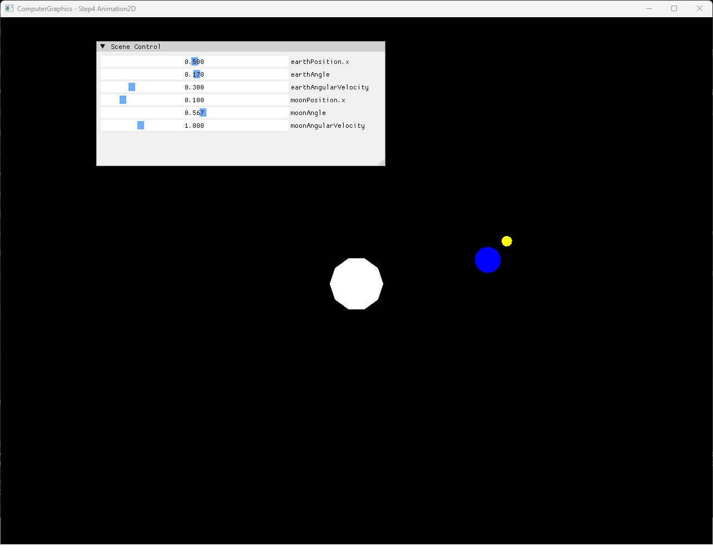

# Step4 Animation2D Demo

## 목적

Step4는 Sun, Earth와 Moon의 2D polygonal fan에 시간 기반 angle update와 계층적 transform을 적용해 parent orbit과 child local orbit이 결합되는 결과를 보여준다. 정지 screenshot은 천체와 UI 구성을 제시하고 selected video는 시간에 따른 상대 운동을 증명한다.

## 책임 범위

- Sun 고정, Earth의 Sun 기준 orbit과 Moon의 Earth 기준 local orbit 구현을 설명한다.
- Moon local transform에 Earth transform을 적용하는 계층적 조합을 설명한다.
- CPU animation·rasterization과 DirectX11 presentation의 경계를 설명한다.
- 일반 timestep과 hierarchy 개념은 [2D Animation And Hierarchical Orbit](../../01_Topics/AnimationAndPhysics/Animation2D.md)으로 위임한다.
- build/run/capture 사실은 [Verification Index](../../02_Verification/Part2_Chapter04/verification-index.md)로 위임한다.

## 결과 미리보기

대표 전체 창 screenshot은 Sun, Earth와 Moon의 초기 배치, 전체 application title과 Scene Control UI를 함께 보여준다.



Selected video는 Earth의 parent orbit과 Moon의 local orbit이 시간에 따라 결합되는 과정을 보여준다. 검수 완료 master는 게시 전까지 비추적 보관 영역에 유지한다.

Sun은 화면 원점에 고정되고 Earth는 더 큰 radius로 Sun 주위를 움직인다. Moon은 Earth보다 빠른 local orbit을 수행하면서 Earth의 전체 공전 경로도 함께 따른다.

## 입력과 출력

| 구분 | 내용 |
| --- | --- |
| Sun | Radius `0.1`, 10-segment white circle fan, 원점 고정 |
| Earth | Radius `0.05`, 10-segment blue circle fan, orbit radius `0.5`, angular velocity `0.3` |
| Moon | Radius `0.02`, 10-segment yellow circle fan, local orbit radius `0.1`, angular velocity `1.0` |
| Time update | Render loop마다 고정 `dt = 1/30` 적용 |
| CPU 출력 | 계층 transform 결과를 rasterize한 1280×960 RGBA32F pixel buffer |
| 화면 출력 | Dynamic texture를 sampling한 full-screen quad와 Scene Control UI |

## 구현 흐름

1. Sun, Earth와 Moon의 indexed circle fan 원본을 구성한다.
2. Sun runtime vertex를 변환하지 않고 원점에 rasterize한다.
3. Earth local vertex에 orbit offset을 더하고 Earth angle로 원점 주위 회전한다.
4. Moon local vertex에 local offset을 더하고 Moon angle로 회전한다.
5. Moon 결과에 Earth offset과 Earth angle을 적용해 상위 orbit을 조합한다.
6. Earth와 Moon angle을 angular velocity와 고정 timestep으로 증가시킨다.
7. 변환한 vertex를 CPU indexed triangle rasterizer에 전달한다.
8. RGBA32F framebuffer를 DirectX11 dynamic texture로 표시한다.

## 핵심 구현

### Mesh And Orbit State

세 천체는 같은 indexed triangle fan 구조를 사용하지만 radius와 uniform color가 다르다. Constructor는 Earth와 Moon의 X offset을 orbit radius로 초기화하고 angle과 angular velocity는 별도 runtime state로 유지한다.

- [Sun·Earth·Moon circle fan 구성](../../../Part2_Chapter04/04_Rasterization_Step4_Animation2D/Rasterization.cpp#L10-L29)
- [천체별 angle·velocity와 orbit distance 상태](../../../Part2_Chapter04/04_Rasterization_Step4_Animation2D/Rasterization.h#L28-L45)
- [Indexed circle fan 원본 data 생성](../../../Part2_Chapter04/04_Rasterization_Step4_Animation2D/Mesh.cpp#L5-L29)

### Hierarchical Orbit Composition

Earth는 local vertex에 `earthPosition`을 더한 뒤 `earthAngle`로 회전해 Sun 원점을 중심으로 이동한다. Moon은 먼저 자체 offset과 angle을 적용하고 이 local 결과에 Earth offset과 angle을 적용한다. 따라서 Moon은 Earth 주변을 공전하면서 Earth와 함께 Sun 주위도 이동한다.

#### Orbit Transform 의사코드

```cpp
// Pseudo C++: parent orbit과 child local orbit 조합
EarthVertex TransformEarth(EarthVertex source)
{
    return RotateZ(source + earthOffset, earthAngle);
}

MoonVertex TransformMoon(MoonVertex source)
{
    MoonVertex local = RotateZ(source + moonOffset, moonAngle);
    return RotateZ(local + earthOffset, earthAngle);
}
```

- [Sun 고정과 Earth 원점 기준 orbit](../../../Part2_Chapter04/04_Rasterization_Step4_Animation2D/Rasterization.cpp#L100-L121)
- [Moon local orbit과 Earth parent orbit 조합](../../../Part2_Chapter04/04_Rasterization_Step4_Animation2D/Rasterization.cpp#L123-L140)
- [Orbit distance·angle·velocity UI 연결](../../../Part2_Chapter04/04_Rasterization_Step4_Animation2D/main.cpp#L66-L75)

### Fixed Timestep Update

`Update()`는 두 angle에 `angularVelocity * dt`를 누적한다. `dt`는 실제 elapsed time이 아니라 `1/30` 상수이므로 update 호출 빈도가 30 FPS와 다르면 실제 시간 기준 속도도 달라진다.

- [고정 timestep과 angle 누적](../../../Part2_Chapter04/04_Rasterization_Step4_Animation2D/Rasterization.cpp#L143-L148)
- [Update·render·present 순서](../../../Part2_Chapter04/04_Rasterization_Step4_Animation2D/main.cpp#L57-L85)

### CPU Rasterization And Presentation

Animation transform은 CPU에서 수행한다. CPU rasterizer가 barycentric color interpolation으로 pixel buffer를 만들고 `Example::Update()`가 이를 DirectX11 dynamic texture에 복사한다. Vertex/Pixel Shader는 full-screen quad와 결과 texture sampling만 담당한다.

- [CPU animation·rasterization과 texture upload](../../../Part2_Chapter04/04_Rasterization_Step4_Animation2D/Example.cpp#L10-L22)
- [RGBA32F dynamic texture 생성](../../../Part2_Chapter04/04_Rasterization_Step4_Animation2D/Example.cpp#L145-L161)
- [Full-screen quad presentation](../../../Part2_Chapter04/04_Rasterization_Step4_Animation2D/Example.cpp#L248-L267)
- [Texture presentation shader](../../../Part2_Chapter04/04_Rasterization_Step4_Animation2D/PixelShader.hlsl#L5-L10)

## 시각 결과

White Sun은 화면 중심에 고정된다. Blue Earth는 radius `0.5` 경로를 따라 이동하고 yellow Moon은 Earth보다 작은 radius와 높은 angular velocity로 local orbit을 수행한다. Selected video의 시작·중간·종료 frame에서 Earth의 위치가 Sun 주위를 이동하고 Moon의 상대 위치가 Earth 주변에서 더 빠르게 바뀌는 결과를 확인했다.

정지 screenshot은 title, UI parameter와 한 시점의 계층 배치를 보여준다. Video는 한 장의 screenshot으로 설명할 수 없는 두 angular velocity와 parent-child motion의 시간적 관계를 보완한다.

## 구현 범위와 한계

- 고정 `dt = 1/30`을 frame마다 적용하므로 실제 frame cadence에 따라 wall-clock animation 속도가 달라진다.
- Angle을 주기적으로 wrap하지 않아 장시간 실행 시 floating-point 정밀도 저하 가능성이 있다.
- 천체가 uniform color circle이므로 self rotation과 orbital rotation을 분리해 보여주지 않는다.
- UI는 X offset을 orbit radius로 노출하며 임의 pivot과 3D orbit은 포함하지 않는다.
- Dynamic texture upload는 mapped `RowPitch`와 `Map()` 실패를 별도로 처리하지 않는다.

## 검증

- [Part2 Chapter04 Verification](../../02_Verification/Part2_Chapter04/verification-index.md)
- Debug x64 build/run: 성공, 2026-08-01 현재 확인
- Release x64 build/run: 성공, 2026-08-01 현재 확인
- Application title: `ComputerGraphics - Step4 Animation2D`
- Screenshot: 1282×992, metadata·공개 안전성·사용자 시각 검수 완료
- Selected video: H.264, 1282×992, CFR 30 FPS, 7.77초, audio 없음, 전체 decode와 사용자 시각 검수 완료

## 관련 코드

- [천체 mesh와 animation state](../../../Part2_Chapter04/04_Rasterization_Step4_Animation2D/Rasterization.h#L28-L45)
- [계층적 orbit과 fixed timestep](../../../Part2_Chapter04/04_Rasterization_Step4_Animation2D/Rasterization.cpp#L95-L148)
- [Scene Control UI와 render loop](../../../Part2_Chapter04/04_Rasterization_Step4_Animation2D/main.cpp#L57-L85)
- [CPU indexed triangle rasterization](../../../Part2_Chapter04/04_Rasterization_Step4_Animation2D/Rasterization.cpp#L54-L93)
- [Application title](../../../Part2_Chapter04/04_Rasterization_Step4_Animation2D/main.cpp#L30-L42)

## 관련 문서

- [Step4 Animation2D Example](../../../Part2_Chapter04/04_Rasterization_Step4_Animation2D/README.md)
- [2D Animation And Hierarchical Orbit](../../01_Topics/AnimationAndPhysics/Animation2D.md)
- [2D Transformations](../../01_Topics/Rasterization/Transformations2D.md)
- [Verification Index](../../02_Verification/Part2_Chapter04/verification-index.md)
- [Demo Index](demo-index.md)
