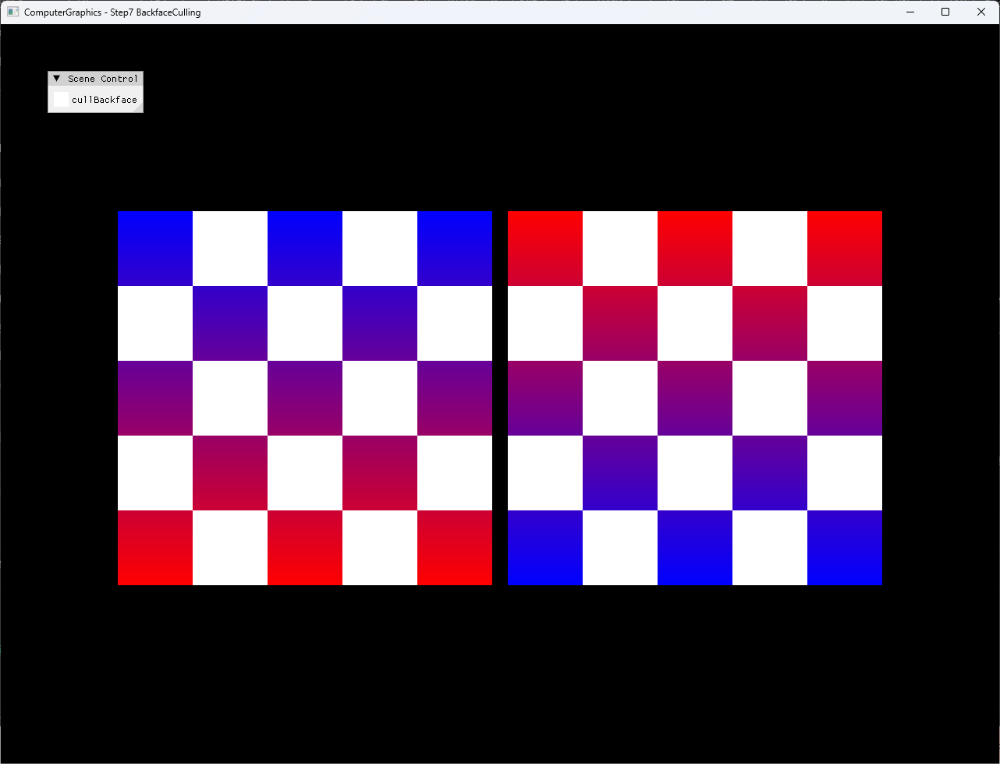

# Step7 BackfaceCulling Demo

## 목적

Step7은 동일 square topology에 서로 다른 transform을 적용해 반대 post-transform winding을 만들고, CPU software rasterizer의 signed-area backface culling 결과를 비교한다. ImGui checkbox로 culling을 끄고 켜면서 primitive rejection이 최종 framebuffer에 미치는 영향을 확인한다.

## 책임 범위

- 동일 index topology와 오른쪽 square의 X축 π 회전 관계를 설명한다.
- World Y-up에서 raster Y-down으로 바뀌는 좌표계와 area 부호를 연결한다.
- Degenerate triangle과 backface 조기 반환을 구분한다.
- Culling Off에서 반대 winding triangle도 rasterize되는 흐름을 설명한다.
- ImGui checkbox와 CPU rasterizer state를 연결한다.
- DirectX11 HLSL presentation과 CPU culling 책임을 구분한다.
- 일반적인 winding과 face orientation은 [Backface Culling](../../01_Topics/Rasterization/BackfaceCulling.md)으로 위임한다.
- build/run/capture 사실은 [Verification Index](../../02_Verification/Part2_Chapter04/verification-index.md)로 위임한다.

## 결과 미리보기

### Culling On


### Culling Off



On에서는 왼쪽 front-facing square만 남고 Off에서는 반전된 오른쪽 square도 함께 표시된다. 두 screenshot과 On → Off → On selected local video는 기술 검수와 사용자 시각 검수를 완료했다.

## 입력과 출력

| 구분 | 내용 |
| --- | --- |
| 공통 mesh 입력 | 네 position, UV와 `{0, 1, 2, 0, 2, 3}` index로 구성한 square |
| 왼쪽 transform | 원본 orientation, X translation `-0.52` |
| 오른쪽 transform | X축 π 회전, X translation `0.52` |
| Orientation 입력 | `ProjectWorldToRaster()` 이후 세 raster vertex |
| Culling 출력 | Degenerate 또는 활성화된 backface의 조기 반환 |
| CPU framebuffer | Culling On에서 왼쪽 square, Off에서 좌우 square |
| 화면 출력 | CPU framebuffer texture와 ImGui checkbox를 합성한 DirectX11 window |

## 구현 흐름

1. 동일한 square topology와 UV를 두 mesh에 복사한다.
2. 오른쪽 square에 X축 π 회전을 적용해 Y 방향과 post-transform winding을 반전한다.
3. CPU vertex stage에서 각 mesh transform을 position에 적용한다.
4. Transformed vertex를 Y-down raster 좌표로 변환한다.
5. 세 raster vertex의 `EdgeFunction()`으로 signed area를 계산한다.
6. Area가 0이면 degenerate triangle로 제외한다.
7. Culling이 켜져 있고 area가 0 이하이면 backface로 제외한다.
8. 통과한 triangle은 signed area로 barycentric weight를 정규화한다.
9. Coverage, attribute 보간, depth test와 CPU pixel shading을 수행한다.
10. CPU framebuffer를 dynamic texture로 upload하고 HLSL presentation quad로 표시한다.

## 핵심 구현

### Same Topology, Opposite Post-Transform Winding

두 square는 같은 vertex와 index topology를 사용한다. 오른쪽 square의 X축 π 회전은 평면 vertex의 Y 방향을 뒤집어 화면상 크기를 유지하면서 post-transform orientation만 반전한다.

- [공통 square topology와 UV](../../../Part2_Chapter04/04_Rasterization_Step7_BackfaceCulling/Mesh.cpp#L33-L55)
- [좌우 square 배치와 X축 π 회전](../../../Part2_Chapter04/04_Rasterization_Step7_BackfaceCulling/Rasterization.cpp#L69-L86)
- [X축 transform과 CPU vertex stage](../../../Part2_Chapter04/04_Rasterization_Step7_BackfaceCulling/Rasterization.cpp#L15-L51)

### Raster-Space Signed Area

`ProjectWorldToRaster()`는 world Y-up을 raster Y-down으로 바꾼다. 이 변환 이후 `EdgeFunction(v0, v1, v2)`의 양수 area를 front-facing으로 취급하므로 winding 이름만으로 부호를 일반화하지 않고 현재 좌표계 convention과 함께 판정한다.

#### Signed Area 의사코드

```cpp
// Pseudo C++: raster 좌표계의 orientation 분류
float ComputeSignedArea(Vertex a, Vertex b, Vertex c)
{
    return Cross2D(b.position - a.position,
                   c.position - a.position);
}
```

- [Y-down raster 좌표 변환](../../../Part2_Chapter04/04_Rasterization_Step7_BackfaceCulling/Rasterization.cpp#L91-L100)
- [2D edge function](../../../Part2_Chapter04/04_Rasterization_Step7_BackfaceCulling/Rasterization.cpp#L102-L107)

### Early Backface Rejection

Area가 0인 triangle은 culling 설정과 무관하게 제외한다. Culling이 활성화된 경우 area가 0 이하인 triangle도 bounding box와 per-pixel coverage 이전에 반환한다.

#### Culling 의사코드

```cpp
// Pseudo C++: degenerate와 backface 조기 반환
void RasterizeTriangle(Triangle triangle, bool cullingEnabled)
{
    float area = ComputeSignedArea(triangle);
    if (area == 0.0f)
    {
        return;
    }
    if (cullingEnabled && IsBackFacing(area))
    {
        return;
    }

    RasterizeCoveredPixels(triangle, area);
}
```

- [Raster-space signed area와 backface 조기 반환](../../../Part2_Chapter04/04_Rasterization_Step7_BackfaceCulling/Rasterization.cpp#L109-L122)
- [Culling 이후 barycentric coverage와 depth test](../../../Part2_Chapter04/04_Rasterization_Step7_BackfaceCulling/Rasterization.cpp#L132-L168)

### Runtime Culling Toggle

`cullBackface`는 기본적으로 true이며 ImGui checkbox가 CPU rasterizer의 동일 Boolean 상태를 직접 변경한다. Off에서는 음수 area로 나눈 edge 값이 triangle 내부에서 양의 barycentric weight가 되므로 오른쪽 square도 정상 rasterize된다.

- [기본 culling 상태](../../../Part2_Chapter04/04_Rasterization_Step7_BackfaceCulling/Rasterization.h#L38-L38)
- [ImGui culling checkbox](../../../Part2_Chapter04/04_Rasterization_Step7_BackfaceCulling/main.cpp#L63-L67)

### CPU Framebuffer Presentation

Backface 판정, coverage, depth와 pixel shading은 C++ CPU rasterizer에서 수행한다. DirectX11 HLSL은 CPU framebuffer texture를 full-screen quad로 표시하며 GPU rasterizer state로 Step7의 backface culling을 수행하지 않는다.

- [CPU framebuffer와 dynamic texture upload](../../../Part2_Chapter04/04_Rasterization_Step7_BackfaceCulling/Example.cpp#L10-L21)
- [Presentation HLSL runtime compile](../../../Part2_Chapter04/04_Rasterization_Step7_BackfaceCulling/Example.cpp#L24-L77)
- [Full-screen presentation draw](../../../Part2_Chapter04/04_Rasterization_Step7_BackfaceCulling/Example.cpp#L217-L235)

## 시각 결과

Culling On에서는 왼쪽 square만 표시된다. 왼쪽의 pattern은 위쪽 blue에서 아래쪽 red로 변한다. 오른쪽 square는 post-transform area가 음수이므로 coverage 이전에 제외된다.

Culling Off에서는 좌우 square가 모두 표시된다. 오른쪽은 X축 회전으로 UV orientation도 반전되어 위쪽 red에서 아래쪽 blue로 변한다. Geometry 위치와 index topology는 유지되므로 두 화면의 차이는 runtime culling state에 대응한다.

Selected local video는 On → Off → On 순서로 checkbox와 결과가 전환되는 흐름을 보여준다. 전체 decode와 사용자 시각 검수를 완료했으며 local 검수 증거로 유지한다.

## 구현 범위와 한계

- Front-face 판정은 현재 Y-down raster 좌표와 `area > 0` convention에 결합돼 있다.
- `area == 0.0f` exact 비교는 거의 퇴화한 triangle을 epsilon으로 제거하지 않는다.
- X축 π 회전은 근사 상수 `3.141592f`를 사용한다.
- Clipping, perspective division과 GPU rasterizer state의 전체 culling 순서를 재현하지 않는다.
- Barycentric attribute와 depth는 screen-space affine 보간을 사용한다.
- Dynamic texture upload는 `Map()` 실패와 mapped `RowPitch` 차이를 별도로 처리하지 않는다.
- Shader file runtime load는 example working directory에 의존한다.

## 검증

- [Part2 Chapter04 Verification](../../02_Verification/Part2_Chapter04/verification-index.md)
- Debug x64 build/run: 성공, 2026-08-01 현재 확인
- Release x64 build/run: 성공, 2026-08-01 현재 확인
- Application title: `ComputerGraphics - Step7 BackfaceCulling`
- Runtime shader compile: 성공
- Culling On screenshot: 1282×992, 기술·사용자 시각 검수 완료
- Culling Off screenshot: 1282×992, 기술·사용자 시각 검수 완료
- Selected video: H.264 High, yuv420p, 1282×992, CFR 30 FPS, 19.1초, audio 없음, 전체 decode와 사용자 시각 검수 완료

## 관련 코드

- [공통 square topology와 UV](../../../Part2_Chapter04/04_Rasterization_Step7_BackfaceCulling/Mesh.cpp#L33-L55)
- [좌우 square transform과 post-transform winding](../../../Part2_Chapter04/04_Rasterization_Step7_BackfaceCulling/Rasterization.cpp#L69-L86)
- [Raster-space signed area와 backface 조기 반환](../../../Part2_Chapter04/04_Rasterization_Step7_BackfaceCulling/Rasterization.cpp#L91-L122)
- [Culling 이후 barycentric coverage와 depth test](../../../Part2_Chapter04/04_Rasterization_Step7_BackfaceCulling/Rasterization.cpp#L132-L168)
- [Runtime culling checkbox](../../../Part2_Chapter04/04_Rasterization_Step7_BackfaceCulling/main.cpp#L63-L67)
- [CPU framebuffer의 DirectX11 presentation](../../../Part2_Chapter04/04_Rasterization_Step7_BackfaceCulling/Example.cpp#L217-L235)

## 관련 문서

- [Step7 BackfaceCulling Example](../../../Part2_Chapter04/04_Rasterization_Step7_BackfaceCulling/README.md)
- [Backface Culling](../../01_Topics/Rasterization/BackfaceCulling.md)
- [Triangle Rasterization](../../01_Topics/Rasterization/TriangleRasterization.md)
- [Shader Stage](../../01_Topics/DirectX11Pipeline/ShaderStage.md)
- [Verification Index](../../02_Verification/Part2_Chapter04/verification-index.md)
- [Demo Index](demo-index.md)
