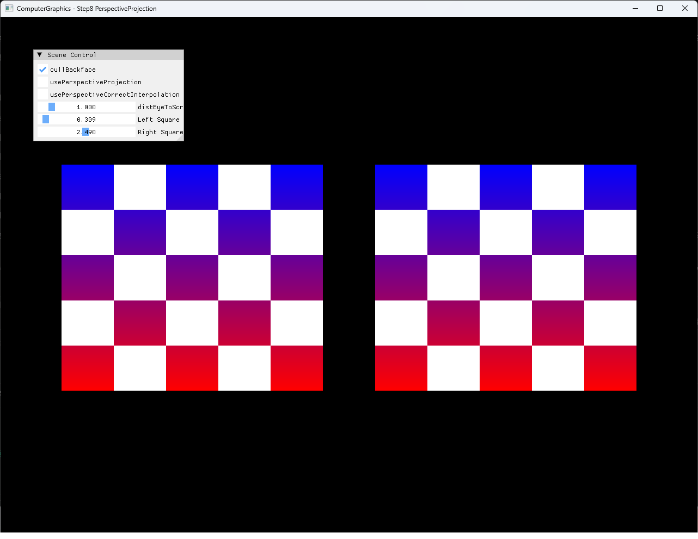
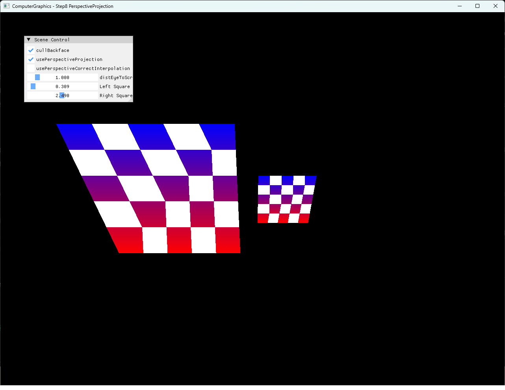

# Step8 PerspectiveProjection Demo

## 목적

Step8은 서로 다른 Z에 놓인 두 square를 사용해 orthographic과 perspective projection의 크기 차이를 확인하고, screen-space affine interpolation과 perspective-correct interpolation의 checker pattern을 비교한다. Projection과 attribute correction을 독립적인 runtime toggle로 제공해 각 단계가 최종 CPU framebuffer에 미치는 영향을 분리한다.

## 책임 범위

- 동일한 square topology와 서로 다른 Z 배치의 관계를 설명한다.
- `distEyeToScreen / (distEyeToScreen + z)` 기반 간소화 projection을 설명한다.
- Raster-space barycentric weight와 reciprocal-depth 보정 흐름을 구분한다.
- Checker pattern으로 affine UV 왜곡과 perspective-correct 결과를 비교한다.
- CPU rasterization과 DirectX11 HLSL presentation 책임을 구분한다.
- 일반적인 projection과 보간 이론은 [Perspective Projection](../../01_Topics/Rasterization/PerspectiveProjection.md)으로 위임한다.
- build/run/capture 사실은 [Verification Index](../../02_Verification/Part2_Chapter04/verification-index.md)로 위임한다.

## 결과 미리보기

### Orthographic



### Perspective, Affine Interpolation



### Perspective-Correct Interpolation


세 화면은 `distEyeToScreen = 1.000`, `Left Square Z = 0.309`, `Right Square Z = 2.490`을 유지한다. Projection과 interpolation toggle만 단계별로 바꿔 크기 변화와 checker 보정의 책임을 분리한다.

## 입력과 출력

| 구분 | 내용 |
| --- | --- |
| 공통 mesh 입력 | 같은 position, UV와 `{0, 1, 2, 0, 2, 3}` index로 구성한 square 두 개 |
| 공통 transform | X축 -30도 회전, X translation `-0.6`과 `0.6` |
| Depth 입력 | 왼쪽 Z `0.309`, 오른쪽 Z `2.490`, eye-to-screen 거리 `1.000` |
| Projection 상태 | Orthographic 또는 `dist / (dist + z)` perspective projection |
| Interpolation 상태 | Screen-space affine 또는 reciprocal-depth 보정 barycentric weight |
| CPU 출력 | Projected coverage, checker color와 depth test를 반영한 framebuffer |
| 화면 출력 | CPU framebuffer texture와 ImGui control을 합성한 DirectX11 window |

## 구현 흐름

1. 같은 square topology와 checker UV를 두 mesh에 복사한다.
2. 두 square에 같은 X축 회전과 서로 다른 X, Z translation을 적용한다.
3. CPU vertex stage에서 mesh transform을 position에 적용한다.
4. Projection이 켜지면 eye-to-screen 거리와 vertex Z로 XY 비율을 계산한다.
5. Projected XY를 aspect-correct NDC와 Y-down raster 좌표로 변환한다.
6. Raster-space edge function으로 barycentric weight와 coverage를 계산한다.
7. Perspective correction이 켜지면 각 weight를 eye-relative Z로 나누고 다시 정규화한다.
8. 선택된 weight로 depth, color와 UV를 보간한다.
9. Depth test를 통과한 fragment에 checker pixel shader를 적용한다.
10. CPU framebuffer를 dynamic texture로 upload하고 HLSL presentation quad로 표시한다.

## 핵심 구현

### Depth-Scaled Projection

Projection toggle이 꺼지면 world XY가 크기를 유지한다. 켜지면 eye-to-screen 거리 `d`와 vertex Z로 `d / (d + z)`를 계산하고 XY에 곱한다. 같은 topology라도 가까운 왼쪽 square가 커지고 먼 오른쪽 square가 작아진다.

#### Projection 의사코드

```cpp
// Pseudo C++: depth에 따른 projected XY 계산
Vec2 Project(Vec3 point, float screenDistance, bool perspective)
{
    if (!perspective)
    {
        return point.xy;
    }

    float ratio = screenDistance / (screenDistance + point.z);
    return ratio * point.xy;
}
```

- [두 square의 공통 회전과 초기 배치](../../../Part2_Chapter04/04_Rasterization_Step8_PerspectiveProjection/Rasterization.cpp#L69-L87)
- [Depth-scaled projection과 raster 좌표 변환](../../../Part2_Chapter04/04_Rasterization_Step8_PerspectiveProjection/Rasterization.cpp#L92-L108)

### Reciprocal-Depth Weight Correction

Coverage에서 얻은 screen-space weight를 그대로 사용하면 checker UV가 화면 공간에서 affine하게 보간된다. Correction이 활성화되면 각 weight를 `z + distEyeToScreen`으로 나누고 합으로 정규화한 뒤 depth, color와 UV 계산에 사용한다.

#### Perspective-Correct Interpolation 의사코드

```cpp
// Pseudo C++: reciprocal-depth barycentric correction
Weights Correct(Weights screen, Depths eyeRelative)
{
    Weights divided = screen / eyeRelative;
    return divided / Sum(divided);
}
```

- [Raster-space barycentric coverage](../../../Part2_Chapter04/04_Rasterization_Step8_PerspectiveProjection/Rasterization.cpp#L117-L156)
- [Reciprocal-depth weight 보정](../../../Part2_Chapter04/04_Rasterization_Step8_PerspectiveProjection/Rasterization.cpp#L157-L171)
- [보정된 depth, color와 UV 보간](../../../Part2_Chapter04/04_Rasterization_Step8_PerspectiveProjection/Rasterization.cpp#L173-L186)

### Runtime Comparison Controls

ImGui는 projection, perspective correction과 eye-to-screen 거리를 독립적으로 변경한다. 두 square의 Z slider도 같은 장면에서 near/far 관계를 조정하므로 코드 변경 없이 세 비교 상태를 재현할 수 있다.

- [Projection과 interpolation runtime 상태](../../../Part2_Chapter04/04_Rasterization_Step8_PerspectiveProjection/Rasterization.h#L38-L43)
- [Projection, correction과 Z 조정 UI](../../../Part2_Chapter04/04_Rasterization_Step8_PerspectiveProjection/main.cpp#L64-L84)

### CPU Framebuffer Presentation

Projection, coverage, interpolation, depth test와 checker shading은 C++ CPU rasterizer에서 수행한다. DirectX11 HLSL은 CPU framebuffer texture를 full-screen quad로 표시하며 Step8의 perspective 계산을 담당하지 않는다.

- [CPU framebuffer 갱신과 dynamic texture upload](../../../Part2_Chapter04/04_Rasterization_Step8_PerspectiveProjection/Example.cpp#L10-L21)
- [Presentation HLSL runtime compile](../../../Part2_Chapter04/04_Rasterization_Step8_PerspectiveProjection/Example.cpp#L24-L77)
- [Full-screen presentation draw](../../../Part2_Chapter04/04_Rasterization_Step8_PerspectiveProjection/Example.cpp#L217-L236)

## 시각 결과

Orthographic 상태에서는 Z가 다른 두 square가 같은 화면 크기로 나타난다. Projection을 켜면 왼쪽 near square는 크게, 오른쪽 far square는 작게 나타나 depth와 projected size의 관계가 드러난다.

Affine 상태의 기울어진 square에서는 checker column과 row 간격이 surface의 원근 변화와 일치하지 않는다. Perspective correction을 켜면 reciprocal-depth weight가 UV 분포를 재조정해 checker가 기하학적 기울기와 일관된 간격으로 이어진다.

세 정지 이미지만으로 두 toggle의 결과가 직접 비교되므로 별도 video는 선택하지 않는다.

## 구현 범위와 한계

- Matrix와 homogeneous clip space 대신 간소화된 `dist / (dist + z)` 비율을 사용한다.
- Near/far clipping과 denominator가 0 이하인 vertex 처리를 포함하지 않는다.
- Perspective-correct weight를 depth, color와 UV에 동일하게 사용한다.
- Depth buffer 초기값 `10.0f`는 명시적인 far plane이 아니다.
- `eyePoint`는 현재 projection 계산에 사용하지 않는다.
- Resize에 따른 framebuffer와 viewport 재생성을 처리하지 않는다.
- Dynamic texture upload는 `Map()` 실패와 mapped `RowPitch` 차이를 별도로 처리하지 않는다.
- Shader file runtime load는 example working directory에 의존한다.

## 검증

- [Part2 Chapter04 Verification](../../02_Verification/Part2_Chapter04/verification-index.md)
- Debug x64 build/run: 성공, 2026-08-01 현재 확인
- Release x64 build/run: 성공, 2026-08-01 현재 확인
- Application title: `ComputerGraphics - Step8 PerspectiveProjection`
- Runtime shader compile: 성공
- Orthographic screenshot: 1282×992, 기술·사용자 시각 검수 완료
- Perspective affine screenshot: 1282×992, 기술·사용자 시각 검수 완료
- Perspective-correct screenshot: 1282×992, 기술·사용자 시각 검수 완료
- PNG sensitive metadata chunk: 없음

## 관련 코드

- [두 square topology와 checker UV](../../../Part2_Chapter04/04_Rasterization_Step8_PerspectiveProjection/Mesh.cpp#L32-L59)
- [두 square의 transform과 초기 Z](../../../Part2_Chapter04/04_Rasterization_Step8_PerspectiveProjection/Rasterization.cpp#L69-L87)
- [Perspective projection과 raster 좌표 변환](../../../Part2_Chapter04/04_Rasterization_Step8_PerspectiveProjection/Rasterization.cpp#L92-L108)
- [Barycentric coverage와 reciprocal-depth 보정](../../../Part2_Chapter04/04_Rasterization_Step8_PerspectiveProjection/Rasterization.cpp#L117-L175)
- [Runtime projection과 interpolation UI](../../../Part2_Chapter04/04_Rasterization_Step8_PerspectiveProjection/main.cpp#L64-L84)
- [CPU framebuffer의 DirectX11 presentation](../../../Part2_Chapter04/04_Rasterization_Step8_PerspectiveProjection/Example.cpp#L217-L236)

## 관련 문서

- [Step8 PerspectiveProjection Example](../../../Part2_Chapter04/04_Rasterization_Step8_PerspectiveProjection/README.md)
- [Perspective Projection](../../01_Topics/Rasterization/PerspectiveProjection.md)
- [Depth Buffer](../../01_Topics/Rasterization/DepthBuffer.md)
- [Triangle Rasterization](../../01_Topics/Rasterization/TriangleRasterization.md)
- [Verification Index](../../02_Verification/Part2_Chapter04/verification-index.md)
- [Demo Index](demo-index.md)
