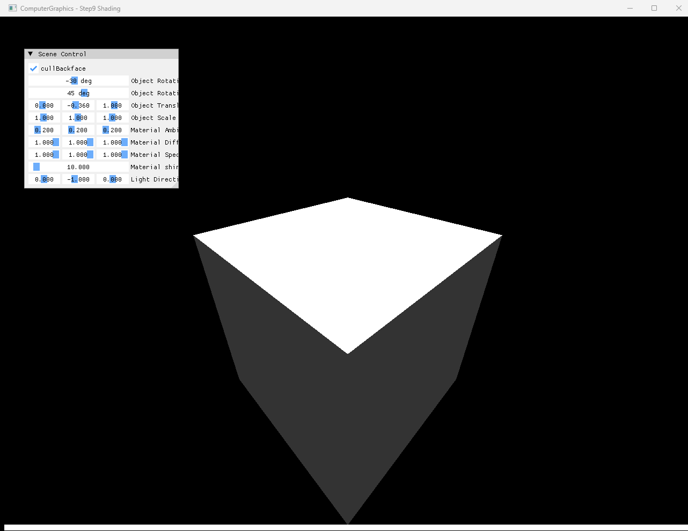

# Step9 Shading Demo

## 목적

Step9은 Step8의 perspective-correct CPU software rasterizer에 box topology, face normal과 directional Blinn-Phong shading을 추가한다. Position과 normal이 CPU pipeline을 따라 이동하고 material과 light parameter가 최종 framebuffer color를 만드는 흐름을 확인한다.

## 책임 범위

- 24개 vertex와 face별 normal로 구성한 box topology를 설명한다.
- Position과 normal transform의 차이를 설명한다.
- Perspective-correct position·normal 보간과 per-pixel shading 입력을 연결한다.
- Ambient, Lambert diffuse와 half-vector specular 합성을 설명한다.
- CPU shading과 DirectX11 presentation 책임을 구분한다.
- 일반적인 Phong과 Blinn-Phong 비교는 [Phong And Blinn-Phong](../../01_Topics/LightingAndShading/PhongAndBlinnPhong.md)으로 위임한다.
- Build/run/capture 사실은 [Verification Index](../../02_Verification/Part2_Chapter04/verification-index.md)로 위임한다.

## 결과 미리보기

기본 directional light는 위쪽을 향하는 surface-to-light vector를 만든다. Top face는 diffuse와 specular 기여가 커서 밝게 나타나고 side face는 normal과 light가 직교에 가까워 ambient 중심의 어두운 명암을 유지한다.

## 입력과 출력

| 구분 | 내용 |
| --- | --- |
| Geometry 입력 | Face마다 vertex 네 개와 동일 normal을 사용하는 box, 12개 triangle |
| Transform 입력 | Scale, Y·X·Z rotation과 translation |
| Material 입력 | Ambient·diffuse·specular color, `kd`, `ks`, shininess |
| Light 입력 | Ambient·diffuse·specular color와 directional light direction |
| CPU 출력 | Perspective-correct position·normal과 Blinn-Phong color를 반영한 framebuffer |
| 화면 출력 | CPU framebuffer texture와 Scene Control을 합성한 DirectX11 window |

## 구현 흐름

1. Box의 6개 face마다 vertex 네 개와 face normal을 구성한다.
2. CPU vertex stage에서 position에는 scale, rotation과 translation을 적용하고 normal에는 rotation을 적용한다.
3. World position을 간소화된 perspective projection으로 raster 좌표에 배치한다.
4. Edge function으로 coverage와 barycentric weight를 계산한다.
5. Reciprocal-depth weight로 world position과 normal을 보간하고 normal을 정규화한다.
6. Eye position, directional light와 material로 ambient, diffuse와 Blinn-Phong specular를 합성한다.
7. Depth test를 통과한 color를 CPU framebuffer에 기록한다.
8. Dynamic texture upload와 full-screen quad로 CPU 결과를 표시한다.

## 핵심 구현

### Box Topology And Face Normals

Box는 모서리 vertex를 face 사이에서 공유하지 않는다. 각 face가 독립된 vertex 네 개와 ±X, ±Y 또는 ±Z normal을 사용하므로 한 face 안에서는 같은 normal을 유지하고 face 경계에서 명암이 분리된다.

- [Face별 box vertex와 normal](../../../Part2_Chapter04/04_Rasterization_Step9_Shading/Mesh.cpp#L5-L53)
- [12개 triangle index](../../../Part2_Chapter04/04_Rasterization_Step9_Shading/Mesh.cpp#L55-L59)

### Position And Normal Transform

Position은 component-wise scale 이후 Y, X, Z rotation과 translation을 순서대로 적용한다. Normal은 translation 영향을 받지 않으며 rotation 뒤 정규화한다. 현재 구현은 inverse-transpose normal matrix를 사용하지 않아 non-uniform scale에서는 일반적인 normal transform과 차이가 생긴다.

- [Position과 normal의 CPU vertex transform](../../../Part2_Chapter04/04_Rasterization_Step9_Shading/MyShader.h#L91-L108)

### Perspective-Correct Shading Inputs

Raster-space coverage를 통과한 fragment는 각 barycentric weight를 eye-relative depth로 나누고 다시 정규화한다. 보정된 weight로 world position과 face normal을 보간하며 normal은 pixel stage에 전달하기 전에 다시 정규화한다.

- [Coverage와 face 방향 normal 선택](../../../Part2_Chapter04/04_Rasterization_Step9_Shading/Rasterization.cpp#L88-L112)
- [Reciprocal-depth position·normal 보간](../../../Part2_Chapter04/04_Rasterization_Step9_Shading/Rasterization.cpp#L114-L137)

### Directional Blinn-Phong Shading

Ambient는 light와 material ambient color를 곱한다. Diffuse는 `max(N·L, 0)`을 사용하고 specular는 normalized half-vector와 normal의 내적을 shininess만큼 거듭제곱한다. 현재 구현은 specular 결과에 `N·L`을 추가로 곱해 light가 surface 뒤에 있을 때 highlight를 제거하고 grazing 영역을 더 감쇠한다.

- [Ambient와 Lambert diffuse 계산](../../../Part2_Chapter04/04_Rasterization_Step9_Shading/MyShader.h#L30-L43)
- [Half-vector specular 계산](../../../Part2_Chapter04/04_Rasterization_Step9_Shading/MyShader.h#L45-L60)
- [Directional Blinn-Phong 합성](../../../Part2_Chapter04/04_Rasterization_Step9_Shading/MyShader.h#L63-L79)
- [World position 기반 view direction과 CPU pixel stage](../../../Part2_Chapter04/04_Rasterization_Step9_Shading/MyShader.h#L110-L122)

### Runtime Material And Light Controls

Scene Control은 object rotation·translation·scale, material ambient·diffuse·specular·shininess와 light direction을 조정한다. Light direction은 길이가 충분할 때 정규화하며 0 vector에서는 ambient만 남을 수 있다.

- [Object, material과 light control](../../../Part2_Chapter04/04_Rasterization_Step9_Shading/main.cpp#L63-L105)

### CPU Framebuffer Presentation

Transform, rasterization, attribute interpolation과 shading은 C++ CPU 경로에서 수행한다. DirectX11 HLSL은 CPU framebuffer texture를 full-screen quad에 표시하며 Blinn-Phong 계산을 수행하지 않는다.

- [CPU framebuffer와 dynamic texture upload](../../../Part2_Chapter04/04_Rasterization_Step9_Shading/Example.cpp#L10-L21)
- [CPU mesh 순회와 triangle rasterization](../../../Part2_Chapter04/04_Rasterization_Step9_Shading/Rasterization.cpp#L144-L173)
- [Full-screen presentation draw](../../../Part2_Chapter04/04_Rasterization_Step9_Shading/Example.cpp#L217-L236)

## 시각 결과

기본 화면의 top face는 directional light와 같은 방향의 normal을 가져 밝게 나타난다. 두 side face는 같은 material을 사용하지만 normal 방향이 달라 더 어두운 값이 되며 face별 flat normal 구성이 명확한 경계를 만든다.

Scene Control에 표시된 material과 light parameter는 shading 결과가 geometry color가 아니라 runtime lighting 합성으로 생성됨을 보여준다. Step9은 시간 변화가 핵심이 아니고 한 장의 전체 창 capture로 topology, 명암과 parameter를 함께 확인할 수 있어 video를 제외한다.

## 구현 범위와 한계

- Step9은 Blinn-Phong만 구현하며 reflection-vector Phong과 runtime 비교하지 않는다.
- Face마다 같은 normal을 사용하므로 smooth shading 결과가 아니다.
- Non-uniform scale을 지원하는 UI와 달리 inverse-transpose normal transform을 포함하지 않는다.
- Specular에 `N·L`을 추가로 곱하는 현재 식은 예제 고유 variant다.
- Eye point는 `(0, 0, -1)`로 고정되어 projection parameter 변경과 자동 연동되지 않는다.
- Near/far clipping, output clamp, gamma correction과 tone mapping을 포함하지 않는다.
- Dynamic texture upload는 `Map()` 실패와 mapped `RowPitch` 차이를 별도로 처리하지 않는다.
- Shader file runtime load는 example working directory에 의존한다.

## 검증

- [Part2 Chapter04 Verification](../../02_Verification/Part2_Chapter04/verification-index.md)
- Debug x64 build/run: 성공, 2026-08-01 현재 확인
- Release x64 build/run: 성공, 2026-08-01 현재 확인
- Application title: `ComputerGraphics - Step9 Shading`
- Runtime shader compile: 성공
- Default screenshot: 1282×992, 기술·사용자 시각 검수 완료
- PNG sensitive metadata chunk: 없음
- Video: 제외, 고정 shading 결과는 screenshot으로 설명 가능

## 관련 코드

- [Face별 box topology와 normal](../../../Part2_Chapter04/04_Rasterization_Step9_Shading/Mesh.cpp#L5-L59)
- [Position과 normal transform](../../../Part2_Chapter04/04_Rasterization_Step9_Shading/MyShader.h#L91-L108)
- [Ambient·diffuse·half-vector specular](../../../Part2_Chapter04/04_Rasterization_Step9_Shading/MyShader.h#L30-L79)
- [Perspective-correct position·normal 보간](../../../Part2_Chapter04/04_Rasterization_Step9_Shading/Rasterization.cpp#L114-L137)
- [CPU shading pipeline](../../../Part2_Chapter04/04_Rasterization_Step9_Shading/Rasterization.cpp#L144-L173)
- [Runtime material과 light UI](../../../Part2_Chapter04/04_Rasterization_Step9_Shading/main.cpp#L63-L105)
- [CPU framebuffer의 DirectX11 presentation](../../../Part2_Chapter04/04_Rasterization_Step9_Shading/Example.cpp#L217-L236)

## 관련 문서

- [Step9 Shading Example](../../../Part2_Chapter04/04_Rasterization_Step9_Shading/README.md)
- [Phong And Blinn-Phong](../../01_Topics/LightingAndShading/PhongAndBlinnPhong.md)
- [Phong Shading](../../01_Topics/LightingAndShading/PhongShading.md)
- [Perspective Projection](../../01_Topics/Rasterization/PerspectiveProjection.md)
- [Verification Index](../../02_Verification/Part2_Chapter04/verification-index.md)
- [Demo Index](demo-index.md)
