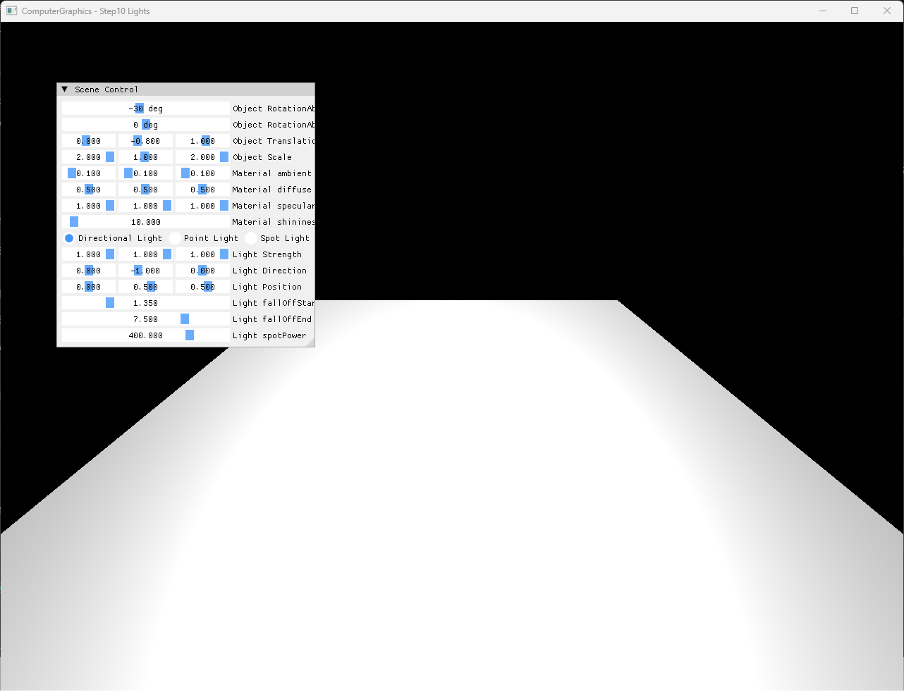
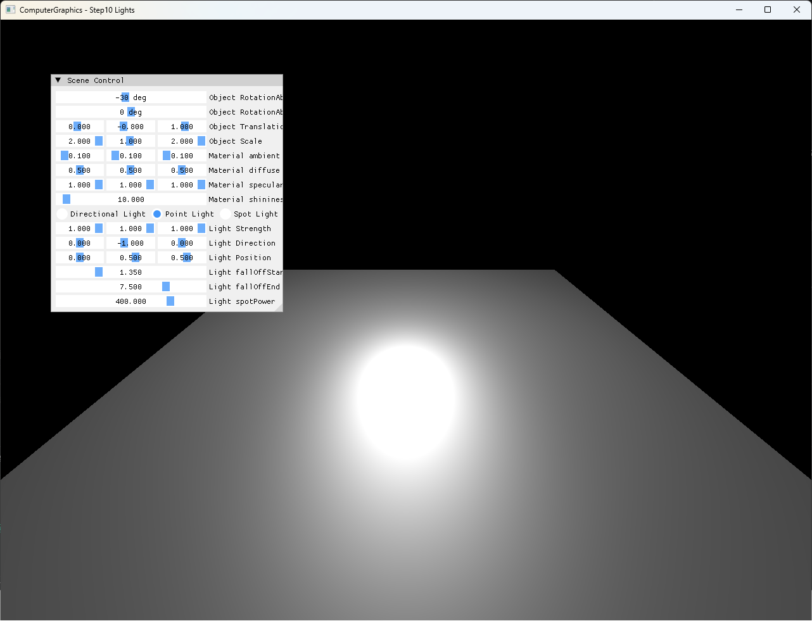
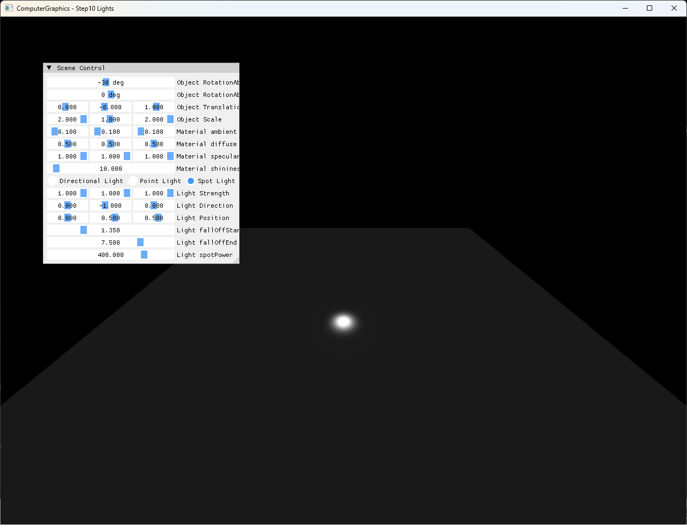

# Step10 Lights Demo

## 목적

Step10은 Step9의 CPU Blinn-Phong shading 경로에 Directional, Point와 Spot Light를 교체 적용한다. 같은 geometry, material, camera와 기본 Light parameter를 유지하고 Light type만 바꾸어 방향, 위치, 거리 감쇠와 cone factor가 결과에 만드는 차이를 확인한다.

## 책임 범위

- 세 Light type이 공통 CPU Blinn-Phong 경로에 전달하는 Light vector와 strength 차이를 설명한다.
- Point·Spot의 distance attenuation과 Spot cone factor를 설명한다.
- Perspective-correct world position·normal이 per-pixel lighting 입력으로 사용되는 흐름을 연결한다.
- CPU shading과 DirectX11 presentation 책임을 구분한다.
- 일반적인 Light type 이론은 [Light Types](../../01_Topics/LightingAndShading/LightTypes.md)로 위임한다.
- Phong과 Blinn-Phong의 일반 이론은 [Phong And Blinn-Phong](../../01_Topics/LightingAndShading/PhongAndBlinnPhong.md)으로 위임한다.
- build/run/capture 사실은 [Verification Index](../../02_Verification/Part2_Chapter04/verification-index.md)로 위임한다.

## 결과 미리보기

### Directional Light

평행한 surface-to-light 방향과 거리 감쇠가 없는 strength를 사용해 넓은 face에 균일한 방향성 명암을 만든다.

### Point Light

`(0, 0.5, 0.5)`의 Light position을 중심으로 입사 방향과 distance attenuation이 달라져 넓은 radial highlight가 나타난다.

### Spot Light

Point Light의 거리 감쇠에 `spotPower=400` cone factor를 곱해 중심의 작은 영역에 Light contribution을 집중한다.

## 입력과 출력

| 구분 | 내용 |
| --- | --- |
| Geometry 입력 | Face별 vertex와 normal을 가진 box, non-uniform scale `(2, 1, 2)` |
| Material 입력 | Ambient `(0.1, 0.1, 0.1)`, diffuse `(0.5, 0.5, 0.5)`, specular `(1, 1, 1)`, shininess `10` |
| 공통 Light 입력 | Strength `(1, 1, 1)`, direction `(0, -1, 0)`, position `(0, 0.5, 0.5)` |
| 감쇠 입력 | `fallOffStart=1.35`, `fallOffEnd=7.5`, `spotPower=400` |
| CPU 출력 | Light type별 Blinn-Phong color를 반영한 RGBA32F framebuffer |
| 화면 출력 | CPU framebuffer texture와 Scene Control을 합성한 DirectX11 window |

## 구현 흐름

1. ImGui에서 Directional, Point 또는 Spot Light type과 공통 parameter를 선택한다.
2. CPU vertex stage에서 position과 normal을 변환한다.
3. Rasterizer가 perspective-correct barycentric weight로 world position과 normal을 보간한다.
4. CPU pixel stage가 `lightType`에 따라 surface-to-light vector와 Light strength를 계산한다.
5. 공통 Blinn-Phong 함수가 ambient, diffuse와 specular를 합성한다.
6. Depth test를 통과한 color를 CPU framebuffer에 기록한다.
7. Dynamic texture upload와 full-screen quad로 CPU 결과를 표시한다.

## 핵심 구현

### Common Blinn-Phong Path

세 Light 함수는 서로 다른 Light vector와 strength를 계산한 뒤 같은 Blinn-Phong 함수로 전달한다. Diffuse는 `N·L`, specular는 normal과 halfway vector의 내적을 shininess만큼 거듭제곱하며 material ambient는 공통으로 더한다.

- [공통 Blinn-Phong 합성](../../../Part2_Chapter04/04_Rasterization_Step10_Lights/MyShader.h#L31-L39)
- [Light type별 CPU pixel stage 분기](../../../Part2_Chapter04/04_Rasterization_Step10_Lights/MyShader.h#L138-L154)

### Directional Light

저장된 `direction`은 Light가 진행하는 방향이다. Directional 경로는 그 반대 방향을 surface-to-light vector로 사용하고 거리와 world position에 관계없는 공통 strength를 적용한다.

- [Directional Light vector와 strength](../../../Part2_Chapter04/04_Rasterization_Step10_Lights/MyShader.h#L42-L49)

### Point Light And Distance Attenuation

Point 경로는 Light position에서 fragment까지의 거리를 구한다. `fallOffEnd` 밖의 fragment를 제외하고 구간 안에서는 `(fallOffEnd - distance) / (fallOffEnd - fallOffStart)`를 0~1로 제한해 strength에 곱한다.

- [선형 distance attenuation](../../../Part2_Chapter04/04_Rasterization_Step10_Lights/MyShader.h#L51-L57)
- [Point Light 방향과 감쇠](../../../Part2_Chapter04/04_Rasterization_Step10_Lights/MyShader.h#L59-L77)

### Spot Light And Cone Factor

Spot 경로는 Point와 같은 거리 감쇠를 계산한 뒤 light-to-surface 방향과 저장된 Light direction의 내적에 `spotPower`를 적용한다. 기본값 400은 중심 정렬도가 높은 작은 영역만 유지해 Point 결과와 명확히 구분되는 집중된 highlight를 만든다.

- [Spot Light 거리와 방향 감쇠](../../../Part2_Chapter04/04_Rasterization_Step10_Lights/MyShader.h#L79-L102)
- [기본 Light parameter](../../../Part2_Chapter04/04_Rasterization_Step10_Lights/Mesh.h#L27-L34)

### Perspective-Correct Lighting Inputs

Rasterizer는 projected triangle의 reciprocal-depth weight로 world position과 normal을 보간하고 normal을 다시 정규화한다. 이 position은 Point·Spot Light vector와 거리를 fragment마다 계산하는 입력이 된다.

- [Perspective-correct position·normal 보간](../../../Part2_Chapter04/04_Rasterization_Step10_Lights/Rasterization.cpp#L106-L128)
- [CPU shading constants 설정](../../../Part2_Chapter04/04_Rasterization_Step10_Lights/Rasterization.cpp#L130-L147)

### Runtime Light Controls

Scene Control은 Light type, strength, direction, position, falloff와 spot power를 조정한다. 세 capture는 geometry와 material을 고정하고 Directional·Point·Spot 선택만 바꾼 기본 상태를 사용한다.

- [Light type과 parameter control](../../../Part2_Chapter04/04_Rasterization_Step10_Lights/main.cpp#L97-L136)

### CPU Framebuffer Presentation

Transform, rasterization, interpolation과 lighting은 C++ CPU 경로에서 수행한다. DirectX11 HLSL은 CPU RGBA32F framebuffer texture를 full-screen quad에 표시하며 Light 계산을 수행하지 않는다.

- [CPU framebuffer와 dynamic texture upload](../../../Part2_Chapter04/04_Rasterization_Step10_Lights/Example.cpp#L10-L21)
- [Full-screen presentation draw](../../../Part2_Chapter04/04_Rasterization_Step10_Lights/Example.cpp#L217-L236)
- [Presentation vertex shader](../../../Part2_Chapter04/04_Rasterization_Step10_Lights/VertexShader.hlsl#L11-L18)
- [Presentation pixel shader](../../../Part2_Chapter04/04_Rasterization_Step10_Lights/PixelShader.hlsl#L9-L11)

## 시각 결과

Directional은 전체 face에 같은 입사 방향을 적용해 넓고 균일한 밝기 분포를 보인다. Point는 Light position을 중심으로 넓은 radial highlight를 만들며 surface position에 따른 방향과 거리 차이가 동시에 드러난다. Spot은 같은 위치와 distance attenuation을 유지하지만 높은 cone exponent로 중심부만 남겨 세 모델 중 가장 좁은 영향 범위를 보인다.

세 capture는 `position=(0, 0.5, 0.5)`, `fallOffStart=1.35`, `fallOffEnd=7.5`, `spotPower=400`을 공통으로 유지한다. 시간 변화보다 이산 상태 비교가 핵심이므로 video를 제외하고 같은 구도의 전체 창 screenshot을 사용한다.

## 구현 범위와 한계

- 한 개 Light만 선택하며 multiple light accumulation을 포함하지 않는다.
- 선형 distance attenuation은 inverse-square falloff를 구현하지 않는다.
- Spot은 inner·outer cone angle 대신 단일 power exponent를 사용한다.
- `fallOffStart == fallOffEnd` guard와 coincident Light/fragment position의 zero-distance guard가 없다.
- Point·Spot cutoff 밖에서도 material ambient 처리 방식 때문에 물리적으로 연속적인 경계가 아니다.
- Non-uniform scale에서 inverse-transpose normal transform을 사용하지 않는다.
- Near/far clipping, gamma correction과 tone mapping을 포함하지 않는다.
- Dynamic texture upload는 `Map()` 실패와 mapped `RowPitch` 차이를 별도로 처리하지 않는다.
- Shader file runtime load는 example working directory에 의존한다.

## 검증

- [Part2 Chapter04 Verification](../../02_Verification/Part2_Chapter04/verification-index.md)
- Debug x64 build/run: 성공, 2026-08-01 현재 확인
- Release x64 build/run: 성공, 2026-08-01 현재 확인
- Application title: `ComputerGraphics - Step10 Lights`
- Runtime shader compile: 성공
- Directional·Point·Spot screenshot: 각 1282×992, 기술·사용자 시각 검수 완료
- PNG sensitive metadata chunk: 없음
- Video: 제외, 세 이산 Light 상태는 screenshot으로 비교 가능

## 관련 코드

- [Light와 Material parameter](../../../Part2_Chapter04/04_Rasterization_Step10_Lights/Mesh.h#L20-L34)
- [Directional·Point·Spot Light 계산](../../../Part2_Chapter04/04_Rasterization_Step10_Lights/MyShader.h#L31-L102)
- [CPU vertex·pixel stage](../../../Part2_Chapter04/04_Rasterization_Step10_Lights/MyShader.h#L114-L154)
- [Position·normal 보간과 constants 설정](../../../Part2_Chapter04/04_Rasterization_Step10_Lights/Rasterization.cpp#L106-L147)
- [Runtime Light control](../../../Part2_Chapter04/04_Rasterization_Step10_Lights/main.cpp#L97-L136)
- [CPU framebuffer의 DirectX11 presentation](../../../Part2_Chapter04/04_Rasterization_Step10_Lights/Example.cpp#L217-L236)

## 관련 문서

- [Step10 Lights Example](../../../Part2_Chapter04/04_Rasterization_Step10_Lights/README.md)
- [Light Types](../../01_Topics/LightingAndShading/LightTypes.md)
- [Phong And Blinn-Phong](../../01_Topics/LightingAndShading/PhongAndBlinnPhong.md)
- [Verification Index](../../02_Verification/Part2_Chapter04/verification-index.md)
- [Demo Index](demo-index.md)
