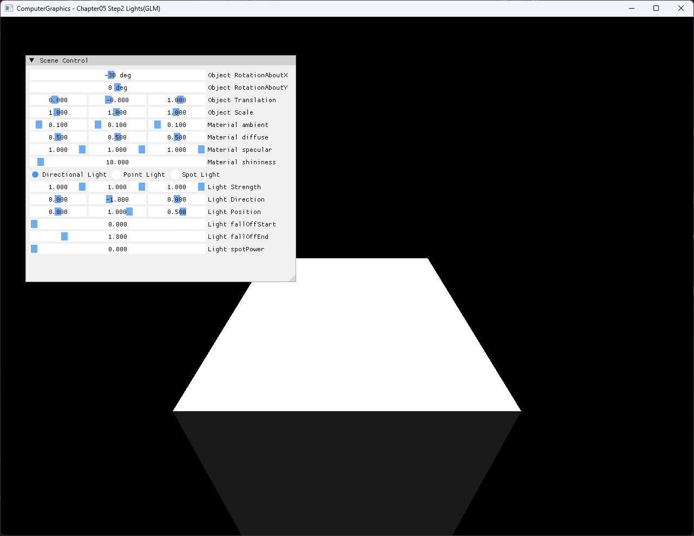

# Chapter05 Step2 Lights(GLM) Demo

## 목적

Step1에서 수치로 확인한 GLM affine transformation이 Step2의 object position, normal과 lighting 결과에 어떻게 연결되는지 보여준다. CPU rasterizer가 model·normal transform과 Blinn-Phong lighting을 처리하고 DirectX11이 그 결과를 표시하는 책임 경계를 함께 설명한다.

## 책임 범위

- Step2의 GLM model matrix와 inverse-transpose normal matrix 사용을 설명한다.
- Directional·Point·Spot Light와 CPU Blinn-Phong 처리 흐름을 설명한다.
- 기본 transform과 non-uniform scale 조정 결과를 비교한다.
- 일반 matrix 이론은 [Matrix And Affine Transformations](../../01_Topics/Rasterization/MatrixAndAffineTransformations.md)으로 위임한다.
- 일반 lighting 이론은 [Phong And Blinn-Phong](../../01_Topics/LightingAndShading/PhongAndBlinnPhong.md)과 [Light Types](../../01_Topics/LightingAndShading/LightTypes.md)로 위임한다.
- build/run/capture 사실은 [Verification Index](../../02_Verification/Part2_Chapter05-08/verification-index.md)로 위임한다.

## 결과 미리보기

### 기본 상태



### Non-Uniform Scale 조정


## 입력과 출력

| 구분 | 내용 |
| --- | --- |
| Geometry | Position과 normal을 가진 cube mesh |
| Transform | Translation, X·Y·Z rotation과 scale |
| Material | Ambient, diffuse, specular와 shininess |
| Light | Directional·Point·Spot 선택과 공통 parameter |
| 출력 | CPU `RGBA32F` pixel buffer와 D3D11 dynamic texture |
| 비교 상태 | 기본값과 `Rotation=(-25°, 35°)`, `Translation=(0.4, 0, 1)`, `Scale=(1.351, 0.65, 1)` |

## 구현 흐름

1. Object transform에서 scale, rotation과 translation matrix를 구성한다.
2. `T * Rz * Ry * Rx * S`를 position용 model matrix로 사용한다.
3. Model matrix의 inverse transpose를 normal matrix로 구성한다.
4. Position은 `w=1`, normal은 `w=0`으로 CPU vertex stage에서 변환한다.
5. Triangle coverage, depth와 perspective-correct interpolation을 처리한다.
6. 선택한 Light type에 따라 각 pixel의 Blinn-Phong 결과를 계산한다.
7. CPU pixel buffer를 D3D11 dynamic texture로 업로드해 full-screen quad에 표시한다.

## 핵심 구현

### Model And Normal Transform

Column-vector convention에서 오른쪽 matrix가 먼저 적용되므로 vertex는 scale, X·Y·Z rotation과 translation 순서로 변환된다. Non-uniform scale이 포함된 model matrix를 normal에 그대로 적용하면 surface와의 직교 관계가 깨질 수 있어 inverse transpose를 별도로 사용한다.

#### Transform 의사코드

```cpp
// Pseudo C++: model과 normal transform 구성
Matrix S = Scale(object.scale);
Matrix R = RotateZ(object.rz) * RotateY(object.ry) * RotateX(object.rx);
Matrix T = Translate(object.translation);

constants.model = T * R * S;
constants.normal = InverseTranspose(constants.model);

worldPosition = constants.model * Vector4(localPosition, 1);
worldNormal = Normalize(constants.normal * Vector4(localNormal, 0));
```

- [Model과 inverse-transpose normal matrix 구성](../../../Part2_Chapter05-08/05_AffineTransformations_Step2_Lights%28GLM%29/Rasterization.cpp#L140-L160)
- [Position `w=1`과 normal `w=0` 변환](../../../Part2_Chapter05-08/05_AffineTransformations_Step2_Lights%28GLM%29/MyShader.h#L90-L110)

### CPU Blinn-Phong Lighting

Directional Light는 동일한 surface-to-light 방향을 사용한다. Point Light는 pixel position에서 Light position으로 향하는 vector와 거리를 계산하고, Spot Light는 여기에 cone factor를 추가한다. 공통 Blinn-Phong 함수는 ambient, Lambert diffuse와 half-vector specular를 합성한다.

#### Lighting 의사코드

```cpp
// Pseudo C++: Light type별 strength와 Blinn-Phong 합성
Vector L = ResolveSurfaceToLight(lightType, light, position);
float diffuse = Max(Dot(L, normal), 0);
Vector strength = light.strength * diffuse;

if (lightType != Directional)
{
    strength *= LinearAttenuation(light, position);
}

if (lightType == Spot)
{
    strength *= SpotCone(light, L);
}

Vector H = Normalize(toEye + L);
Vector specular = material.specular * Pow(Max(Dot(H, normal), 0), shininess);
color = material.ambient + (material.diffuse + specular) * strength;
```

- [Blinn-Phong과 Directional Light 계산](../../../Part2_Chapter05-08/05_AffineTransformations_Step2_Lights%28GLM%29/MyShader.h#L17-L35)
- [Point·Spot attenuation과 cone 계산](../../../Part2_Chapter05-08/05_AffineTransformations_Step2_Lights%28GLM%29/MyShader.h#L41-L87)
- [Light type별 pixel shading 선택](../../../Part2_Chapter05-08/05_AffineTransformations_Step2_Lights%28GLM%29/MyShader.h#L117-L133)

### CPU Result Presentation

Geometry coverage, interpolation과 lighting은 CPU에서 끝난다. D3D11 경로는 완성된 `RGBA32F` pixel buffer를 dynamic texture로 복사하고 HLSL full-screen pass로 표시한다.

- [CPU rasterization과 pixel shading](../../../Part2_Chapter05-08/05_AffineTransformations_Step2_Lights%28GLM%29/Rasterization.cpp#L60-L138)
- [Dynamic texture upload](../../../Part2_Chapter05-08/05_AffineTransformations_Step2_Lights%28GLM%29/Example.cpp#L10-L21)

## 시각 결과

기본 상태는 X축 회전만 적용된 cube와 Directional Light 결과를 보여준다. 조정 상태는 Y축 회전과 X·Y 비균등 scale을 추가해 여러 face의 orientation과 밝기 차이를 동시에 드러낸다. 두 capture는 같은 창 크기와 Directional Light parameter를 유지하므로 transform 변경에 따른 silhouette와 면별 lighting 변화를 직접 비교할 수 있다.

Capture는 inverse-transpose 계산 자체를 증명하지 않는다. 해당 사실은 normal matrix 구성과 `w=0` 변환 코드로 확인하고, capture는 non-uniform scale 상태에서도 변환된 geometry와 lighting 결과가 정상 출력되는 실행 증거로 사용한다.

## 구현 범위와 한계

- 한 번에 하나의 Directional·Point·Spot Light만 처리한다.
- Ambient 항은 Light strength와 분리해 material ambient를 그대로 더한다.
- Point·Spot attenuation은 `fallOffStart`와 `fallOffEnd` 사이의 선형 모델이다.
- Shadow, multiple light accumulation, gamma correction과 tone mapping은 포함하지 않는다.
- HLSL은 CPU lighting을 재현하지 않고 texture presentation만 담당한다.
- Dynamic texture upload의 `RowPitch` 처리는 별도 portability 작업으로 둔다.

## 검증

- [Part2 Chapter05-08 Verification](../../02_Verification/Part2_Chapter05-08/verification-index.md)
- Debug x64 build/run: 성공, 2026-08-02 현재 확인
- Release x64 build/run: 성공, 2026-08-02 현재 확인
- Runtime shader load: 성공, project 폴더 CWD
- Capture: 기본·조정 전체 창 screenshot, `1282×992`
- Video: 정지 image 두 장으로 transform 차이를 설명할 수 있어 제외

## 관련 코드

- [Transform·material·light UI](../../../Part2_Chapter05-08/05_AffineTransformations_Step2_Lights%28GLM%29/main.cpp#L64-L131)
- [CPU rasterizer와 transform 상수](../../../Part2_Chapter05-08/05_AffineTransformations_Step2_Lights%28GLM%29/Rasterization.cpp#L60-L160)
- [CPU vertex·pixel shader](../../../Part2_Chapter05-08/05_AffineTransformations_Step2_Lights%28GLM%29/MyShader.h#L17-L133)
- [D3D11 texture presentation](../../../Part2_Chapter05-08/05_AffineTransformations_Step2_Lights%28GLM%29/Example.cpp#L10-L21)

## 관련 문서

- [Step2 Lights(GLM) Example](../../../Part2_Chapter05-08/05_AffineTransformations_Step2_Lights%28GLM%29/README.md)
- [Step1 Matrix(GLM) Demo](05_MatrixGLM.md)
- [Matrix And Affine Transformations Topic](../../01_Topics/Rasterization/MatrixAndAffineTransformations.md)
- [Phong And Blinn-Phong Topic](../../01_Topics/LightingAndShading/PhongAndBlinnPhong.md)
- [Light Types Topic](../../01_Topics/LightingAndShading/LightTypes.md)
- [Verification Index](../../02_Verification/Part2_Chapter05-08/verification-index.md)
- [Demo Index](demo-index.md)
