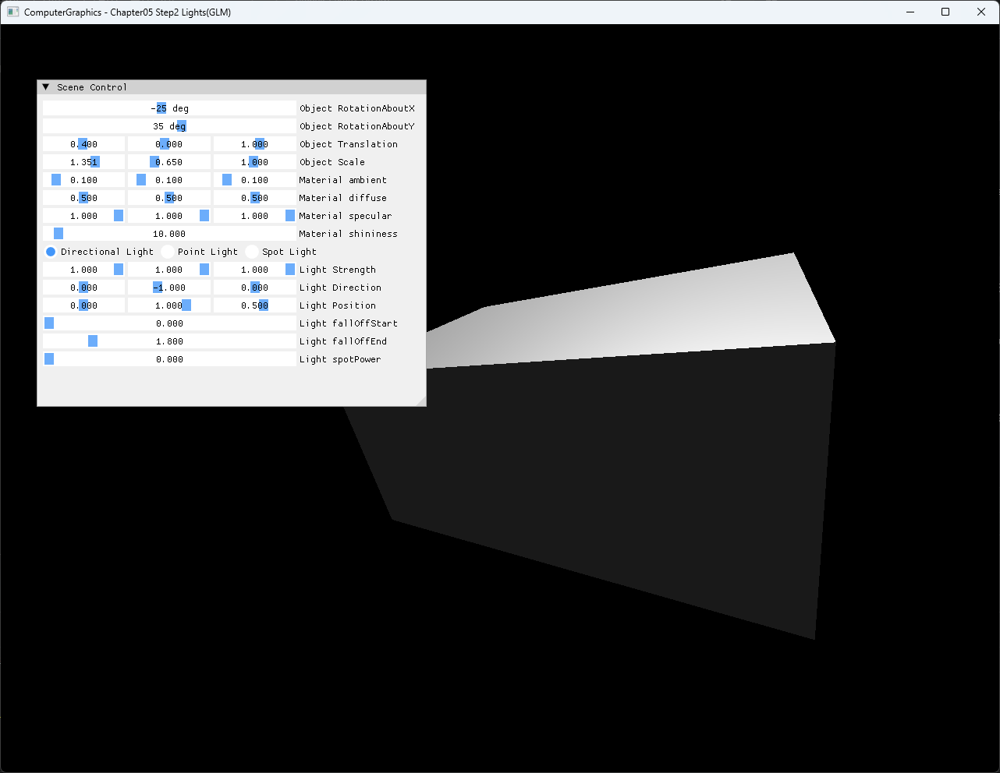
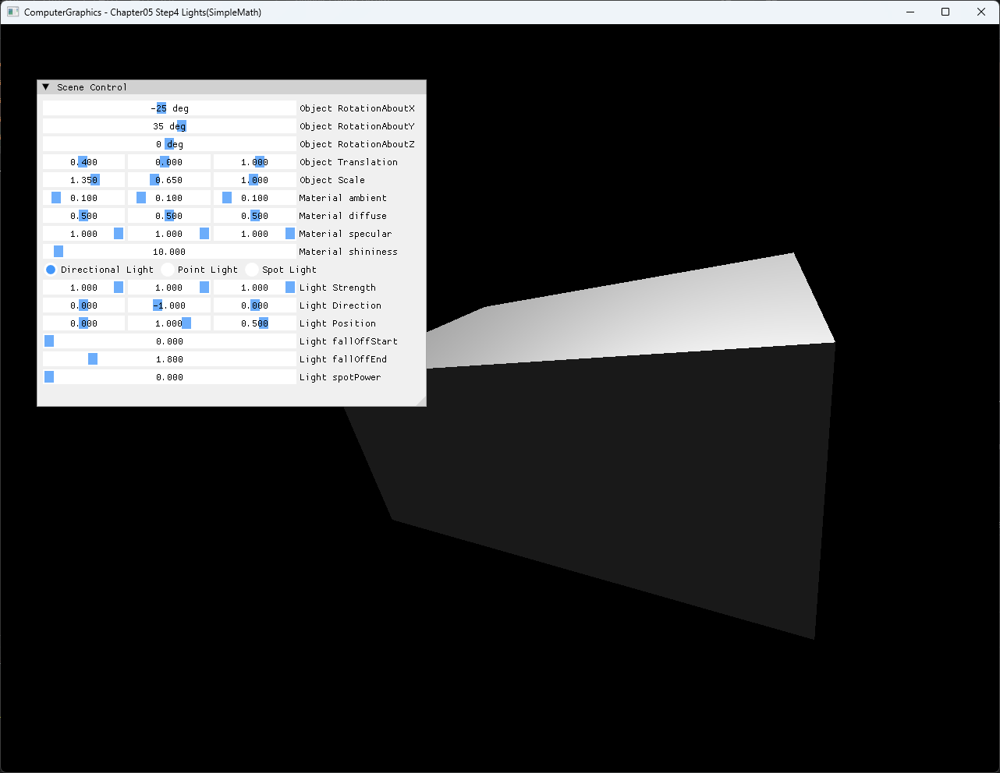

# Chapter05 Step4 Lights(SimpleMath) Demo

## 목적

Chapter05 Step1~4의 GLM → DirectXMath/SimpleMath 전환을 마무리한다. Step2 GLM과 같은 CPU rasterization·lighting 장면을 SimpleMath로 옮겼을 때 matrix 식은 달라져도 vertex에 적용되는 transform 순서와 시각 결과가 유지되는지 비교한다.

## 책임 범위

- GLM column-vector와 SimpleMath row-vector convention의 구현 차이를 설명한다.
- Step1의 matrix 기초, Step2의 GLM 적용과 Step3의 DirectXMath API 연결이 Step4에 어떻게 수렴하는지 설명한다.
- Step2와 같은 transform 의도를 적용한 실행 결과를 비교한다.
- SimpleMath model·normal transform과 CPU Blinn-Phong 연결을 설명한다.
- 일반 matrix 이론은 [Matrix And Affine Transformations](../../01_Topics/Rasterization/MatrixAndAffineTransformations.md)으로 위임한다.
- 일반 lighting 이론은 [Phong And Blinn-Phong](../../01_Topics/LightingAndShading/PhongAndBlinnPhong.md)과 [Light Types](../../01_Topics/LightingAndShading/LightTypes.md)로 위임한다.
- build/run/capture 사실은 [Verification Index](../../02_Verification/Part2_Chapter05-08/verification-index.md)로 위임한다.

## 결과 미리보기

### Step2 GLM 기준



### Step4 SimpleMath 대응



## 입력과 출력

| 구분 | 내용 |
| --- | --- |
| Geometry | Position과 normal을 가진 동일한 cube mesh |
| Step2 convention | GLM column-vector, `T * Rz * Ry * Rx * S` |
| Step4 convention | SimpleMath row-vector, `S * Rx * Ry * Rz * T` |
| 비교 transform | `Rotation=(-25°, 35°, 0°)`, `Translation=(0.4, 0, 1)`, `Scale≈(1.35, 0.65, 1)` |
| Material·Light | 같은 Directional Light와 Blinn-Phong parameter 의도 |
| 출력 | CPU `RGBA32F` pixel buffer와 D3D11 dynamic texture |

## 구현 흐름

1. SimpleMath scale, X·Y·Z rotation과 translation matrix를 구성한다.
2. Row-vector convention에 맞춰 `S * Rx * Ry * Rz * T`를 model matrix로 사용한다.
3. Translation을 제거한 선형 transform의 inverse transpose를 normal matrix로 구성한다.
4. Position은 `w=1`, normal은 `w=0`으로 변환하고 normal을 정규화한다.
5. Triangle coverage, depth와 perspective-correct interpolation을 처리한다.
6. 보간 normal을 다시 정규화하고 선택한 Light type의 Blinn-Phong 결과를 계산한다.
7. CPU pixel buffer를 D3D11 dynamic texture로 업로드해 full-screen quad에 표시한다.

## 핵심 구현

### SimpleMath Transform Convention

GLM Step2와 SimpleMath Step4는 vector가 matrix의 어느 쪽에 놓이는지가 다르다. 따라서 같은 transform 적용 순서를 유지하려면 matrix multiplication 표기를 반대로 구성한다.

#### Transform 의사코드

```cpp
// Pseudo C++: SimpleMath row-vector convention
Matrix S = Scale(object.scale);
Matrix R = RotateX(object.rx) * RotateY(object.ry) * RotateZ(object.rz);
Matrix T = Translate(object.translation);

constants.model = S * R * T;
constants.normal = Transpose(Inverse(RemoveTranslation(constants.model)));

worldPosition = Vector4(localPosition, 1) * constants.model;
worldNormal = Normalize(Vector4(localNormal, 0) * constants.normal);
```

- [SimpleMath model과 inverse-transpose normal matrix 구성](../../../Part2_Chapter05-08/05_AffineTransformations_Step4_Lights%28SimpleMath%29/Rasterization.cpp#L157-L175)
- [Position과 normal의 SimpleMath transform](../../../Part2_Chapter05-08/05_AffineTransformations_Step4_Lights%28SimpleMath%29/MyShader.h#L104-L123)

### CPU Rasterization And Lighting

Triangle area가 0인 degenerate primitive는 barycentric division 전에 제외한다. Perspective-correct weight로 position과 normal을 보간하고, 보간된 normal을 정규화한 뒤 Directional·Point·Spot Light 중 선택한 경로로 전달한다.

#### Rasterization 의사코드

```cpp
// Pseudo C++: coverage, interpolation과 lighting
float area = Edge(v0, v1, v2);
if (area == 0 || IsCulled(area))
{
    return;
}

Weights w = PerspectiveCorrect(Barycentric(point));
if (Inside(w) && IsCloser(InterpolateDepth(w)))
{
    Vector normal = Normalize(InterpolateNormal(w));
    pixel = Shade(selectedLightType, position, normal, material);
}
```

- [Degenerate guard와 triangle coverage](../../../Part2_Chapter05-08/05_AffineTransformations_Step4_Lights%28SimpleMath%29/Rasterization.cpp#L59-L103)
- [Perspective-correct 보간과 normal 정규화](../../../Part2_Chapter05-08/05_AffineTransformations_Step4_Lights%28SimpleMath%29/Rasterization.cpp#L104-L146)
- [Directional·Point·Spot Light 계산](../../../Part2_Chapter05-08/05_AffineTransformations_Step4_Lights%28SimpleMath%29/MyShader.h#L21-L88)
- [Light type별 pixel shading](../../../Part2_Chapter05-08/05_AffineTransformations_Step4_Lights%28SimpleMath%29/MyShader.h#L130-L149)

### CPU Result Presentation

Geometry coverage, interpolation과 lighting은 CPU에서 끝난다. D3D11 경로는 완성된 pixel buffer를 dynamic texture로 복사하고 HLSL full-screen pass로 표시한다.

- [CPU render와 dynamic texture upload](../../../Part2_Chapter05-08/05_AffineTransformations_Step4_Lights%28SimpleMath%29/Example.cpp#L17-L24)
- [Full-screen texture draw](../../../Part2_Chapter05-08/05_AffineTransformations_Step4_Lights%28SimpleMath%29/Example.cpp#L250-L270)

## 시각 결과

Step1은 GLM matrix 연산을 수치로 확인하고 Step2는 그 연산을 graphics 결과로 연결한다. Step3은 DirectXMath 연산형·저장형과 SimpleMath wrapper로 전환하는 API bridge이며, Step4는 Step2와 같은 cube와 transform 적용 순서를 SimpleMath로 다시 구성한다.

Step4 대응 capture는 Y rotation과 non-uniform scale로 여러 face의 orientation과 밝기 차이를 드러내며, SimpleMath로 옮긴 뒤에도 silhouette와 Directional Light 결과가 같은 의도로 유지되는지 보여준다. 이는 서로 다른 convention이 같은 표현이라는 뜻이 아니라, 각 convention에 맞게 식을 구성하면 동등한 affine transform을 만들 수 있다는 의미다.

Capture는 convention 변환과 inverse-transpose 계산을 단독으로 증명하지 않는다. Matrix composition과 normal 변환은 코드 근거로 확인하고, capture는 그 구현이 실제 실행 결과로 이어졌다는 증거로 사용한다.

## 구현 범위와 한계

- 한 번에 하나의 Directional·Point·Spot Light만 처리한다.
- Ambient 항은 Light strength와 분리해 material ambient를 그대로 더한다.
- Point·Spot attenuation은 선형 모델이다.
- Shadow, multiple light accumulation, gamma correction과 tone mapping은 포함하지 않는다.
- HLSL은 CPU lighting을 재현하지 않고 texture presentation만 담당한다.
- Dynamic texture upload의 `RowPitch` 처리는 별도 portability 작업으로 둔다.

## 검증

- [Part2 Chapter05-08 Verification](../../02_Verification/Part2_Chapter05-08/verification-index.md)
- Debug x64 build/run: 성공, 2026-08-02 현재 확인
- Release x64 build/run: 성공, 2026-08-02 현재 확인
- Runtime shader load: 성공, project 폴더 CWD
- Capture: 전체 창 screenshot, `1282×992`, 사용자 시각 확인 완료
- Video: 정적 GLM·SimpleMath 비교로 convention 차이를 설명할 수 있어 제외

## 관련 코드

- [Transform·material·light UI](../../../Part2_Chapter05-08/05_AffineTransformations_Step4_Lights%28SimpleMath%29/main.cpp#L65-L151)
- [CPU rasterizer와 SimpleMath transform](../../../Part2_Chapter05-08/05_AffineTransformations_Step4_Lights%28SimpleMath%29/Rasterization.cpp#L59-L180)
- [CPU vertex·pixel shader](../../../Part2_Chapter05-08/05_AffineTransformations_Step4_Lights%28SimpleMath%29/MyShader.h#L21-L149)
- [D3D11 texture presentation](../../../Part2_Chapter05-08/05_AffineTransformations_Step4_Lights%28SimpleMath%29/Example.cpp#L17-L24)

## 관련 문서

- [Step4 Lights(SimpleMath) Example](../../../Part2_Chapter05-08/05_AffineTransformations_Step4_Lights%28SimpleMath%29/README.md)
- [Step2 Lights(GLM) Demo](05_LightsGLM.md)
- [Step3 DirectXMath Demo](05_DirectXMath.md)
- [Step1 Matrix(GLM) Demo](05_MatrixGLM.md)
- [Matrix And Affine Transformations Topic](../../01_Topics/Rasterization/MatrixAndAffineTransformations.md)
- [Phong And Blinn-Phong Topic](../../01_Topics/LightingAndShading/PhongAndBlinnPhong.md)
- [Light Types Topic](../../01_Topics/LightingAndShading/LightTypes.md)
- [Verification Index](../../02_Verification/Part2_Chapter05-08/verification-index.md)
- [Demo Index](demo-index.md)
