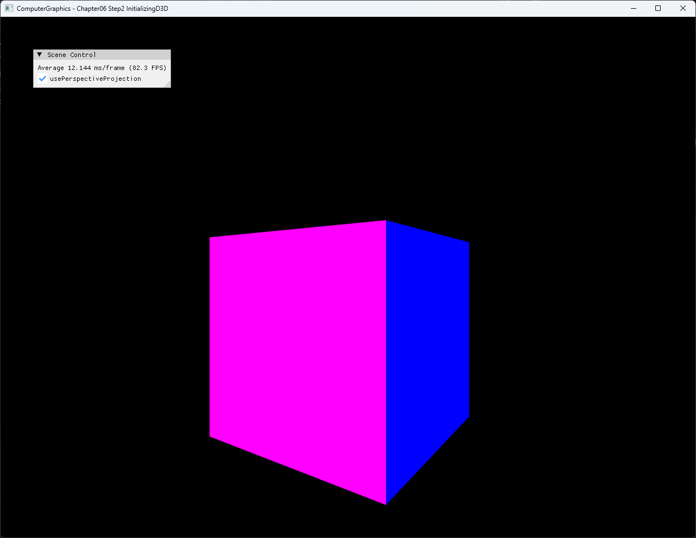

# Chapter06 Step2 InitializingD3D Demo

## 목적

Step2는 Win32 window에 D3D11 presentation resource와 최소 shader pipeline을 연결해 indexed color cube를 매 frame 그린다. Step1에서 분리한 device·context ownership이 swap chain, render target, depth buffer, viewport, buffer·shader binding과 `Present()`로 이어지는 첫 graphics frame을 보여준다.

## 책임 범위

- Window와 D3D11 device resource의 초기화 순서를 설명한다.
- Swap chain back buffer, render target과 depth resource의 연결을 설명한다.
- Cube geometry, 고정 MVP constant buffer와 shader binding이 draw call로 이어지는 흐름을 설명한다.
- 일반 device·context 역할은 [Device And Context](../../01_Topics/DirectX11Pipeline/DeviceAndContext.md)로 위임한다.
- Swap chain, view와 viewport 관계는 [Swap Chain And Viewport](../../01_Topics/DirectX11Pipeline/SwapChainAndViewport.md)로 위임한다.
- build/run/capture 사실은 [Verification Index](../../02_Verification/Part2_Chapter05-08/verification-index.md)로 위임한다.

## 결과 미리보기

기본 perspective 상태의 전체 application window에서 다색 cube의 두 면과 모서리, Scene Control과 application title을 확인한다.



## 입력과 출력

| 구분 | 내용 |
| --- | --- |
| 입력 | Cube vertex·index, face color, 고정 camera·projection parameter |
| 초기화 | Win32 window, device·context, swap chain, render target, depth resource와 viewport |
| 처리 | Y축 model 회전, MVP constant buffer 갱신, indexed triangle draw |
| 출력 | 기본 perspective에서 회전하는 다색 cube와 Scene Control |

## 구현 흐름

1. Win32 window를 만들고 client size를 기준으로 graphics resource 조건을 정한다.
2. Hardware device와 immediate context를 생성하고 지원 MSAA quality를 확인한다.
3. Swap chain을 생성한 뒤 back buffer에서 render target view를 만든다.
4. Viewport, rasterizer state, depth texture·view·state를 준비한다.
5. ImGui backend와 cube vertex·index·constant buffer, shader와 input layout을 초기화한다.
6. 매 frame model rotation과 고정 view·projection을 constant buffer에 기록한다.
7. Render target과 depth buffer를 clear하고 pipeline resource를 binding한다.
8. `DrawIndexed()`로 cube를 그리고 ImGui를 합성한 뒤 `Present()`로 표시한다.

## 핵심 구현

### Device Resource Initialization

Window 생성 이후 device와 context를 준비하고 같은 device 조건으로 swap chain을 연결한다. Back buffer는 render target view로, 별도 depth texture는 depth-stencil view로 해석하며 viewport는 고정 client area 전체를 사용한다.

#### 초기화 의사코드

```cpp
// Pseudo C++: window와 D3D11 frame resource 초기화
if (!CreateApplicationWindow())
{
    return Failure;
}

if (!CreateDeviceAndContext())
{
    return Failure;
}

CreateSwapChain();
CreateBackBufferView();
CreateViewportAndRasterizer();
CreateDepthResources();
InitializeGuiBackend();
```

- [Application 초기화 순서](../../../Part2_Chapter05-08/06_GraphicsPipeline_Step2_InitializingD3D/AppBase.cpp#L97-L108)
- [Device와 feature level 선택](../../../Part2_Chapter05-08/06_GraphicsPipeline_Step2_InitializingD3D/AppBase.cpp#L198-L247)
- [Swap chain과 render target view](../../../Part2_Chapter05-08/06_GraphicsPipeline_Step2_InitializingD3D/AppBase.cpp#L253-L317)
- [Viewport와 depth resource](../../../Part2_Chapter05-08/06_GraphicsPipeline_Step2_InitializingD3D/AppBase.cpp#L320-L382)

### Scene Resource And MVP Update

Cube는 position과 face color를 분리한 indexed geometry다. Model matrix는 frame delta를 누적한 Y축 회전과 고정 scale·translation을 합성하고, 고정 view와 선택한 projection을 함께 constant buffer에 저장한다.

#### Scene update 의사코드

```cpp
// Pseudo C++: cube MVP 갱신
rotation += deltaTime;

Matrix model = Scale * RotateY(rotation) * Translate;
Matrix view = LookAt(FixedEye, FixedTarget, Up);
Matrix projection = usePerspective
    ? Perspective(Fov, Aspect, Near, Far)
    : Orthographic(Aspect, Near, Far);

UpdateConstantBuffer(model, view, projection);
```

- [Cube geometry와 GPU resource 구성](../../../Part2_Chapter05-08/06_GraphicsPipeline_Step2_InitializingD3D/ExampleApp.cpp#L10-L170)
- [고정 MVP와 projection 선택](../../../Part2_Chapter05-08/06_GraphicsPipeline_Step2_InitializingD3D/ExampleApp.cpp#L173-L204)

### Pipeline Binding And Presentation

Scene frame은 render target과 depth buffer를 clear한 뒤 viewport, output-merger resource, shader, constant buffer, vertex/index buffer와 topology를 binding한다. Indexed draw 이후 ImGui draw data를 같은 frame에 합성하고 swap chain을 present한다.

#### Frame 의사코드

```cpp
// Pseudo C++: scene draw와 presentation
BeginGuiFrame();
UpdateScene(deltaTime);

ClearColorAndDepth();
BindPipelineResources();
DrawIndexed(cubeIndexCount);

RenderGui();
PresentWithVSync();
```

- [Scene pipeline binding과 indexed draw](../../../Part2_Chapter05-08/06_GraphicsPipeline_Step2_InitializingD3D/ExampleApp.cpp#L206-L245)
- [Frame loop, ImGui 합성과 Present](../../../Part2_Chapter05-08/06_GraphicsPipeline_Step2_InitializingD3D/AppBase.cpp#L58-L95)

## 시각 결과

다색 cube의 두 면과 모서리가 함께 보이는 frame은 vertex/index buffer, MVP transform, rasterization과 color shader가 하나의 draw path로 연결됐음을 보여준다. Scene Control은 기본 perspective 상태를 확인하는 보조 정보로 사용한다. 회전 자체와 orthographic 전환은 이 초기화 단계의 핵심 비교 대상이 아니므로 video와 조정 screenshot은 제외한다.

## 구현 범위와 한계

- Device를 먼저 만들고 `D3D11CreateDeviceAndSwapChain()`에서 다시 생성해 초기화 책임이 중복된다.
- Back buffer raw pointer만 수동 `Release()`해 Step1의 일관된 `ComPtr` 사용과 차이가 있다.
- Window resize message에서 swap chain buffer, render target과 depth resource를 재생성하지 않는다.
- Shader compile이 project 폴더 CWD의 상대 파일명에 의존한다.
- Shader compile과 일부 resource 생성 실패 경로가 충분히 강제되지 않는다.
- Perspective·orthographic parameter 비교와 camera 조작은 Step3으로 위임한다.
- Debug/Release x64만 현재 검증하며 Win32 configuration은 다루지 않는다.

## 검증

- [Part2 Chapter05-08 Verification](../../02_Verification/Part2_Chapter05-08/verification-index.md)
- Debug x64 build/run: 성공, 2026-08-02 현재 확인, project 폴더 CWD, exit code 0
- Release x64 build/run: 성공, 2026-08-02 현재 확인, project 폴더 CWD, exit code 0
- Application title: `ComputerGraphics - Chapter06 Step2 InitializingD3D`
- Capture: 확보, PNG 1282×992, 자동 기술 검수와 사용자 시각 확인 완료

## 관련 코드

- [Application resource 초기화](../../../Part2_Chapter05-08/06_GraphicsPipeline_Step2_InitializingD3D/AppBase.cpp#L97-L108)
- [Swap chain·render target·depth 초기화](../../../Part2_Chapter05-08/06_GraphicsPipeline_Step2_InitializingD3D/AppBase.cpp#L253-L382)
- [Cube resource와 MVP 갱신](../../../Part2_Chapter05-08/06_GraphicsPipeline_Step2_InitializingD3D/ExampleApp.cpp#L10-L204)
- [Pipeline binding과 indexed draw](../../../Part2_Chapter05-08/06_GraphicsPipeline_Step2_InitializingD3D/ExampleApp.cpp#L206-L245)

## 관련 문서

- [Chapter06 Step2 InitializingD3D Example](../../../Part2_Chapter05-08/06_GraphicsPipeline_Step2_InitializingD3D/README.md)
- [이전 단계: Chapter06 Step1 COM Demo](06_COM.md)
- [Device And Context Topic](../../01_Topics/DirectX11Pipeline/DeviceAndContext.md)
- [Swap Chain And Viewport Topic](../../01_Topics/DirectX11Pipeline/SwapChainAndViewport.md)
- [Verification Index](../../02_Verification/Part2_Chapter05-08/verification-index.md)
- [Demo Index](demo-index.md)
