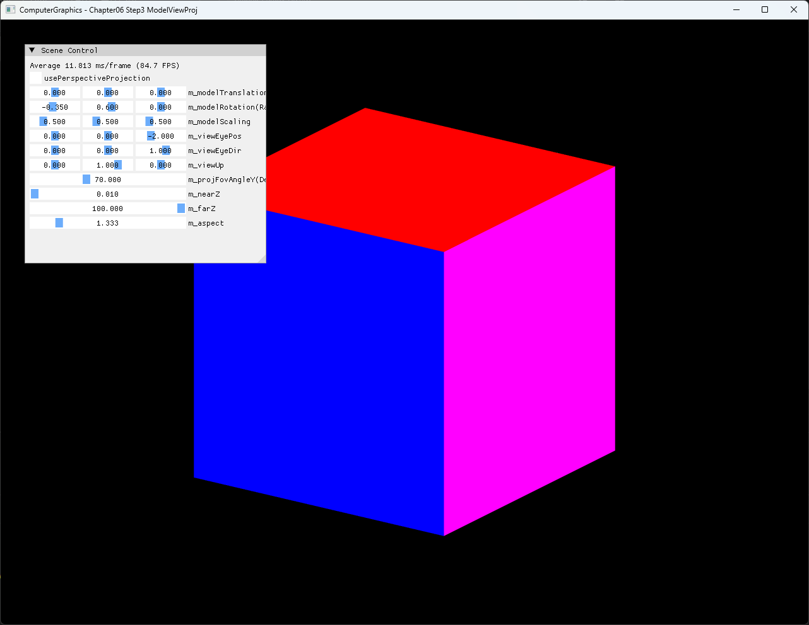

# Chapter06 Step3 ModelViewProj Demo

## 목적

Step3는 Step2의 고정 MVP에서 벗어나 Model transform, camera 기준과 projection parameter를 UI로 분리한다. 같은 cube와 draw pipeline을 유지한 채 각 matrix가 화면 결과에 미치는 영향을 직접 비교한다.

## 책임 범위

- Step2 대비 추가된 Model·View·Projection parameter와 매 frame 갱신 경로를 설명한다.
- SimpleMath와 DirectXMath로 matrix를 구성하고 HLSL constant buffer에 전달하는 선택을 설명한다.
- 동일한 Model·View에서 perspective와 orthographic projection의 결과 차이를 비교한다.
- 일반적인 matrix·affine transform 이론은 [Matrix And Affine Transformations](../../01_Topics/Rasterization/MatrixAndAffineTransformations.md)로 위임한다.
- projection 원리는 [Perspective Projection](../../01_Topics/Rasterization/PerspectiveProjection.md)으로 위임한다.
- D3D11 resource 초기화는 [Step2 InitializingD3D Demo](06_InitializingD3D.md)로 위임한다.
- build/run/capture 사실은 [Verification Index](../../02_Verification/Part2_Chapter05-08/verification-index.md)로 위임한다.

## 결과 미리보기

Perspective와 orthographic은 같은 Model rotation과 View를 사용한다. Projection 방식만 바꾼 전체 application window screenshot 2장을 세로로 비교한다.

### Perspective


### Orthographic



## 입력과 출력

| 구분 | 내용 |
| --- | --- |
| 입력 | Cube vertex·index, Model translation·rotation·scale, View eye·direction·up, FOV·near·far·aspect |
| 처리 | Model·View·Projection 구성, transpose, dynamic constant buffer 갱신, vertex shader transform |
| 비교 | 동일한 Model·View에서 perspective와 orthographic projection 전환 |
| 출력 | UI parameter에 따라 위치·방향·크기와 원근감이 바뀌는 indexed color cube |

## 구현 흐름

1. Step2와 같은 indexed cube, shader와 D3D11 frame resource를 준비한다.
2. ImGui에서 Model·View·Projection parameter를 입력받는다.
3. Model matrix를 scale, rotation과 translation 순서로 합성한다.
4. Eye position, direction과 up vector로 left-handed View matrix를 만든다.
5. Checkbox에 따라 perspective 또는 orthographic Projection matrix를 만든다.
6. 세 matrix를 transpose해 dynamic constant buffer에 기록한다.
7. Vertex shader의 `b0`에 constant buffer를 연결하고 indexed cube를 그린다.

## 핵심 구현

### Model Transform

Model parameter는 object local coordinate를 scene에 배치한다. 현재 구현은 SimpleMath row-vector convention에서 scale, Y·X·Z rotation과 translation을 합성하고 HLSL 전달 전에 transpose한다.

#### Model matrix 의사코드

```cpp
// Pseudo C++: UI parameter 기반 Model matrix
Matrix model = Scale(modelScale)
    * RotateY(modelRotation.y)
    * RotateX(modelRotation.x)
    * RotateZ(modelRotation.z)
    * Translate(modelTranslation);

constantBuffer.model = Transpose(model);
```

- [Model transform 합성과 transpose](../../../Part2_Chapter05-08/06_GraphicsPipeline_Step3_ModelViewProj/ExampleApp.cpp#L172-L181)
- [Model parameter 기본값](../../../Part2_Chapter05-08/06_GraphicsPipeline_Step3_ModelViewProj/ExampleApp.h#L48-L53)

### View And Projection

View는 eye position에서 direction을 바라보는 left-handed camera basis를 만든다. Projection은 같은 camera와 object를 유지하면서 FOV 기반 perspective 또는 off-center orthographic matrix를 선택한다.

#### View·Projection 의사코드

```cpp
// Pseudo C++: camera와 projection 선택
Matrix view = LookToLH(eyePosition, eyeDirection, upDirection);

Matrix projection = usePerspective
    ? PerspectiveFovLH(fovY, aspect, nearZ, farZ)
    : OrthographicOffCenterLH(-aspect, aspect, -1, 1, nearZ, farZ);

constantBuffer.view = Transpose(view);
constantBuffer.projection = Transpose(projection);
```

- [View matrix 구성](../../../Part2_Chapter05-08/06_GraphicsPipeline_Step3_ModelViewProj/ExampleApp.cpp#L183-L186)
- [Perspective·orthographic projection 선택](../../../Part2_Chapter05-08/06_GraphicsPipeline_Step3_ModelViewProj/ExampleApp.cpp#L188-L197)
- [View·Projection parameter 기본값](../../../Part2_Chapter05-08/06_GraphicsPipeline_Step3_ModelViewProj/ExampleApp.h#L54-L60)

### Constant Buffer And Shader Transform

매 frame 갱신한 세 matrix는 dynamic constant buffer에 복사해 vertex shader `b0`에 연결한다. Shader는 local position에 Model, View, Projection을 순서대로 적용하고 clip-space position을 출력한다.

#### MVP 전달 의사코드

```cpp
// Pseudo C++: CPU MVP 갱신과 vertex shader 사용
UpdateDynamicBuffer(mvpData);
BindVertexConstantBuffer(slot0, mvpBuffer);

output.position = input.position;
output.position = Mul(model, output.position);
output.position = Mul(view, output.position);
output.position = Mul(projection, output.position);
```

- [Dynamic constant buffer 갱신](../../../Part2_Chapter05-08/06_GraphicsPipeline_Step3_ModelViewProj/AppBase.h#L100-L105)
- [Vertex shader constant buffer binding](../../../Part2_Chapter05-08/06_GraphicsPipeline_Step3_ModelViewProj/ExampleApp.cpp#L225-L230)
- [HLSL Model·View·Projection transform](../../../Part2_Chapter05-08/06_GraphicsPipeline_Step3_ModelViewProj/ColorVertexShader.hlsl#L1-L31)

### Scene Control

UI는 Model transform, camera basis, FOV·near·far·aspect와 projection 방식을 분리한다. 진단 검증에서는 Model rotation, eye position, FOV, aspect와 projection checkbox가 각각 화면 결과에 반영됨을 확인했다.

- [Model·View·Projection UI](../../../Part2_Chapter05-08/06_GraphicsPipeline_Step3_ModelViewProj/ExampleApp.cpp#L244-L258)

## 시각 결과

Tracked screenshot은 Model rotation X `-0.35`, Y `0.60`, scale `0.5`, eye `(0, 0, -2)`, direction `(0, 0, 1)`을 공통으로 사용한다. Perspective에서는 거리에 따른 축소와 사선 수렴이 나타나고, orthographic에서는 depth와 무관한 일정한 투영 크기로 cube가 더 크게 보인다.

Local selected video는 Model rotation Y만 `0.000 → 0.785`로 바꾼다. 7.27초 동안 slider를 한 방향으로 연속 drag해 cube 회전을 보여주며 screenshot을 대체하지 않고 parameter 반응 검토 근거로 유지한다.

## 구현 범위와 한계

- Step2의 device resource와 draw pipeline을 다시 설명하지 않고 재사용한다.
- Matrix transpose는 CPU storage와 HLSL 해석을 연결하기 위한 구현 선택이며 coordinate handedness와 같은 개념이 아니다.
- View direction이 0에 가깝거나 up vector와 평행한 invalid camera 조합을 차단하지 않는다.
- Near·far 순서, FOV 극값과 aspect 유효성을 UI에서 강제하지 않는다.
- `farZ` 기본값 `100`과 slider 최대값 `10`이 달라 slider 조작 후 기본값 복원이 어렵다.
- Aspect는 실제 window client size와 자동 동기화되지 않는다.
- Runtime shader compile은 project 폴더 CWD에 의존한다.
- Screenshot 2장은 tracked capture로 유지하고 video는 Publication 단계 전까지 local-only로 유지한다.

## 검증

- [Part2 Chapter05-08 Verification](../../02_Verification/Part2_Chapter05-08/verification-index.md)
- Debug x64 build/run: 성공, 2026-08-02 현재 확인, project 폴더 CWD
- Release x64 build/run: 성공, 2026-08-02 현재 확인, project 폴더 CWD
- Application title: `ComputerGraphics - Chapter06 Step3 ModelViewProj`
- UI: Model·View·FOV·aspect와 projection 전환 반영 확인
- Screenshot: 1282×992 PNG 2장 기술 검사와 사용자 시각 확인 완료
- Video: H.264, 1282×992, 30 FPS, 7.27초, audio 없음, 전체 decode PASS, 사용자 확인 완료, local-only

## 관련 코드

- [MVP parameter와 constant data](../../../Part2_Chapter05-08/06_GraphicsPipeline_Step3_ModelViewProj/ExampleApp.h#L23-L60)
- [MVP 구성과 dynamic buffer 갱신](../../../Part2_Chapter05-08/06_GraphicsPipeline_Step3_ModelViewProj/ExampleApp.cpp#L172-L200)
- [Pipeline binding과 indexed draw](../../../Part2_Chapter05-08/06_GraphicsPipeline_Step3_ModelViewProj/ExampleApp.cpp#L203-L241)
- [Scene Control UI](../../../Part2_Chapter05-08/06_GraphicsPipeline_Step3_ModelViewProj/ExampleApp.cpp#L244-L258)
- [Vertex shader transform](../../../Part2_Chapter05-08/06_GraphicsPipeline_Step3_ModelViewProj/ColorVertexShader.hlsl#L1-L31)

## 관련 문서

- [Chapter06 Step3 ModelViewProj Example](../../../Part2_Chapter05-08/06_GraphicsPipeline_Step3_ModelViewProj/README.md)
- [이전 단계: Chapter06 Step2 InitializingD3D Demo](06_InitializingD3D.md)
- [Matrix And Affine Transformations Topic](../../01_Topics/Rasterization/MatrixAndAffineTransformations.md)
- [Perspective Projection Topic](../../01_Topics/Rasterization/PerspectiveProjection.md)
- [Verification Index](../../02_Verification/Part2_Chapter05-08/verification-index.md)
- [Demo Index](demo-index.md)
