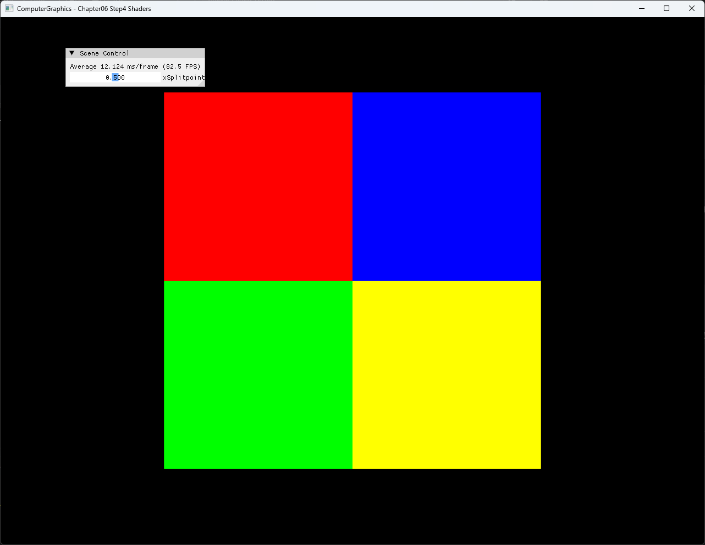
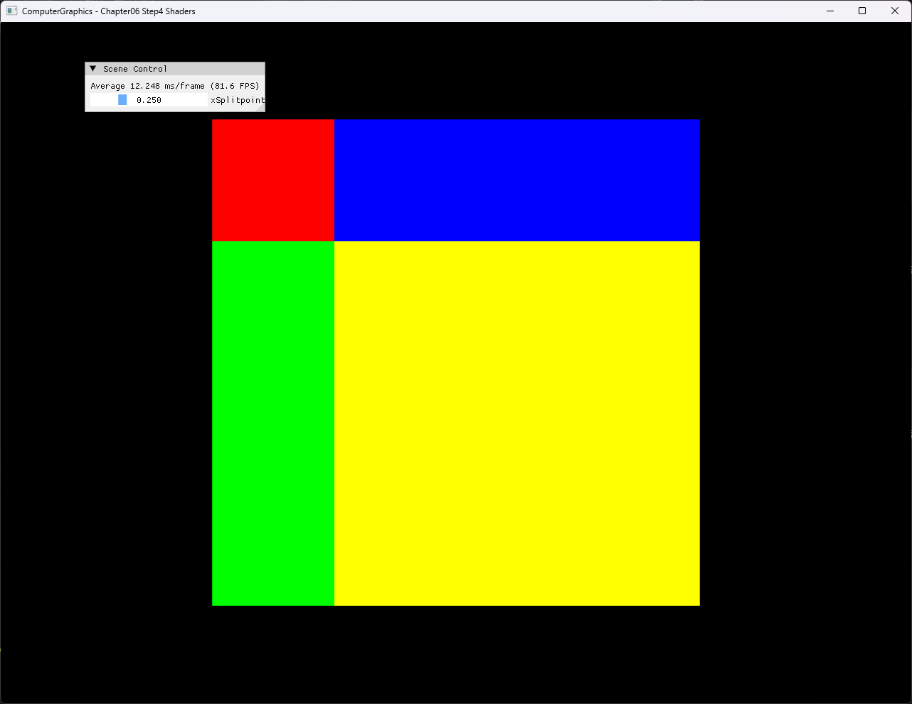

# Chapter06 Step4 Shaders Demo

## 목적

Step4는 Step3의 MVP transform에 실제 GPU shader stage contract와 pixel constant buffer를 추가한다. Square의 UV를 `xSplitPoint`와 비교해 fragment 색상을 선택하고, CPU UI 값이 pixel shader 결과를 어떻게 바꾸는지 확인한다.

## 책임 범위

- Position·color·UV가 input layout과 vertex shader를 거쳐 pixel shader로 전달되는 흐름을 설명한다.
- Vertex shader의 position transform과 pixel shader의 fragment color 선택 책임을 구분한다.
- `b0` MVP와 `b1` pixel constant buffer의 stage별 binding을 설명한다.
- 기본 `0.5`와 조정 `0.25`의 결과 차이를 설명한다.
- 일반 shader stage 이론은 [Shader Stage](../../01_Topics/DirectX11Pipeline/ShaderStage.md)로 위임한다.
- build/run/capture 사실은 [Verification Index](../../02_Verification/Part2_Chapter05-08/verification-index.md)로 위임한다.

## 결과 미리보기

### 기본값 0.5



### 조정값 0.25



## 입력과 출력

| 구분 | 내용 |
| --- | --- |
| 입력 | Square position·color·UV, MVP matrix, `xSplitPoint` |
| Vertex stage | Position에 Model·View·Projection 적용, color·UV 전달 |
| Rasterization | Square coverage 생성과 color·UV fragment 보간 |
| Pixel stage | UV의 X·Y를 threshold와 비교해 red·green·blue·yellow 선택 |
| 출력 | Threshold 위치가 반영된 네 색상 square와 Scene Control |

## 구현 흐름

1. Position·color·UV를 가진 indexed square를 만든다.
2. `POSITION`, `COLOR`와 `TEXCOORD` input layout을 vertex shader contract와 연결한다.
3. 고정 Model·View·Projection을 `b0` vertex constant buffer에 기록한다.
4. UI의 `xSplitPoint`를 `b1` pixel constant buffer에 기록한다.
5. Vertex shader가 position을 clip space로 변환하고 color와 UV를 전달한다.
6. Pixel shader가 UV의 X·Y를 threshold와 비교해 네 색상 중 하나를 선택한다.
7. Slider 값을 바꿔 X·Y 경계가 함께 이동하는 결과를 확인한다.

## 핵심 구현

### Vertex Input And Stage Contract

Square vertex의 position, color와 UV는 input layout의 semantic으로 vertex shader에 전달된다. Vertex shader는 MVP transform을 position에 적용하고 color와 UV는 후속 stage가 사용할 수 있도록 그대로 출력한다.

#### Vertex stage 의사코드

```cpp
// Pseudo C++: vertex transform과 attribute 전달
VertexOutput RunVertexShader(VertexInput input, MVP matrices)
{
    VertexOutput output;
    output.position = matrices.projection
        * matrices.view
        * matrices.model
        * input.position;
    output.color = input.color;
    output.uv = input.uv;
    return output;
}
```

- [Square position·color·UV 구성](../../../Part2_Chapter05-08/06_GraphicsPipeline_Step4_Shaders/ExampleApp.cpp#L10-L53)
- [Input layout과 shader 생성](../../../Part2_Chapter05-08/06_GraphicsPipeline_Step4_Shaders/ExampleApp.cpp#L249-L264)
- [Vertex shader contract와 MVP transform](../../../Part2_Chapter05-08/06_GraphicsPipeline_Step4_Shaders/ColorVertexShader.hlsl#L13-L54)

### Pixel Constant Buffer And UV Branch

CPU는 `xSplitPoint`를 매 frame pixel constant buffer에 기록하고 pixel shader의 slot `b1`에 연결한다. Pixel shader는 UV의 X와 Y를 같은 threshold와 비교해 네 영역을 선택한다.

#### Pixel branch 의사코드

```cpp
// Pseudo C++: 같은 threshold를 사용하는 UV 사분면 선택
Color SelectColor(Vector2 uv, float split)
{
    if (uv.x < split)
    {
        return uv.y < split ? Red : Green;
    }

    return uv.y < split ? Blue : Yellow;
}
```

- [Pixel constant buffer 구조와 기본값](../../../Part2_Chapter05-08/06_GraphicsPipeline_Step4_Shaders/ExampleApp.h#L36-L55)
- [Pixel constant buffer 초기화와 갱신](../../../Part2_Chapter05-08/06_GraphicsPipeline_Step4_Shaders/ExampleApp.cpp#L226-L230)
- [Pixel buffer 갱신과 stage binding](../../../Part2_Chapter05-08/06_GraphicsPipeline_Step4_Shaders/ExampleApp.cpp#L309-L353)
- [UV threshold color 선택](../../../Part2_Chapter05-08/06_GraphicsPipeline_Step4_Shaders/ColorPixelShader.hlsl#L3-L39)

### UI To Shader Result

ImGui slider는 CPU의 `p_xSplitPoint`를 변경한다. 다음 frame의 dynamic buffer update가 같은 값을 GPU에 전달하므로 shader 재compile 없이 화면의 분기 경계가 이동한다.

#### UI 갱신 의사코드

```cpp
// Pseudo C++: UI 값을 pixel shader constant buffer에 전달
UpdateGui(splitPoint);

PixelConstants constants;
constants.xSplitPoint = splitPoint;
UpdateDynamicBuffer(constants);
BindPixelConstantBuffer(slot1, constants);
DrawIndexed(square);
```

- [`xSplitPoint` 기본값](../../../Part2_Chapter05-08/06_GraphicsPipeline_Step4_Shaders/ExampleApp.h#L97-L100)
- [UI 값의 per-frame buffer 갱신](../../../Part2_Chapter05-08/06_GraphicsPipeline_Step4_Shaders/ExampleApp.cpp#L304-L312)
- [Scene Control slider](../../../Part2_Chapter05-08/06_GraphicsPipeline_Step4_Shaders/ExampleApp.cpp#L368-L372)

## 시각 결과

기본값 `0.5`에서는 X·Y 경계가 square 중앙에서 만나 같은 크기의 red, green, blue와 yellow 영역을 만든다. 조정값 `0.25`에서는 왼쪽 열이 전체 폭의 약 1/4로 줄고 위쪽 행도 약 1/4로 줄어든다. 이 변화는 하나의 scalar가 두 UV 축의 분기 기준으로 함께 사용됨을 보여준다.

정적 screenshot 두 장이 기본·조정 결과와 UI 값을 모두 보여주므로 연속 slider 이동 video는 추가하지 않는다.

## 구현 범위와 한계

- `MakeSquare()`만 draw에 사용하며 `MakeBox()`는 현재 실행 경로에 포함되지 않는다.
- Constant buffer의 `leftColor`와 `rightColor`는 선언·업로드되지만 pixel shader가 읽지 않는다.
- Vertex color도 pixel input까지 전달되지만 hard-coded color branch에는 사용되지 않는다.
- `xSplitPoint` 하나로 X·Y를 함께 나누므로 각 축을 독립적으로 조절하지 않는다.
- Texture sampling, material와 lighting은 이후 단계의 책임으로 둔다.
- Runtime shader compile은 project 폴더 CWD에 의존한다.
- Debug/Release x64만 현재 검증하며 Win32 configuration은 다루지 않는다.

## 검증

- [Part2 Chapter05-08 Verification](../../02_Verification/Part2_Chapter05-08/verification-index.md)
- Debug x64 build/run: 성공, 2026-08-02 현재 확인, project 폴더 CWD
- Release x64 build/run: 성공, 2026-08-02 현재 확인, project 폴더 CWD
- Application title: `ComputerGraphics - Chapter06 Step4 Shaders`
- UI: 기본 `0.5`와 조정 `0.25`의 X·Y 경계 반영 확인
- Capture: PNG 1282×992 2장, 자동 기술 검수와 사용자 시각 확인 완료
- Video: 제외, 정적 결과 비교로 구현 효과를 충분히 설명함

## 관련 코드

- [Square resource와 shader 초기화](../../../Part2_Chapter05-08/06_GraphicsPipeline_Step4_Shaders/ExampleApp.cpp#L10-L264)
- [MVP·pixel constant buffer 갱신](../../../Part2_Chapter05-08/06_GraphicsPipeline_Step4_Shaders/ExampleApp.cpp#L277-L312)
- [Pipeline binding과 indexed draw](../../../Part2_Chapter05-08/06_GraphicsPipeline_Step4_Shaders/ExampleApp.cpp#L315-L365)
- [Vertex shader transform과 attribute 전달](../../../Part2_Chapter05-08/06_GraphicsPipeline_Step4_Shaders/ColorVertexShader.hlsl#L13-L54)
- [Pixel shader UV branch](../../../Part2_Chapter05-08/06_GraphicsPipeline_Step4_Shaders/ColorPixelShader.hlsl#L3-L39)

## 관련 문서

- [Chapter06 Step4 Shaders Example](../../../Part2_Chapter05-08/06_GraphicsPipeline_Step4_Shaders/README.md)
- [이전 단계: Chapter06 Step3 ModelViewProj Demo](06_ModelViewProj.md)
- [Shader Stage Topic](../../01_Topics/DirectX11Pipeline/ShaderStage.md)
- [Verification Index](../../02_Verification/Part2_Chapter05-08/verification-index.md)
- [Demo Index](demo-index.md)
