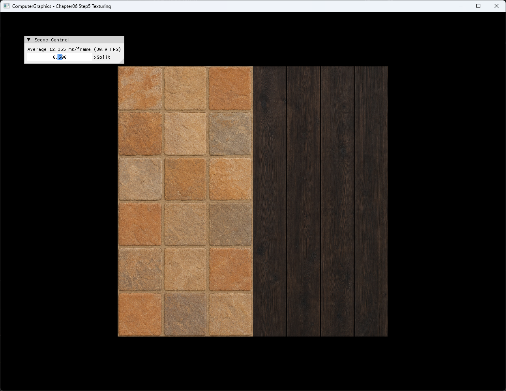
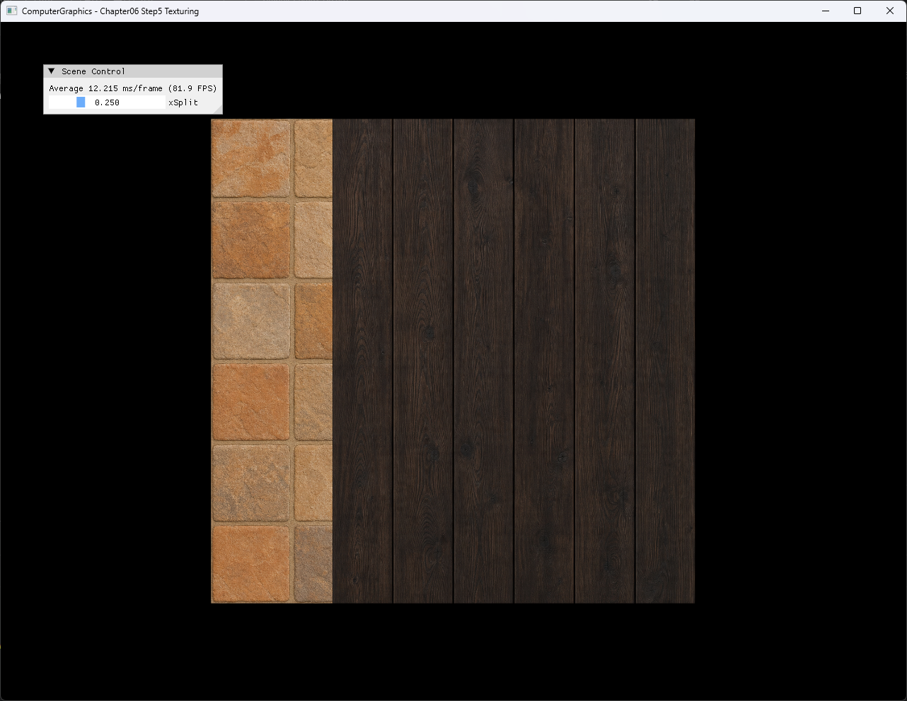

# Chapter06 Step5 Texturing Demo

## 목적

Step5는 Step4의 UV 전달과 pixel constant buffer에 GPU texture resource, shader resource view와 sampler를 추가한다. 두 texture를 `xSplit`으로 선택해 CPU의 resource 생성부터 pixel shader sampling까지 이어지는 흐름을 확인한다.

## 책임 범위

- Generated image가 immutable RGBA texture와 SRV로 변환되는 흐름을 설명한다.
- SRV `t0`·`t1`, sampler `s0`와 pixel constant buffer `b0`의 binding을 설명한다.
- 같은 UV로 두 texture를 sampling하고 `xSplit`으로 결과를 선택하는 구현을 설명한다.
- 기본 `0.5`와 조정 `0.25`의 결과 차이를 설명한다.
- 일반 texture coordinate·filter·address mode 이론은 [Texture Sampling](../../01_Topics/TexturingAndMapping/TextureSampling.md)으로 위임한다.
- build/run/capture 사실은 [Verification Index](../../02_Verification/Part2_Chapter05-08/verification-index.md)로 위임한다.

## 결과 미리보기

### 기본값 0.5



### 조정값 0.25



## 입력과 출력

| 구분 | 내용 |
| --- | --- |
| 입력 | Generated 석재·목재 PNG, square position·color·UV, MVP matrix, `xSplit` |
| CPU resource | `stb_image` RGBA decode, immutable `Texture2D`와 SRV 2개, linear wrap sampler |
| Vertex stage | Position에 Model·View·Projection 적용, color·UV 전달 |
| Pixel stage | UV X와 `xSplit` 비교, `t0` 또는 `t1`을 `s0`으로 sampling |
| 출력 | 두 재질의 선택 경계와 Scene Control UI가 표시된 square |

## 구현 흐름

1. Position·color·UV를 가진 indexed square를 만든다.
2. Generated 석재와 목재 PNG를 RGBA8 immutable texture와 SRV로 만든다.
3. Linear filtering과 wrap address mode를 가진 sampler를 만든다.
4. Vertex shader가 MVP transform과 UV 전달을 수행한다.
5. SRV를 `t0`·`t1`, sampler를 `s0`, `xSplit` constant buffer를 `b0`에 연결한다.
6. Pixel shader가 UV X를 경계값과 비교해 두 texture 중 하나를 같은 UV로 sampling한다.
7. Slider 값을 바꿔 선택 경계가 이동하는 결과를 확인한다.

## 핵심 구현

### Texture Resource And View

CPU는 image를 4-channel로 decode하고 `DXGI_FORMAT_R8G8B8A8_UNORM` immutable texture를 만든다. Texture load, resource 생성과 SRV 생성 중 하나라도 실패하면 초기화를 중단해 null resource 사용을 막는다.

#### Texture 생성 의사코드

```cpp
// Pseudo C++: image decode와 shader resource 생성
bool CreateTexture(String path, Texture& texture, ShaderResourceView& view)
{
    Image image = DecodeRgba(path);
    if (!image)
    {
        return false;
    }

    texture = CreateImmutableRgbaTexture(image);
    view = CreateShaderResourceView(texture);
    return texture && view;
}
```

- [Texture load와 실패 처리](../../../Part2_Chapter05-08/06_GraphicsPipeline_Step5_Texturing/AppBase.cpp#L520-L571)
- [Generated input과 sampler 초기화](../../../Part2_Chapter05-08/06_GraphicsPipeline_Step5_Texturing/ExampleApp.cpp#L166-L203)

### SRV And Sampler Binding

두 SRV는 pixel shader의 `t0`·`t1`, sampler는 `s0`에 연결된다. `xSplit`은 16-byte aligned constant buffer를 통해 pixel shader `b0`에 전달된다.

#### Resource binding 의사코드

```cpp
// Pseudo C++: pixel stage resource slot 연결
BindPixelShaderResource(0, darkWoodView);
BindPixelShaderResource(1, stoneTilesView);
BindPixelSampler(0, linearWrapSampler);
BindPixelConstantBuffer(0, splitConstants);
DrawIndexed(square);
```

- [Pixel constant buffer 구조](../../../Part2_Chapter05-08/06_GraphicsPipeline_Step5_Texturing/ExampleApp.h#L41-L47)
- [SRV·sampler·constant buffer binding](../../../Part2_Chapter05-08/06_GraphicsPipeline_Step5_Texturing/ExampleApp.cpp#L298-L347)

### UV Split Sampling

Pixel shader는 보간된 `uv.x`가 `xSplit`보다 크면 `t0` 목재를, 그렇지 않으면 `t1` 석재를 선택한다. 두 경우 모두 같은 UV와 sampler를 사용하므로 경계의 위치만 바뀌고 각 재질의 mapping은 유지된다.

#### Texture 선택 의사코드

```cpp
// Pseudo C++: UV X 경계에 따른 texture 선택
Color SampleSplitTexture(Vector2 uv, float split)
{
    if (uv.x > split)
    {
        return Sample(darkWood, linearWrapSampler, uv);
    }

    return Sample(stoneTiles, linearWrapSampler, uv);
}
```

- [Square UV 구성](../../../Part2_Chapter05-08/06_GraphicsPipeline_Step5_Texturing/ExampleApp.cpp#L10-L52)
- [Vertex shader UV 전달](../../../Part2_Chapter05-08/06_GraphicsPipeline_Step5_Texturing/ColorVertexShader.hlsl#L19-L47)
- [Pixel shader texture 선택과 sampling](../../../Part2_Chapter05-08/06_GraphicsPipeline_Step5_Texturing/ColorPixelShader.hlsl#L1-L21)
- [`xSplit` Scene Control](../../../Part2_Chapter05-08/06_GraphicsPipeline_Step5_Texturing/ExampleApp.cpp#L350-L354)

## 시각 결과

기본값 `0.5`에서는 석재와 목재가 같은 폭으로 표시된다. 조정값 `0.25`에서는 석재 영역이 약 1/4, 목재 영역이 약 3/4로 바뀐다. 각 재질의 UV mapping은 유지되고 세로 경계만 이동하므로 UI 값이 pixel constant buffer와 branch에 반영됐음을 확인할 수 있다.

정적 screenshot 두 장이 generated input의 mapping과 경계 이동을 모두 보여주므로 slider 이동 video는 추가하지 않는다.

## 구현 범위와 한계

- `MakeSquare()`만 draw에 사용하며 `MakeBox()`는 현재 실행 경로에 포함되지 않는다.
- Vertex color는 pixel input까지 전달되지만 texture 결과에는 사용되지 않는다.
- Texture는 mip level 하나만 가지며 mipmap 생성·trilinear·anisotropic filtering을 다루지 않는다.
- Linear wrap sampler는 UV 경계에서 반대쪽 edge texel을 참조할 수 있다.
- Generated texture는 외부 원문 pixel을 복제하지 않은 공개용 입력이며 생성 prompt 원문은 tracked 문서에 포함하지 않는다.
- Runtime shader와 texture load는 project 폴더 CWD에 의존한다.
- Debug/Release x64만 현재 검증하며 Win32 configuration은 다루지 않는다.

## 검증

- [Part2 Chapter05-08 Verification](../../02_Verification/Part2_Chapter05-08/verification-index.md)
- Debug x64 build/run: 성공, 2026-08-02 현재 확인, project 폴더 CWD
- Release x64 build/run: 성공, 2026-08-02 현재 확인, project 폴더 CWD
- Application title: `ComputerGraphics - Chapter06 Step5 Texturing`
- Resource: Generated PNG 2개 load와 `t0`·`t1`·`s0`·`b0` binding 확인
- 실패 경로: 잘못된 CWD에서 texture load 실패 보고와 exit code `-1` 확인
- UI: 기본 `0.5`와 조정 `0.25`의 세로 경계 반영 확인
- Capture: PNG 1282×992 2장, 자동 기술 검수와 사용자 시각 확인 완료
- Video: 제외, 정적 결과 비교로 구현 효과를 충분히 설명함

## 관련 코드

- [Square resource와 texture 초기화](../../../Part2_Chapter05-08/06_GraphicsPipeline_Step5_Texturing/ExampleApp.cpp#L10-L250)
- [Texture decode와 GPU resource 생성](../../../Part2_Chapter05-08/06_GraphicsPipeline_Step5_Texturing/AppBase.cpp#L520-L571)
- [Resource binding과 indexed draw](../../../Part2_Chapter05-08/06_GraphicsPipeline_Step5_Texturing/ExampleApp.cpp#L298-L347)
- [Vertex shader transform과 UV 전달](../../../Part2_Chapter05-08/06_GraphicsPipeline_Step5_Texturing/ColorVertexShader.hlsl#L10-L48)
- [Pixel shader texture 선택](../../../Part2_Chapter05-08/06_GraphicsPipeline_Step5_Texturing/ColorPixelShader.hlsl#L1-L21)

## 관련 문서

- [Chapter06 Step5 Texturing Example](../../../Part2_Chapter05-08/06_GraphicsPipeline_Step5_Texturing/README.md)
- [이전 단계: Chapter06 Step4 Shaders Demo](06_Shaders.md)
- [Texture Sampling Topic](../../01_Topics/TexturingAndMapping/TextureSampling.md)
- [Shader Stage Topic](../../01_Topics/DirectX11Pipeline/ShaderStage.md)
- [Verification Index](../../02_Verification/Part2_Chapter05-08/verification-index.md)
- [Demo Index](demo-index.md)
