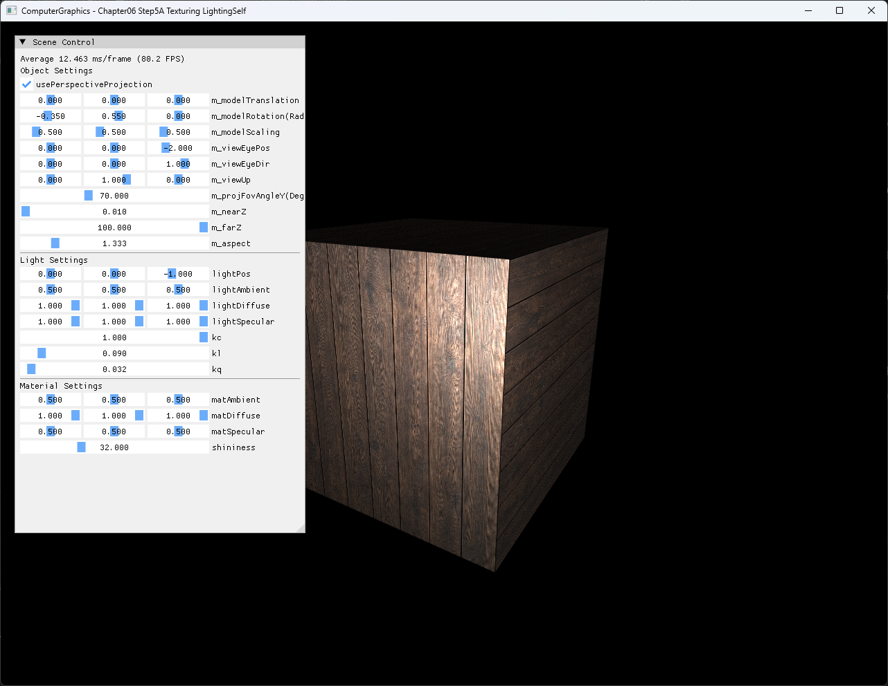
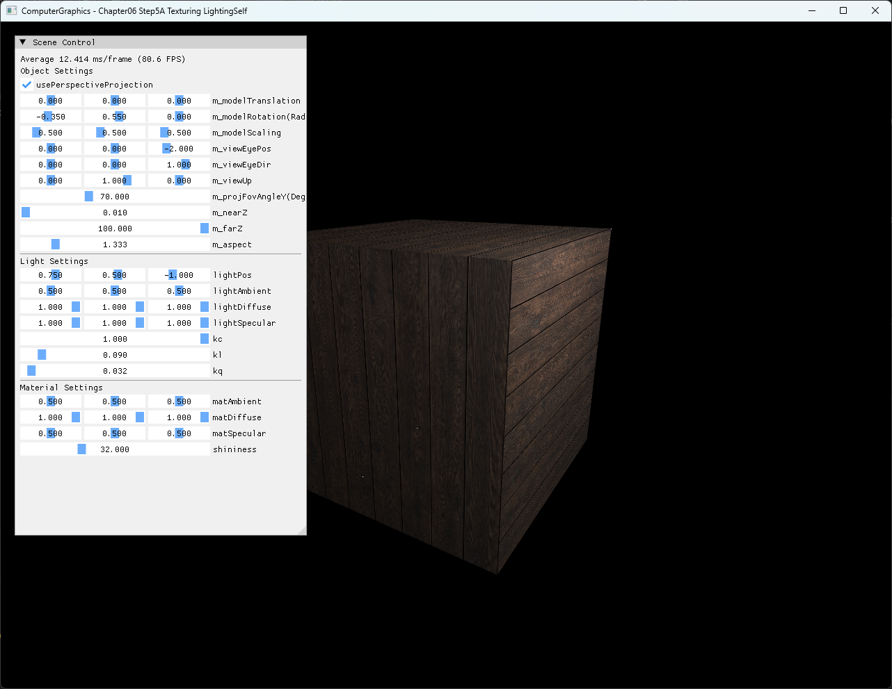

# Chapter06 Step5A Texturing LightingSelf Demo

## 목적

Step5A는 Step5의 GPU texture sampling을 world-space normal과 point-light shading으로 확장한다. 같은 texture와 model·camera·material을 유지한 채 light position만 바꿔 face별 밝기와 highlight가 이동하는 결과를 확인한다.

## 책임 범위

- Box의 face normal과 UV가 shader stage로 전달되는 흐름을 설명한다.
- Inverse-transpose normal transform과 world position 전달을 설명한다.
- Texture color, ambient·diffuse·Blinn-Phong specular와 거리 감쇠의 결합을 설명한다.
- 기본 light와 위치 조정 결과의 차이를 설명한다.
- 일반 texture sampling은 [Texture Sampling](../../01_Topics/TexturingAndMapping/TextureSampling.md)으로 위임한다.
- 일반 조명 이론은 [Phong And Blinn-Phong](../../01_Topics/LightingAndShading/PhongAndBlinnPhong.md)과 [Light Types](../../01_Topics/LightingAndShading/LightTypes.md)로 위임한다.
- build/run/capture 사실은 [Verification Index](../../02_Verification/Part2_Chapter05-08/verification-index.md)로 위임한다.

## 결과 미리보기

### 기본 light position



### 조정 light position



## 입력과 출력

| 구분 | 내용 |
| --- | --- |
| 입력 | Generated 목재 PNG, box position·normal·UV, model·view·projection, light·material parameter |
| Vertex stage | World position, inverse-transpose normal과 UV 전달 |
| Pixel stage | Texture sampling, ambient·Lambert diffuse·Blinn-Phong specular와 거리 감쇠 계산 |
| 기본 상태 | `lightPos=(0, 0, -1)`, model rotation `(-0.35, 0.55, 0)` |
| 비교 상태 | Light position만 `(0.75, 0.5, -1)`로 변경 |
| 출력 | Texture가 적용된 box의 face별 밝기와 highlight 변화 |

## 구현 흐름

1. Face별 normal과 UV를 가진 indexed box를 만든다.
2. 검수한 목재 PNG를 immutable RGBA texture와 SRV로 만든다.
3. Model matrix와 inverse-transpose normal matrix를 갱신한다.
4. Vertex shader가 projected position, world position, transformed normal과 UV를 전달한다.
5. Pixel shader가 texture를 sampling하고 light·view direction을 계산한다.
6. Ambient, diffuse와 specular를 더하고 point-light 거리 감쇠를 적용한다.
7. Light position을 바꿔 face별 조명 결과가 이동하는지 확인한다.

## 핵심 구현

### World Position And Normal Transform

Non-uniform scale에도 normal 방향을 유지하도록 model matrix의 inverse-transpose를 별도 constant buffer 값으로 전달한다. Vertex shader는 world position을 lighting 좌표계에 남기고 normal과 UV를 pixel stage로 보낸다.

#### Transform 의사코드

```cpp
// Pseudo C++: lighting에 필요한 world-space 값 구성
Matrix model = ComposeModelTransform();
Matrix normalMatrix = InverseTranspose(model);

VertexOutput Transform(Vertex input)
{
    VertexOutput output;
    output.worldPosition = TransformPosition(input.position, model);
    output.clipPosition = Project(output.worldPosition, view, projection);
    output.normal = TransformDirection(input.normal, normalMatrix);
    output.uv = input.uv;
    return output;
}
```

- [Model·normal matrix와 camera position 갱신](../../../Part2_Chapter05-08/06_GraphicsPipeline_Step5_Texturing_LightingSelf/ExampleApp.cpp#L197-L233)
- [World position과 transformed normal 전달](../../../Part2_Chapter05-08/06_GraphicsPipeline_Step5_Texturing_LightingSelf/ColorVertexShader.hlsl#L36-L51)

### Texture And Point-Light Shading

Pixel shader는 texture를 한 번 sampling한 뒤 ambient, Lambert diffuse와 Blinn-Phong specular에 결합한다. Distance denominator는 작은 양수로 제한해 UI에서 감쇠 계수가 0에 가까워져도 division-by-zero를 막는다.

#### Lighting 의사코드

```cpp
// Pseudo C++: textured point-light shading
Color Shade(PixelInput input)
{
    Color textureColor = Sample(texture, input.uv);
    Vector lightVector = lightPosition - input.worldPosition;
    float distance = Length(lightVector);
    Vector lightDirection = Normalize(lightVector);
    Vector viewDirection = Normalize(viewPosition - input.worldPosition);

    Color ambient = lightAmbient * materialAmbient * textureColor;
    Color diffuse = Lambert(input.normal, lightDirection) * textureColor;
    Color specular = BlinnPhong(input.normal, lightDirection,
                               viewDirection, shininess) * textureColor;
    float denominator = Max(kc + kl * distance + kq * distance * distance,
                            0.0001);
    return ambient + (diffuse + specular) / denominator;
}
```

- [Light·material constant buffer](../../../Part2_Chapter05-08/06_GraphicsPipeline_Step5_Texturing_LightingSelf/ExampleApp.h#L43-L80)
- [Texture·sampler와 lighting buffer binding](../../../Part2_Chapter05-08/06_GraphicsPipeline_Step5_Texturing_LightingSelf/ExampleApp.cpp#L236-L273)
- [Texture lighting과 distance attenuation](../../../Part2_Chapter05-08/06_GraphicsPipeline_Step5_Texturing_LightingSelf/ColorPixelShader.hlsl#L36-L59)
- [Light·material parameter UI](../../../Part2_Chapter05-08/06_GraphicsPipeline_Step5_Texturing_LightingSelf/ExampleApp.cpp#L276-L325)

## 시각 결과

기본 상태는 light가 camera 방향의 중앙에 있어 회전한 box의 전면 highlight와 인접 face의 밝기 차이를 함께 보여준다. Light를 오른쪽 위로 옮긴 비교 상태에서는 같은 texture·model·camera·material을 유지하면서 face별 밝기와 highlight 중심이 이동한다. 두 image의 차이는 light position constant buffer가 world-space shading에 반영됐음을 보여준다.

정적 screenshot 두 장이 기준 상태와 단일 변수 변화의 결과를 직접 비교하므로 video는 추가하지 않는다.

## 구현 범위와 한계

- 단일 point light, 단일 box와 단일 texture만 사용한다.
- Texture color를 specular에도 곱하므로 일반적인 dielectric specular 분리와 다르다.
- Gamma correction, normal mapping, shadow와 physically based lighting은 포함하지 않는다.
- Texture는 mip level 하나와 linear wrap sampler만 사용한다.
- Runtime shader와 texture load는 project 폴더 CWD에 의존한다.
- Debug/Release x64만 현재 검증하며 Win32 configuration은 다루지 않는다.

## 검증

- [Part2 Chapter05-08 Verification](../../02_Verification/Part2_Chapter05-08/verification-index.md)
- Debug x64 build/run: 성공, 2026-08-02 현재 확인, project 폴더 CWD
- Release x64 build/run: 성공, 2026-08-02 현재 확인, project 폴더 CWD
- Application title: `ComputerGraphics - Chapter06 Step5A Texturing LightingSelf`
- Resource: Generated 목재 PNG load, `t0`·`s0`와 transform·light·material buffer binding 확인
- 실패 경로: 잘못된 CWD에서 texture load 실패 보고와 exit code `-1` 확인
- UI: 기본 `(0, 0, -1)`과 조정 `(0.75, 0.5, -1)` light position 반영 확인
- Capture: PNG 1282×992 2장, 자동 기술 검수와 사용자 시각 확인 완료
- Video: 제외, 단일 parameter의 정적 결과 비교로 구현 효과를 충분히 설명함

## 관련 코드

- [Box geometry와 texture 초기화](../../../Part2_Chapter05-08/06_GraphicsPipeline_Step5_Texturing_LightingSelf/ExampleApp.cpp#L10-L145)
- [Transform·lighting buffer 갱신](../../../Part2_Chapter05-08/06_GraphicsPipeline_Step5_Texturing_LightingSelf/ExampleApp.cpp#L197-L233)
- [Texture·lighting resource binding과 draw](../../../Part2_Chapter05-08/06_GraphicsPipeline_Step5_Texturing_LightingSelf/ExampleApp.cpp#L236-L273)
- [Vertex shader world-space 출력](../../../Part2_Chapter05-08/06_GraphicsPipeline_Step5_Texturing_LightingSelf/ColorVertexShader.hlsl#L10-L51)
- [Pixel shader texture lighting](../../../Part2_Chapter05-08/06_GraphicsPipeline_Step5_Texturing_LightingSelf/ColorPixelShader.hlsl#L1-L59)

## 관련 문서

- [Chapter06 Step5A Texturing LightingSelf Example](../../../Part2_Chapter05-08/06_GraphicsPipeline_Step5_Texturing_LightingSelf/README.md)
- [이전 단계: Chapter06 Step5 Texturing Demo](06_Texturing.md)
- [Texture Sampling Topic](../../01_Topics/TexturingAndMapping/TextureSampling.md)
- [Phong And Blinn-Phong Topic](../../01_Topics/LightingAndShading/PhongAndBlinnPhong.md)
- [Light Types Topic](../../01_Topics/LightingAndShading/LightTypes.md)
- [Verification Index](../../02_Verification/Part2_Chapter05-08/verification-index.md)
- [Demo Index](demo-index.md)
- [Publication Candidate List](../../05_Publication/candidate-list.md)
