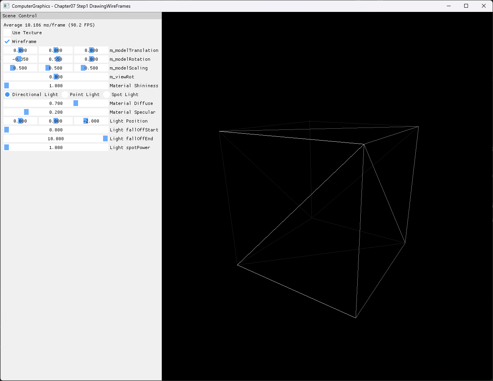

# Chapter07 Step1 DrawingWireFrames Demo

## 목적

절차적으로 생성한 indexed box가 triangle list로 조립된 뒤 rasterizer fill mode에 따라 solid 또는 wireframe으로 표시되는 흐름을 확인한다. 기본 결과는 box 외곽선과 각 face의 triangulation diagonal을 함께 보여준다.

## 책임 범위

- `MeshData`에서 vertex/index buffer로 이어지는 surface mesh 구성을 설명한다.
- `TRIANGLELIST`를 유지한 채 rasterizer state만 전환하는 구현을 설명한다.
- 일반 mesh topology 이론은 [Mesh Topology And Wireframe Rasterization](../../01_Topics/ModelingAndGeometry/MeshTopologyAndWireframeRasterization.md)으로 위임한다.
- build/run/capture 사실은 [Verification Index](../../02_Verification/Part2_Chapter05-08/verification-index.md)로 위임한다.

## 결과 미리보기



## 입력과 출력

| 구분 | 내용 |
| --- | --- |
| Geometry | Face별 normal과 UV를 가진 24개 vertex, 36개 triangle index |
| Pipeline | Vertex/index buffer, `TRIANGLELIST`, solid·wireframe rasterizer state |
| 기본 UI | `Wireframe=On`, `Use Texture=Off`, model rotation X=-0.35·Y=0.55 |
| 출력 | 세 면과 face 내부 diagonal이 보이는 indexed box wireframe |

## 구현 흐름

1. `GeometryGenerator::MakeBox()`가 여섯 face를 각각 두 triangle으로 만든다.
2. Vertex와 index를 immutable GPU buffer로 생성한다.
3. Solid와 wireframe rasterizer state를 각각 준비한다.
4. UI의 `Wireframe` 값에 맞는 state를 rasterizer stage에 binding한다.
5. Input assembler에는 계속 `TRIANGLELIST`를 설정한다.
6. `DrawIndexed()`가 같은 mesh를 선택한 fill mode로 그린다.

## 핵심 구현

### Face 단위 box mesh

Box는 위치만 공유하는 8개 corner가 아니라 face별 normal과 UV를 보존하는 24개 vertex를 사용한다. 각 사각 face의 index 여섯 개는 두 triangle을 만들며 wireframe 결과에서 그 분할 대각선이 드러난다.

#### Box 생성 의사코드

```cpp
// Pseudo C++: face attribute를 보존하는 indexed box 생성
BuildBoxMesh()
{
    for (face : sixFaces)
    {
        AppendFourVertices(face.positions, face.normal, face.uvs);
        AppendTwoTriangles(face.vertexBase);
    }

    return MeshData(vertices, indices);
}
```

- [Face별 vertex와 triangle index 생성](../../../Part2_Chapter05-08/07_Modeling_Step1_DrawingWireFrames/GeometryGenerator.cpp#L55-L188)
- [MeshData의 vertex/index buffer 생성](../../../Part2_Chapter05-08/07_Modeling_Step1_DrawingWireFrames/ExampleApp.cpp#L43-L57)

### Rasterizer fill mode 전환

Wireframe은 별도 line buffer가 아니다. 같은 triangle mesh와 topology를 유지하고 rasterizer state의 `FillMode`만 바꾼다.

#### Fill mode 전환 의사코드

```cpp
// Pseudo C++: triangle topology를 유지하는 wireframe 전환
DrawMesh(wireframeEnabled)
{
    state = wireframeEnabled ? wireframeState : solidState;
    SetRasterizerState(state);
    SetPrimitiveTopology(TriangleList);
    DrawIndexed(indexCount);
}
```

- [Solid·wireframe rasterizer state 생성](../../../Part2_Chapter05-08/07_Modeling_Step1_DrawingWireFrames/AppBase.cpp#L357-L389)
- [Rasterizer state 선택과 triangle-list draw](../../../Part2_Chapter05-08/07_Modeling_Step1_DrawingWireFrames/ExampleApp.cpp#L203-L231)
- [Wireframe UI 전환](../../../Part2_Chapter05-08/07_Modeling_Step1_DrawingWireFrames/ExampleApp.cpp#L234-L247)

## 시각 결과

비스듬한 기본 model rotation으로 box의 앞·옆·윗면을 동시에 노출한다. 밝은 외곽선은 cube silhouette을 나타내고 각 face 내부의 선은 사각 face를 구성하는 두 triangle의 경계다.

UI에서 `Wireframe`이 선택되고 `Use Texture`가 해제된 상태를 함께 보여주므로 결과가 texture edge가 아니라 rasterizer fill mode에서 나온 것임을 확인할 수 있다. 중복되거나 끊어진 edge, 검은 frame과 clipping은 관찰되지 않았다.

## 구현 범위와 한계

- `TRIANGLELIST` 기반 surface mesh만 다루며 명시적 `LINELIST`는 다음 Step2 책임이다.
- Hidden edge를 제거하는 CAD wireframe이나 anti-aliased line을 구현하지 않는다.
- Empty cylinder generator와 이후 primitive 생성 기능을 선행 구현하지 않는다.
- Generated wood texture는 solid mode 비교를 위해 유지하지만 대표 capture에서는 사용하지 않는다.
- Video는 이산적인 fill-mode 상태를 screenshot 한 장으로 설명할 수 있어 제외한다.

## 검증

- [Part2 Chapter05-08 Verification](../../02_Verification/Part2_Chapter05-08/verification-index.md)
- Debug x64 build/run: 성공, 2026-08-02 현재 확인, project 폴더 CWD
- Release x64 build/run: 성공, 2026-08-02 현재 확인, project 폴더 CWD
- Runtime: exact title, shader와 generated wood load, clean exit 확인
- Resize: wide·compact·반복 resize와 minimize/restore 자동 sequence 통과
- Capture: 1282×992 PNG, title·UI·wireframe geometry 기술·시각 검수 완료
- Asset: generated wood가 Chapter06 Step5–9와 동일 SHA-256임을 확인
- Video: 제외, 정적 결과만으로 topology와 fill mode 설명 가능

## 관련 코드

- [Box mesh 생성](../../../Part2_Chapter05-08/07_Modeling_Step1_DrawingWireFrames/GeometryGenerator.cpp#L55-L188)
- [GPU buffer 생성](../../../Part2_Chapter05-08/07_Modeling_Step1_DrawingWireFrames/ExampleApp.cpp#L43-L57)
- [Rasterizer state 생성](../../../Part2_Chapter05-08/07_Modeling_Step1_DrawingWireFrames/AppBase.cpp#L357-L389)
- [Fill mode 선택과 indexed draw](../../../Part2_Chapter05-08/07_Modeling_Step1_DrawingWireFrames/ExampleApp.cpp#L203-L231)
- [Resize resource lifetime](../../../Part2_Chapter05-08/07_Modeling_Step1_DrawingWireFrames/AppBase.cpp#L487-L516)

## 관련 문서

- [Chapter07 Step1 Example README](../../../Part2_Chapter05-08/07_Modeling_Step1_DrawingWireFrames/README.md)
- [이전 단계: Chapter06 Step9 Demo](09_PhongVsBlinnPhong.md)
- 다음 단계: Chapter07 Step2 DrawingNormals 문서화 대기
- [Mesh Topology And Wireframe Rasterization](../../01_Topics/ModelingAndGeometry/MeshTopologyAndWireframeRasterization.md)
- [Verification Index](../../02_Verification/Part2_Chapter05-08/verification-index.md)
- [Demo Index](demo-index.md)
- [Publication Candidate List](../../05_Publication/candidate-list.md)
