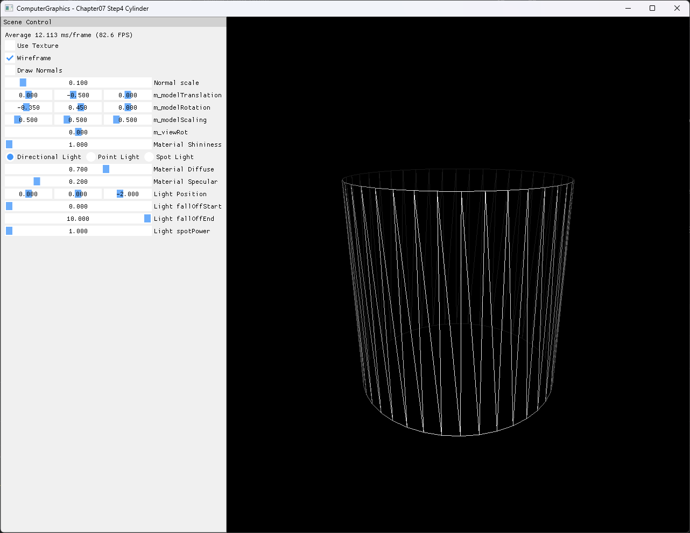

# Chapter07 Step4 Cylinder Demo

## 목적

Bottom·top ring을 40개 slice로 sample하고 ring 사이를 80개 triangle로 연결해 cap 없는 cylinder side surface를 생성하는 과정을 확인한다.

## 책임 범위

- Ring sample, UV seam과 side triangulation의 실제 구현 선택을 설명한다.
- 일반 생성 원리는 [Procedural Primitive Generation](../../01_Topics/ModelingAndGeometry/ProceduralPrimitiveGeneration.md)으로 위임한다.
- Build/run/capture 사실은 [Verification Index](../../02_Verification/Part2_Chapter05-08/verification-index.md)로 위임한다.

## 결과 미리보기



## 입력과 출력

| 구분 | 내용 |
| --- | --- |
| 생성 입력 | Bottom radius 1.0, top radius 1.0, height 2.0, slices 40 |
| Vertex | `2 × (40 + 1) = 82`, position, radial normal, UV |
| Triangle | `2 × 40 = 80` |
| Index | `6 × 40 = 240`, `DXGI_FORMAT_R16_UINT` |
| 기본 UI | `Wireframe=On`, `Use Texture=Off`, `Draw Normals=Off` |
| 출력 | 열린 상·하단과 UV seam을 가진 cylinder side surface |

## 구현 흐름

1. `2π / sliceCount`로 원주 sample 간격을 구한다.
2. Bottom ring에서 `sliceCount + 1`개의 position·normal·UV를 만든다.
3. 같은 각도 sample을 height만큼 이동해 top ring을 만든다.
4. 중복 seam vertex의 UV를 `u=0`, `u=1`로 분리한다.
5. 인접한 두 ring의 네 vertex를 triangle 두 개로 연결한다.
6. Vertex/index 목록을 GPU buffer로 올리고 `TRIANGLELIST`로 그린다.

## 핵심 구현

### Ring과 seam vertex 생성

```cpp
// Pseudo C++: 두 ring을 각도 간격으로 sample
BuildCylinderRings(bottomRadius, topRadius, height, slices)
{
    for (i = 0; i <= slices; ++i)
    {
        AppendBottomVertex(RotateY(bottomRadius, i), UV(i, 1));
        AppendTopVertex(RotateY(topRadius, i) + Up(height), UV(i, 0));
    }
}
```

- [Bottom·top ring과 UV seam 생성](../../../Part2_Chapter05-08/07_Modeling_Step4_Cylinder/GeometryGenerator.cpp#L200-L271)

### Side surface triangulation

```cpp
// Pseudo C++: 인접한 ring sample을 quad와 triangle로 연결
BuildCylinderSideIndices(slices)
{
    for (i = 0; i < slices; ++i)
    {
        AppendTriangle(i0, i2, i3);
        AppendTriangle(i0, i3, i1);
    }
}
```

- [Ring offset과 side triangle index](../../../Part2_Chapter05-08/07_Modeling_Step4_Cylinder/GeometryGenerator.cpp#L273-L290)
- [Cylinder 파라미터와 GPU buffer 연결](../../../Part2_Chapter05-08/07_Modeling_Step4_Cylinder/ExampleApp.cpp#L46-L55)

## 시각 결과

열린 상단이 보이는 비스듬한 시점에서 두 ring, 40개 원주 slice와 side triangle의 대각선을 확인한다. Wide·compact resize와 minimize/restore 뒤에도 cylinder 비율과 viewport 정합이 유지된다.

## 구현 범위와 한계

- Top·bottom cap과 높이 방향 stack을 생성하지 않는다.
- 현재 호출은 두 radius가 같아 원통이지만 API는 서로 다른 radius도 받는다.
- Taper를 사용할 경우 radial normal은 정확한 frustum normal이 아니다.
- Seam은 같은 position·normal을 중복하고 UV만 분리한다.
- Index winding과 outward radial normal의 방향 정합은 후속 검토 대상으로 둔다.
- Sphere의 pole·stack 처리와 reference/user 구현 비교는 Step5 책임이다.
- Video는 정적 topology에 새로운 정보를 추가하지 않아 제외한다.

## 검증

- Debug/Release x64 build/run 성공, 2026-08-02 현재 확인
- Shader Model 5.0, exact title, generated wood load와 clean exit 확인
- Wide·compact·반복 resize와 minimize/restore 후 viewport·projection 확인
- 1282×992 PNG의 기술·시각·metadata 검수 완료

## 관련 코드

- [Cylinder ring vertex와 UV seam](../../../Part2_Chapter05-08/07_Modeling_Step4_Cylinder/GeometryGenerator.cpp#L200-L271)
- [Cylinder side triangle index](../../../Part2_Chapter05-08/07_Modeling_Step4_Cylinder/GeometryGenerator.cpp#L273-L290)
- [Surface와 optional normal draw](../../../Part2_Chapter05-08/07_Modeling_Step4_Cylinder/ExampleApp.cpp#L230-L286)
- [Resize resource lifetime](../../../Part2_Chapter05-08/07_Modeling_Step4_Cylinder/AppBase.cpp#L485-L529)

## 관련 문서

- [Chapter07 Step4 Example README](../../../Part2_Chapter05-08/07_Modeling_Step4_Cylinder/README.md)
- [이전 단계: Chapter07 Step3 Demo](07_03_Grid.md)
- [다음 단계: Chapter07 Step5 Sphere Demo](07_05_Sphere.md)
- [Procedural Primitive Generation](../../01_Topics/ModelingAndGeometry/ProceduralPrimitiveGeneration.md)
- [Verification Index](../../02_Verification/Part2_Chapter05-08/verification-index.md)
- [Demo Index](demo-index.md)
- [Publication Candidate List](../../05_Publication/candidate-list.md)
