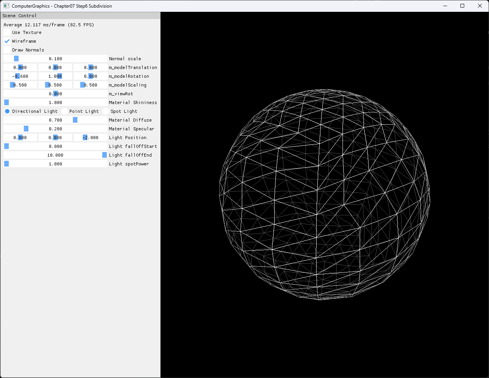

# Chapter07 Step6 Subdivision Demo

## 목적

기존 triangle mesh의 edge midpoint를 만들고 parent triangle 하나를 child triangle 네 개로 재구성한 뒤, 새 vertex를 sphere 표면에 투영하는 subdivision 흐름을 확인한다.

## 책임 범위

- Step6의 midpoint 생성, 1→4 child triangle 구성과 sphere surface projection을 설명한다.
- 일반적인 procedural primitive 이론은 [Procedural Primitive Generation](../../01_Topics/ModelingAndGeometry/ProceduralPrimitiveGeneration.md)으로 위임한다.
- Build/run/capture 사실은 [Verification Index](../../02_Verification/Part2_Chapter05-08/verification-index.md)로 위임한다.
- Step5 UserSolution과 다른 sphere 생성 경로임을 구분하고 Step7 FaceNormals의 선행 topology로 연결한다.

## 결과 미리보기



## 입력과 출력

| 단계 | Vertex | Triangle | Index | 설명 |
| --- | ---: | ---: | ---: | --- |
| Seed | 36 | 50 | 150 | Radius 1.5, slices 5, stacks 5의 위도·경도 sphere |
| Pass 1 | 600 | 200 | 600 | Parent triangle마다 12개 child vertex를 독립 생성 |
| Pass 2 | 2,400 | 800 | 2,400 | 최종 wireframe surface |

## 구현 흐름

1. 5×5 위도·경도 grid로 sphere seed를 만든다.
2. 입력 vertex를 radial normal 방향의 radius 1.5 sphere 위로 투영한다.
3. 각 triangle의 세 edge에서 position과 UV의 midpoint를 만든다.
4. Midpoint를 다시 sphere 표면에 투영하고 radial normal을 갱신한다.
5. 세 corner triangle과 중앙 triangle을 만들어 parent 하나를 child 네 개로 나눈다.
6. Child vertex를 triangle별로 복제하고 순차 index를 생성한다.
7. 같은 subdivision 함수를 두 번 호출하고 최종 mesh를 `TRIANGLELIST`로 그린다.

## 핵심 구현

### Midpoint와 sphere projection

```cpp
// Pseudo C++: edge midpoint를 sphere surface로 투영
ProjectMidpoint(a, b, radius)
{
    midpoint.position = (a.position + b.position) * 0.5;
    midpoint.uv = (a.uv + b.uv) * 0.5;
    midpoint.normal = Normalize(midpoint.position);
    midpoint.position = midpoint.normal * radius;
    return midpoint;
}
```

- [입력 vertex와 midpoint의 sphere projection](../../../Part2_Chapter05-08/07_Modeling_Step6_Subdivision/GeometryGenerator.cpp#L416-L482)

### Parent triangle의 1→4 분할

```cpp
// Pseudo C++: parent winding을 유지하는 child triangle 구성
SubdivideTriangle(v0, v1, v2)
{
    v3 = ProjectMidpoint(v0, v1);
    v4 = ProjectMidpoint(v1, v2);
    v5 = ProjectMidpoint(v2, v0);

    AppendTriangle(v0, v3, v5);
    AppendTriangle(v3, v1, v4);
    AppendTriangle(v5, v4, v2);
    AppendTriangle(v3, v4, v5);
}
```

- [Child triangle과 순차 index 생성](../../../Part2_Chapter05-08/07_Modeling_Step6_Subdivision/GeometryGenerator.cpp#L484-L508)
- [Subdivision 2회 적용과 GPU buffer 연결](../../../Part2_Chapter05-08/07_Modeling_Step6_Subdivision/ExampleApp.cpp#L40-L51)

## 시각 결과

Wireframe은 seed의 각 triangle이 두 pass를 거치며 16개 child triangle로 늘어난 결과를 보여준다. Back-face culling을 사용하지 않아 뒤쪽 edge도 함께 보이며, 화면 내부의 긴 선은 뒷면 topology가 전면으로 투영된 결과다.

## 구현 범위와 한계

- Step5 UserSolution의 두 반구·pole fan을 세분화하지 않고 별도 위도·경도 seed를 사용한다.
- Shared edge midpoint를 cache하지 않아 최종 mesh는 2,400개의 triangle-local vertex를 사용한다.
- 중복 구조는 Step7에서 triangle별 face normal을 넣기 위한 기반으로 유지한다.
- Pole band의 degenerate triangle 10개는 pass마다 4배로 늘어 최종 160개가 된다.
- UV seam 재계산이 없어 texture를 켠 상태는 공개 capture 기준으로 사용하지 않는다.
- 현재 고정 2회는 16-bit index 범위 안이지만 runtime level 확장에는 상한 검사나 32-bit index가 필요하다.
- Video는 runtime subdivision 조작이 없고 정적 wireframe과 수치 표로 결과를 설명할 수 있어 제외한다.

## 검증

- Debug/Release x64 build/run 성공, 2026-08-02 현재 확인
- Shader Model 5.0과 exact application title 확인
- Wide·compact·반복 resize, minimize/restore와 기본 크기 복원 확인
- 1282×992 PNG의 full decode, metadata와 시각 결과 확인
- Generated wood input은 이전 검증 asset과 같은 SHA-256

## 관련 코드

- [Seed sphere 생성](../../../Part2_Chapter05-08/07_Modeling_Step6_Subdivision/GeometryGenerator.cpp#L262-L330)
- [Midpoint와 sphere projection](../../../Part2_Chapter05-08/07_Modeling_Step6_Subdivision/GeometryGenerator.cpp#L416-L482)
- [Child triangle과 순차 index](../../../Part2_Chapter05-08/07_Modeling_Step6_Subdivision/GeometryGenerator.cpp#L484-L508)
- [Surface와 optional normal draw](../../../Part2_Chapter05-08/07_Modeling_Step6_Subdivision/ExampleApp.cpp#L238-L266)
- [Resize resource lifetime](../../../Part2_Chapter05-08/07_Modeling_Step6_Subdivision/AppBase.cpp#L531-L556)

## 관련 문서

- [Chapter07 Step6 Subdivision Example](../../../Part2_Chapter05-08/07_Modeling_Step6_Subdivision/README.md)
- [이전 단계: Chapter07 Step5 Sphere UserSolution Demo](07_05_Sphere.md)
- [다음 단계: Chapter07 Step7 FaceNormals Demo](07_07_FaceNormals.md)
- [Procedural Primitive Generation](../../01_Topics/ModelingAndGeometry/ProceduralPrimitiveGeneration.md)
- [Vertex And Face Normals](../../01_Topics/ModelingAndGeometry/VertexAndFaceNormals.md)
- [Verification Index](../../02_Verification/Part2_Chapter05-08/verification-index.md)
- [Demo Index](demo-index.md)
- [Publication Candidate List](../../05_Publication/candidate-list.md)
