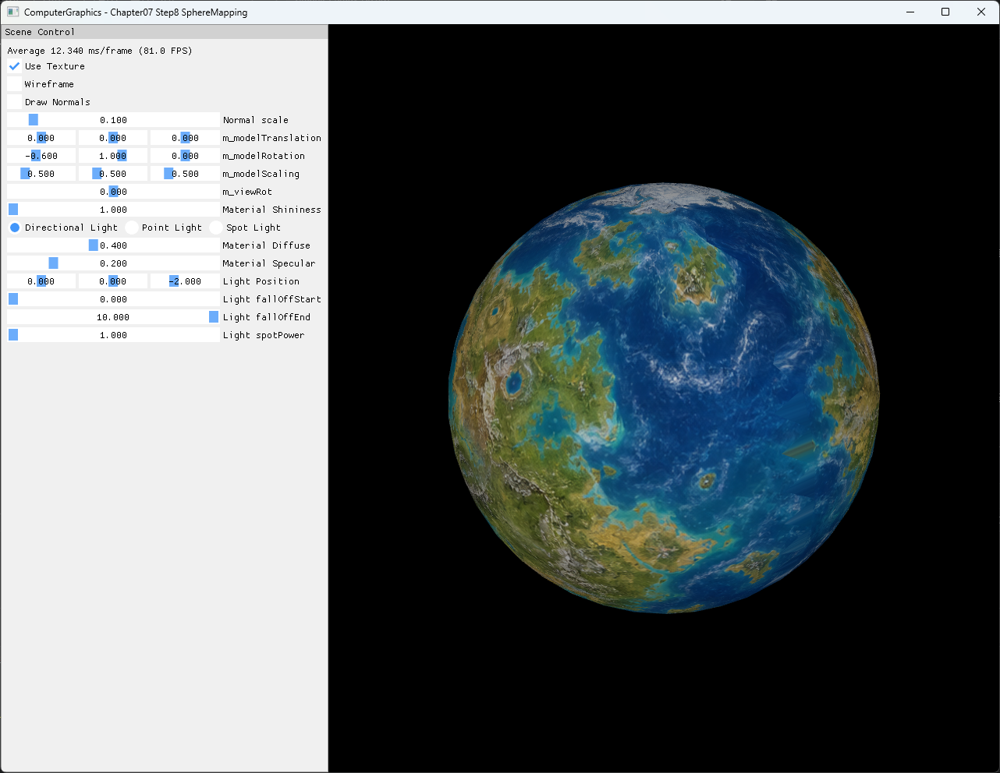

# Chapter07 Step8 SphereMapping Demo

## 목적

Icosahedron subdivision으로 만든 sphere에 spherical UV를 계산하고, U seam을 triangle-local vertex 복제로 보정해 2D 진단 texture를 연속적으로 표시한다.

## 책임 범위

- Icosahedron seed, 3회 subdivision, sphere projection과 radial normal을 설명한다.
- Longitude·latitude UV와 U seam vertex 복제의 구현 선택을 설명한다.
- 일반적인 구면 parameterization은 [Spherical Texture Mapping](../../01_Topics/TexturingAndMapping/SphericalTextureMapping.md)으로 위임한다.
- Texture sampling 설정은 [Texture Sampling](../../01_Topics/TexturingAndMapping/TextureSampling.md)으로 위임한다.
- Build/run/capture 사실은 [Verification Index](../../02_Verification/Part2_Chapter05-08/verification-index.md)로 위임한다.

## 결과 미리보기



## 입력과 출력

| 단계 | Vertex | Triangle | 설명 |
| --- | ---: | ---: | --- |
| Icosahedron seed | 12 | 20 | 정규화 전 공유 vertex와 triangle index |
| Subdivision 1 | 240 | 80 | Triangle당 4개 child와 triangle-local vertex |
| Subdivision 2 | 960 | 320 | Midpoint sphere projection과 UV 재계산 |
| Subdivision 3 | 3,840 | 1,280 | 최종 textured sphere surface |
| Optional diagnostic | 7,680 | 3,840 lines | Surface vertex마다 radial normal start·end 생성 |

Runtime input은 1774×887 `generated_fictional_planet_equirectangular.png`다. 실재 지형을 복제하지 않은 fictional planet의 비대칭 대륙·해양·극지 패턴을 사용해 sphere 방향과 mapping 결과를 추적한다.

## 구현 흐름

1. 12개 shared vertex와 20개 triangle로 icosahedron seed를 만든다.
2. 각 triangle의 세 edge midpoint를 계산한다.
3. 기존 vertex와 midpoint를 radius 1.5 sphere surface로 투영한다.
4. Projected position에서 radial normal과 spherical UV를 계산한다.
5. 원 triangle을 네 child triangle로 나눈다.
6. Child triangle의 U span이 0.5를 넘으면 outlier vertex를 복제해 U를 0 또는 1로 옮긴다.
7. 세 번 반복한 1,280 triangle surface에 generated texture를 wrap sampling한다.
8. 필요할 때 별도 `LINELIST`로 radial normal을 표시한다.

## 핵심 구현

### Sphere projection과 spherical UV

```cpp
// Pseudo C++: projected position에서 normal과 UV 계산
ProjectToSphere(vertex, radius)
{
    vertex.normal = Normalize(vertex.position);
    vertex.position = vertex.normal * radius;

    theta = Atan2(vertex.position.z, vertex.position.x);
    if (theta < 0)
    {
        theta += TwoPi;
    }

    phi = Acos(vertex.position.y / radius);
    vertex.uv = Float2(theta / TwoPi, phi / Pi);
}
```

- [Sphere projection, radial normal과 spherical UV 계산](../../../Part2_Chapter05-08/07_Modeling_Step8_SphereMapping/GeometryGenerator.cpp#L416-L445)

### Triangle-local seam 보정

```cpp
// Pseudo C++: U 경계를 가로지르는 outlier vertex 복제
AppendSeamSafeTriangle(a, b, c)
{
    if (TriangleUSpan(a, b, c) <= 0.5)
    {
        Append(a, b, c);
        return;
    }

    outlier = FindSeamOutlier(a, b, c);
    copy = outlier;
    copy.uv.x = NeighborSideIsHighU() ? 1.0 : 0.0;
    AppendTriangleWithCopy(copy);
}
```

- [U 차이 판정과 outlier vertex 복제](../../../Part2_Chapter05-08/07_Modeling_Step8_SphereMapping/GeometryGenerator.cpp#L448-L530)

### 반복 subdivision

```cpp
// Pseudo C++: 한 triangle을 sphere 위 네 triangle로 분할
SubdivideTriangle(v0, v1, v2)
{
    v3 = ProjectToSphere(Midpoint(v0, v1));
    v4 = ProjectToSphere(Midpoint(v1, v2));
    v5 = ProjectToSphere(Midpoint(v2, v0));

    AppendSeamSafeTriangle(v0, v3, v5);
    AppendSeamSafeTriangle(v3, v1, v4);
    AppendSeamSafeTriangle(v5, v4, v2);
    AppendSeamSafeTriangle(v3, v4, v5);
}
```

- [Midpoint 생성과 네 child triangle 구성](../../../Part2_Chapter05-08/07_Modeling_Step8_SphereMapping/GeometryGenerator.cpp#L532-L572)
- [Icosahedron seed와 3회 subdivision](../../../Part2_Chapter05-08/07_Modeling_Step8_SphereMapping/ExampleApp.cpp#L43-L50)

## 시각 결과

비대칭 대륙과 섬이 서로 다른 longitude에 놓여 sphere 회전과 U 방향을 구분한다. 북·남극의 밝은 ice band는 V 양 끝이 한 점으로 수렴하는 결과를 드러내며, 좌우 edge의 ocean pattern은 U=0·1 seam에서 중앙 대륙을 가로지르는 잘못된 보간이 생기는지 확인하게 한다.

## 구현 범위와 한계

- SphereMapping은 20-triangle icosahedron을 세 번 세분화해 1,280 triangle을 만든다.
- Subdivision 결과는 shared indexed mesh가 아니라 triangle-local 3,840 vertex 구조다.
- Normal은 projected position에서 만든 radial smooth normal이며 Step7 face normal을 사용하지 않는다.
- Seam 보정은 U span이 0.5를 넘는 triangle의 outlier vertex만 U=0 또는 1로 복제한다.
- 별도 pole correction은 구현하지 않는다. Pole position은 주변 triangle에 따라 여러 U로 복제될 수 있다.
- Midpoint UV 평균은 sphere projection 뒤 다시 계산되므로 최종 UV의 직접 근거가 아니다.
- Tangent space, mipmap 생성, anisotropic filtering과 vertex deduplication은 범위 밖이다.

## 검증

- Debug/Release x64 build/run 성공, 2026-08-03 현재 확인
- Project 폴더 CWD와 generated spherical diagnostic texture load 확인
- 20→80→320→1,280 triangle 증가와 최종 3,840 vertex 확인
- Static UV 조사에서 seam-adjusted final triangle 50개와 pole duplicate U=0·1 분포 확인
- Shader Model 5.0과 single texture SRV binding 확인
- Resize·minimize/restore와 전체 창 screenshot은 최종 GUI 검수 후 확정
- Generated input 1774×887 PNG의 dimensions, SHA-256와 metadata 검사 예정
- Video는 seam·pole을 1~2개 screenshot으로 판독 가능한지 확인한 뒤 최종 제외 판정

## 관련 코드

- [Icosahedron seed topology](../../../Part2_Chapter05-08/07_Modeling_Step8_SphereMapping/GeometryGenerator.cpp#L333-L366)
- [Sphere projection과 spherical UV](../../../Part2_Chapter05-08/07_Modeling_Step8_SphereMapping/GeometryGenerator.cpp#L416-L445)
- [Triangle-local U seam 보정](../../../Part2_Chapter05-08/07_Modeling_Step8_SphereMapping/GeometryGenerator.cpp#L448-L530)
- [반복 subdivision과 child triangle 구성](../../../Part2_Chapter05-08/07_Modeling_Step8_SphereMapping/GeometryGenerator.cpp#L532-L572)
- [Generated texture와 3회 subdivision](../../../Part2_Chapter05-08/07_Modeling_Step8_SphereMapping/ExampleApp.cpp#L20-L54)
- [Surface와 optional normal draw 분리](../../../Part2_Chapter05-08/07_Modeling_Step8_SphereMapping/ExampleApp.cpp#L237-L287)
- [Resize resource lifetime](../../../Part2_Chapter05-08/07_Modeling_Step8_SphereMapping/AppBase.cpp#L530-L555)

## 관련 문서

- [Chapter07 Step8 SphereMapping Example](../../../Part2_Chapter05-08/07_Modeling_Step8_SphereMapping/README.md)
- [이전 단계: Chapter07 Step7 FaceNormals Demo](07_07_FaceNormals.md)
- [다음 단계: Chapter07 Step9 ModelFiles Demo](07_09_ModelFiles.md)
- [Spherical Texture Mapping](../../01_Topics/TexturingAndMapping/SphericalTextureMapping.md)
- [Texture Sampling](../../01_Topics/TexturingAndMapping/TextureSampling.md)
- [Procedural Primitive Generation](../../01_Topics/ModelingAndGeometry/ProceduralPrimitiveGeneration.md)
- [Verification Index](../../02_Verification/Part2_Chapter05-08/verification-index.md)
- [Demo Index](demo-index.md)
- [Publication Candidate List](../../05_Publication/candidate-list.md)
