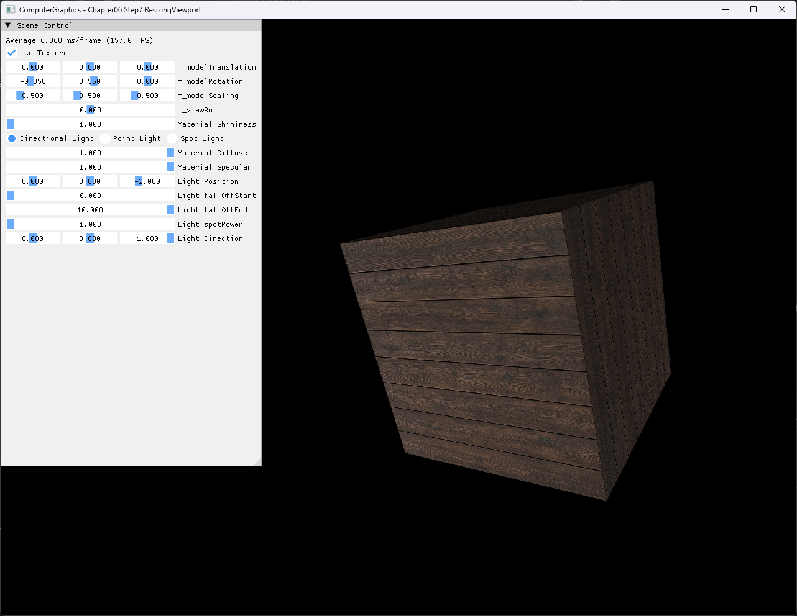

# Chapter06 Step7 ResizingViewport Demo

## 목적

Step7은 Step6의 textured lighting scene을 유지하면서 ImGui control panel과 scene viewport를 하나의 render target 안에서 분리한다. Panel 너비를 viewport의 시작 위치로 사용하고 남은 영역의 aspect ratio를 projection에 반영해 UI와 geometry가 겹치거나 늘어나지 않게 한다.

## 책임 범위

- 고정 크기 render target 안에서 panel과 scene viewport를 분리하는 구현 선택을 설명한다.
- Viewport rectangle과 projection aspect ratio가 함께 바뀌는 이유를 시각 결과에 연결한다.
- Step6 lighting·texture 경로를 유지한 상태에서 viewport 책임만 추가됐음을 구분한다.
- 일반 viewport 개념은 [Swap Chain And Viewport](../../01_Topics/DirectX11Pipeline/SwapChainAndViewport.md)로 위임한다.
- build/run/capture 사실은 [Verification Index](../../02_Verification/Part2_Chapter05-08/verification-index.md)로 위임한다.
- Window client resize와 dependent resource 재생성은 Step8 ResizingWindow로 위임한다.

## 결과 미리보기



## 입력과 출력

| 구분 | 내용 |
| --- | --- |
| UI 입력 | 왼쪽 `Scene Control` panel의 현재 너비 |
| Scene 입력 | Step6 box geometry, generated 목재 texture, transform·projection·Light parameter |
| Viewport | `TopLeftX=panelWidth`, `Width=screenWidth-panelWidth`, 전체 screen height |
| Projection | Scene viewport의 실제 `Width / Height` |
| 출력 | Panel 오른쪽의 textured·lit box와 겹침 없는 UI |

## 구현 흐름

1. Frame 시작 시 ImGui panel을 window의 왼쪽 위에 배치한다.
2. Panel의 현재 너비를 읽어 screen width 범위 안으로 제한한다.
3. Panel 오른쪽에서 시작하고 최소 1px 너비를 보장하는 scene viewport를 만든다.
4. Scene viewport의 실제 aspect ratio로 projection matrix를 갱신한다.
5. Render target 전체를 clear한 뒤 scene draw 직전에 viewport를 rasterizer에 binding한다.
6. Scene draw 뒤 ImGui draw data를 같은 back buffer에 합성하고 frame을 표시한다.

## 핵심 구현

### Panel 기반 Scene Viewport

Panel 너비는 고정 상수가 아니라 현재 ImGui window의 실제 너비에서 얻는다. 화면 너비를 넘어가는 값은 제한하고 scene 영역이 0이 되지 않도록 최소 1px을 남긴다.

#### Viewport 계산 의사코드

```cpp
// Pseudo C++: panel 오른쪽에 scene viewport 배치
Viewport MakeSceneViewport(float panelWidth, Size screen)
{
    float left = Clamp(panelWidth, 0, screen.width - 1);

    Viewport viewport;
    viewport.left = left;
    viewport.top = 0;
    viewport.width = Max(screen.width - left, 1);
    viewport.height = Max(screen.height, 1);
    return viewport;
}
```

- [Panel 너비 전달](../../../Part2_Chapter05-08/06_GraphicsPipeline_Step7_ResizingViewport/AppBase.cpp#L71-L81)
- [Scene viewport rectangle 계산](../../../Part2_Chapter05-08/06_GraphicsPipeline_Step7_ResizingViewport/AppBase.cpp#L543-L556)

### Viewport와 Projection 정렬

Viewport 폭만 줄이고 기존 전체 window aspect ratio를 유지하면 box가 수평으로 찌그러진다. Step7은 계산된 viewport의 `Width / Height`를 projection matrix에 반영해 남은 scene 영역에서도 geometry 비율을 유지한다.

#### Projection 갱신 의사코드

```cpp
// Pseudo C++: 실제 scene viewport 비율 사용
float aspect = sceneViewport.width / sceneViewport.height;

if (usePerspective)
{
    projection = Perspective(fovY, aspect, nearZ, farZ);
}
else
{
    projection = Orthographic(-aspect, aspect, -1, 1, nearZ, farZ);
}
```

- [Viewport aspect ratio 계산](../../../Part2_Chapter05-08/06_GraphicsPipeline_Step7_ResizingViewport/AppBase.cpp#L56-L60)
- [Projection matrix 갱신](../../../Part2_Chapter05-08/06_GraphicsPipeline_Step7_ResizingViewport/ExampleApp.cpp#L220-L231)
- [Viewport binding과 scene draw](../../../Part2_Chapter05-08/06_GraphicsPipeline_Step7_ResizingViewport/ExampleApp.cpp#L254-L292)

## 시각 결과

왼쪽 `Scene Control` panel은 420px 기본 너비로 배치되고 scene viewport는 바로 오른쪽에서 시작한다. Textured box는 panel 아래에 가려지지 않으며 줄어든 viewport 비율에 맞춘 projection 덕분에 수평 stretch 없이 표시된다.

Panel 아래와 scene 밖의 검은 영역은 전체 render target clear 결과이며 깨진 draw나 crop이 아니다. Step7의 핵심 결과는 하나의 정적 전체 창 screenshot에서 panel 경계, scene 시작점과 geometry 비율을 함께 확인할 수 있으므로 video는 제외한다.

## 구현 범위와 한계

- Render target, depth buffer와 window client size는 1280×960으로 고정한다.
- Runtime panel width 변화는 반영하지만 window drag resize는 검증하지 않는다.
- `WM_SIZE`, `ResizeBuffers()`, render target view와 depth resource 재생성은 Step8 책임이다.
- Panel이 지나치게 넓어지면 scene viewport는 최소 1px만 보장하며 실용적인 가독성까지 보장하지 않는다.
- Runtime shader와 texture load는 project 폴더 CWD에 의존한다.
- Debug/Release x64만 현재 검증하며 Win32 configuration은 다루지 않는다.

## 검증

- [Part2 Chapter05-08 Verification](../../02_Verification/Part2_Chapter05-08/verification-index.md)
- Debug x64 build/run: 성공, 2026-08-02 현재 확인, project 폴더 CWD
- Release x64 build/run: 성공, 2026-08-02 현재 확인, project 폴더 CWD
- Application title: `ComputerGraphics - Chapter06 Step7 ResizingViewport`
- Resource: Generated 목재 PNG load, Step5·Step5A·Step6와 동일 SHA-256
- Viewport: 420px panel 오른쪽의 scene 배치와 projection aspect ratio 반영 확인
- Capture: PNG 1282×992, 자동 기술 검수와 사용자 시각 승인 완료
- Video: 제외, 정적 전체 창 screenshot이 viewport 분리 결과를 충분히 설명함

## 관련 코드

- [ImGui frame과 viewport 갱신](../../../Part2_Chapter05-08/06_GraphicsPipeline_Step7_ResizingViewport/AppBase.cpp#L65-L101)
- [Scene viewport 계산](../../../Part2_Chapter05-08/06_GraphicsPipeline_Step7_ResizingViewport/AppBase.cpp#L543-L556)
- [Projection aspect 갱신](../../../Part2_Chapter05-08/06_GraphicsPipeline_Step7_ResizingViewport/ExampleApp.cpp#L220-L231)
- [Viewport binding과 scene draw](../../../Part2_Chapter05-08/06_GraphicsPipeline_Step7_ResizingViewport/ExampleApp.cpp#L254-L292)

## 관련 문서

- [Chapter06 Step7 ResizingViewport Example](../../../Part2_Chapter05-08/06_GraphicsPipeline_Step7_ResizingViewport/README.md)
- [이전 단계: Chapter06 Step6 Lighting Demo](06_Lighting.md)
- [다음 단계: Chapter06 Step8 ResizingWindow Demo](08_ResizingWindow.md)
- [Swap Chain And Viewport Topic](../../01_Topics/DirectX11Pipeline/SwapChainAndViewport.md)
- [Verification Index](../../02_Verification/Part2_Chapter05-08/verification-index.md)
- [Demo Index](demo-index.md)
- [Publication Candidate List](../../05_Publication/candidate-list.md)
