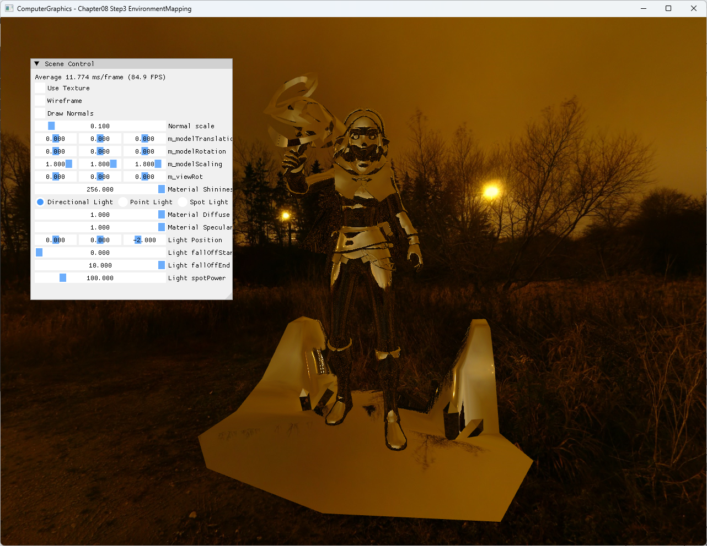

# Chapter08 Step3 EnvironmentMapping Demo

## 목적

Surface normal과 view direction으로 만든 reflection vector가 cubemap의 환경색을 선택하는 과정을 설명한다.

## 책임 범위

- 실제 reflection direction과 texture-cube sampling을 설명한다.
- 일반 이론은 [Cubemap And Environment Mapping](../../01_Topics/TexturingAndMapping/CubemapAndEnvironmentMapping.md)으로 위임한다.
- Build/run/capture 사실은 [Verification Index](../../02_Verification/Part2_Chapter05-08/verification-index.md)로 위임한다.

## 결과 미리보기



## 입력과 출력

| 구분 | 내용 |
| --- | --- |
| 입력 | World normal, eye direction, NightPath cubemap |
| 중간값 | `reflect(-V, N)` direction |
| 출력 | Environment reflection이 적용된 Zelda surface |

## 구현 흐름

1. NightPath DDS를 texture-cube SRV로 로드한다.
2. Vertex shader가 world position과 normal을 전달한다.
3. Pixel shader가 eye direction의 입사 벡터를 normal에 반사한다.
4. Reflection direction으로 cubemap을 sampling한다.
5. Optional diffuse texture와 environment color를 곱해 출력한다.

## 핵심 구현

```cpp
// Pseudo C++: environment reflection
ShadeEnvironment(worldPosition, normal, eye, cubemap)
{
    toEye = Normalize(eye - worldPosition);
    reflected = Reflect(-toEye, Normalize(normal));
    return cubemap.Sample(reflected);
}
```

- [Reflection direction과 cubemap sampling](../../../Part2_Chapter05-08/08_ShaderToys_Step3_EnvironmentMapping/BasicPixelShader.hlsl#L55-L73)
- [NightPath cubemap load](../../../Part2_Chapter05-08/08_ShaderToys_Step3_EnvironmentMapping/ExampleApp.cpp#L20-L34)

## 시각 결과

Zelda와 주변 geometry에 NightPath의 주황색 하늘과 밝은 광원이 방향에 따라 반사된다. 동일 cubemap이 배경과 surface reflection에 사용되어 scene의 환경 연결이 드러난다.

## 구현 범위와 한계

- Roughness에 따른 mip LOD와 Fresnel weight는 적용하지 않는다.
- NightPath attribution은 유지하지만 Zelda asset 권리 근거가 충분하지 않아 공개 후보로 확정하지 않는다.
- Dead `Use Reflection` UI를 제거했으며 reflection은 이 단계의 고정 구현이다.

## 검증

- Debug/Release x64 build/run 성공, 2026-08-03 현재 확인
- HLSL sample의 `.rgb` 명시로 vector truncation warning 제거
- Resize·minimize/restore와 runtime DLL 확인
- 1282×992 전체 창 screenshot과 exact title 확인

## 관련 코드

- [Cubemap resource 생성](../../../Part2_Chapter05-08/08_ShaderToys_Step3_EnvironmentMapping/AppBase.cpp#L694-L714)
- [Environment shader](../../../Part2_Chapter05-08/08_ShaderToys_Step3_EnvironmentMapping/BasicPixelShader.hlsl#L1-L74)
- [Scene draw](../../../Part2_Chapter05-08/08_ShaderToys_Step3_EnvironmentMapping/ExampleApp.cpp#L345-L425)

## 관련 문서

- [Chapter08 Step3 EnvironmentMapping Example](../../../Part2_Chapter05-08/08_ShaderToys_Step3_EnvironmentMapping/README.md)
- [이전 단계: Chapter08 Step2 Cubemapping Demo](08_02_Cubemapping.md)
- [다음 단계: Chapter08 Step4 ImageBasedLighting](08_04_ImageBasedLighting.md)
- [Cubemap And Environment Mapping](../../01_Topics/TexturingAndMapping/CubemapAndEnvironmentMapping.md)
- [Verification Index](../../02_Verification/Part2_Chapter05-08/verification-index.md)
- [Demo Index](demo-index.md)
- [Publication Candidate List](../../05_Publication/candidate-list.md)
