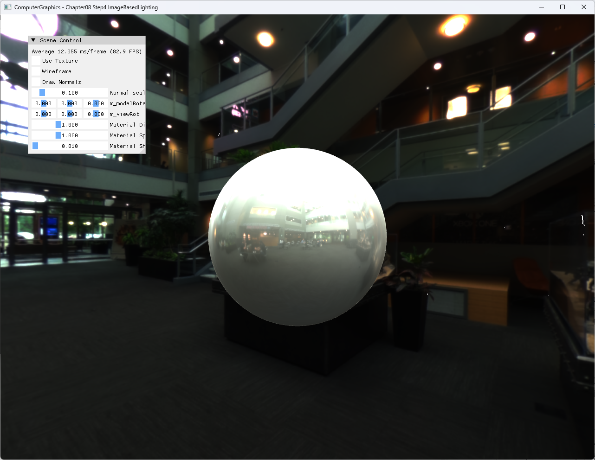

# Chapter08 Step4 ImageBasedLighting Demo

## 목적

Diffuse와 specular 환경 cubemap이 sphere의 surface lighting을 구성하는 방식을 설명한다.

## 책임 범위

- 실제 IBL resource와 shader sampling을 설명한다.
- 일반 이론은 [Image Based Lighting](../../01_Topics/LightingAndShading/ImageBasedLighting.md)으로 위임한다.
- 검증 사실은 [Verification Index](../../02_Verification/Part2_Chapter05-08/verification-index.md)로 위임한다.

## 결과 미리보기



## 입력과 출력

| 구분 | 내용 |
| --- | --- |
| 입력 | Atrium diffuse/specular cubemap, normal, view direction |
| 중간값 | Diffuse irradiance와 reflected specular lookup |
| 출력 | Environment lighting이 적용된 sphere |

## 구현 흐름

1. Diffuse와 specular DDS를 별도 SRV로 만든다.
2. Normal로 diffuse cubemap을 sampling한다.
3. `reflect(-V, N)`으로 specular cubemap을 sampling한다.
4. Material weight와 shininess로 두 결과를 조합한다.

## 핵심 구현

```cpp
// Pseudo C++: 최소 IBL 결합
ShadeIBL(normal, view, diffuseMap, specularMap)
{
    diffuse = diffuseMap.Sample(normal);
    reflected = Reflect(-view, normal);
    specular = specularMap.Sample(reflected);
    return diffuse * materialDiffuse + specular * materialSpecular;
}
```

- [IBL cubemap 초기화](../../../Part2_Chapter05-08/08_ShaderToys_Step4_ImageBasedLighting/ExampleApp.cpp#L24-L41)
- [Diffuse·specular sampling](../../../Part2_Chapter05-08/08_ShaderToys_Step4_ImageBasedLighting/BasicPixelShader.hlsl#L50-L64)

## 시각 결과

Atrium 환경이 배경과 sphere highlight에 함께 나타나고, normal 방향의 저주파 조명과 reflection 방향의 밝은 영역이 구분된다.

## 구현 범위와 한계

- Fixed cubemap sample만 사용하며 roughness LOD와 BRDF integration은 없다.
- Atrium과 surface texture 원본은 비공개로 유지하고 직접 실행한 rendered evidence만 공개한다.

## 검증

- Debug/Release x64 Clean/Rebuild와 실행 성공, 2026-08-03 현재 확인
- HLSL scalar·`pow` range warning 제거
- Resize·minimize/restore와 DirectXTK runtime 확인
- 1282×992 전체 창 screenshot과 exact title 확인

## 관련 코드

- [IBL shader](../../../Part2_Chapter05-08/08_ShaderToys_Step4_ImageBasedLighting/BasicPixelShader.hlsl#L1-L67)
- [Cubemap resource binding](../../../Part2_Chapter05-08/08_ShaderToys_Step4_ImageBasedLighting/ExampleApp.cpp#L356-L372)

## 관련 문서

- [Step4 Example](../../../Part2_Chapter05-08/08_ShaderToys_Step4_ImageBasedLighting/README.md)
- [이전 단계: Step3 Demo](08_03_EnvironmentMapping.md)
- [다음 단계: Chapter08 Step5 FresnelEffect](08_05_FresnelEffect.md)
- [Image Based Lighting](../../01_Topics/LightingAndShading/ImageBasedLighting.md)
- [Verification Index](../../02_Verification/Part2_Chapter05-08/verification-index.md)
- [Demo Index](demo-index.md)
