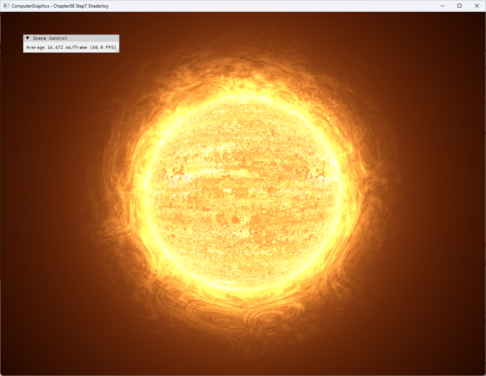

# Chapter08 Step7 Shadertoy Demo

## 목적

Full-screen pixel shader에 time, resolution과 texture channel을 공급하고 procedural noise로 움직이는 star surface와 corona를 만드는 과정을 보여준다.

## 책임 범위

- Step6 scene post-processing에서 Step7 shader-only animation으로 바뀌는 구현을 설명한다.
- Shadertoy 입력의 일반 개념은 [Shadertoy Runtime Inputs](../../01_Topics/DirectX11Pipeline/ShadertoyRuntimeInputs.md)로 위임한다.
- Build/run/capture 사실은 [Verification Index](../../02_Verification/Part2_Chapter05-08/verification-index.md)로 위임한다.

## 결과 미리보기



## 입력과 출력

| 구분 | 내용 |
| --- | --- |
| 입력 | `iTime`, 현재 render target 크기, `shadertoytexture0.jpg` |
| 처리 | Full-screen quad, multi-frequency noise, star surface와 corona 합성 |
| 출력 | 시간에 따라 표면과 glow가 움직이는 animated star |

## 구현 흐름

```text
Frame delta time
→ iTime 누적
→ current width·height를 iResolution으로 전달
→ texture channel 0 sampling
→ multi-frequency noise와 radial mask
→ star surface·corona 합성
→ full-screen output
```

## 핵심 구현

### Runtime 입력 연결

Application은 texture를 shader resource slot 0에 연결하고 매 frame 누적 시간을 constant buffer에 기록한다. Resize 후에는 현재 width와 height로 filter를 다시 만들어 resolution 입력과 viewport를 함께 정렬한다.

```cpp
// Pseudo C++: Shadertoy runtime inputs
RenderFrame(deltaTime, width, height)
{
    time += deltaTime;
    constants.iTime = time;
    constants.iResolution = float2(width, height);
    DrawFullScreen(textureChannel0, constants);
}
```

- [시간 입력 갱신](../../../Part2_Chapter05-08/08_ShaderToys_Step7_Shadertoy/ExampleApp.cpp#L101-L109)
- [Texture channel과 Star filter 구성](../../../Part2_Chapter05-08/08_ShaderToys_Step7_Shadertoy/ExampleApp.cpp#L152-L172)
- [Resolution constant 구성](../../../Part2_Chapter05-08/08_ShaderToys_Step7_Shadertoy/ImageFilter.h#L109-L116)

### Star surface와 corona

Pixel shader는 texture channel에서 밝기 값을 얻고 여러 주파수의 3D noise를 합성한다. Radial distance는 star 본체와 바깥 corona를 나누며 `iTime`이 noise coordinate를 이동시킨다.

- [Noise 함수와 texture 밝기 입력](../../../Part2_Chapter05-08/08_ShaderToys_Step7_Shadertoy/StarPixelShader.hlsl#L28-L68)
- [Multi-frequency surface noise](../../../Part2_Chapter05-08/08_ShaderToys_Step7_Shadertoy/StarPixelShader.hlsl#L79-L93)
- [Star texture와 corona 합성](../../../Part2_Chapter05-08/08_ShaderToys_Step7_Shadertoy/StarPixelShader.hlsl#L98-L127)

### Resize-safe full-screen filter

Aspect ratio는 고정 `1280/960` 대신 현재 `iResolution`에서 계산한다. Window resize는 swap-chain dependent resource와 Star filter를 다시 만들어 늘어나거나 찌그러진 결과를 방지한다.

- [현재 resolution 기반 aspect](../../../Part2_Chapter05-08/08_ShaderToys_Step7_Shadertoy/StarPixelShader.hlsl#L65-L72)
- [Resize 후 filter 재생성](../../../Part2_Chapter05-08/08_ShaderToys_Step7_Shadertoy/ExampleApp.cpp#L175-L178)
- [Swap-chain resource 재생성](../../../Part2_Chapter05-08/08_ShaderToys_Step7_Shadertoy/AppBase.cpp#L487-L510)

## 시각 결과

정지 capture에서는 밝은 star 본체, 표면 noise와 바깥 corona를 함께 판독한다. 9.83초 selected local video에서는 같은 화면의 noise와 corona가 끊김 없이 시간에 따라 움직이는지 확인한다.

## 구현 범위와 한계

- 활성 runtime은 Star shader 한 개와 texture channel 0 하나만 사용한다.
- `Seascape`와 `EnergeticFlyby`는 활성 결과가 아니므로 Demo 설명과 capture 근거에서 제외한다.
- Audio channel, mouse input과 다중 render pass 같은 Shadertoy 기능은 구현하지 않는다.
- Star shader의 원문 링크·작성자 표기는 유지하지만 license와 texture 출처 근거가 충분하지 않아 Publication은 `검토 필요`다.
- Video는 local evidence이며 일반 Git history와 GitHub 게시 후보에 포함하지 않는다.

## 검증

- Debug/Release x64 Clean/Rebuild와 run 성공
- 비활성 Seascape shader build 제외와 활성 Star shader warning 제거
- Wide·compact resize, minimize/restore와 기본 크기 복원 성공
- 1282×992 전체 창 PNG와 공개 application title 확인
- 9.83초, 30 FPS, H.264/yuv420p selected local video full decode 성공
- Screenshot과 video의 계정·개인정보·외부 application UI 부재 확인

## 관련 코드

- [Full-screen filter render](../../../Part2_Chapter05-08/08_ShaderToys_Step7_Shadertoy/ImageFilter.h#L127-L158)
- [Star filter 생성](../../../Part2_Chapter05-08/08_ShaderToys_Step7_Shadertoy/ExampleApp.cpp#L152-L172)
- [Star pixel shader](../../../Part2_Chapter05-08/08_ShaderToys_Step7_Shadertoy/StarPixelShader.hlsl#L58-L127)

## 관련 문서

- [Chapter08 Step7 Shadertoy Example](../../../Part2_Chapter05-08/08_ShaderToys_Step7_Shadertoy/README.md)
- [이전 단계: Chapter08 Step6 BloomEffect Demo](08_06_BloomEffect.md)
- [Shadertoy Runtime Inputs](../../01_Topics/DirectX11Pipeline/ShadertoyRuntimeInputs.md)
- [Verification Index](../../02_Verification/Part2_Chapter05-08/verification-index.md)
- [Demo Index](demo-index.md)
