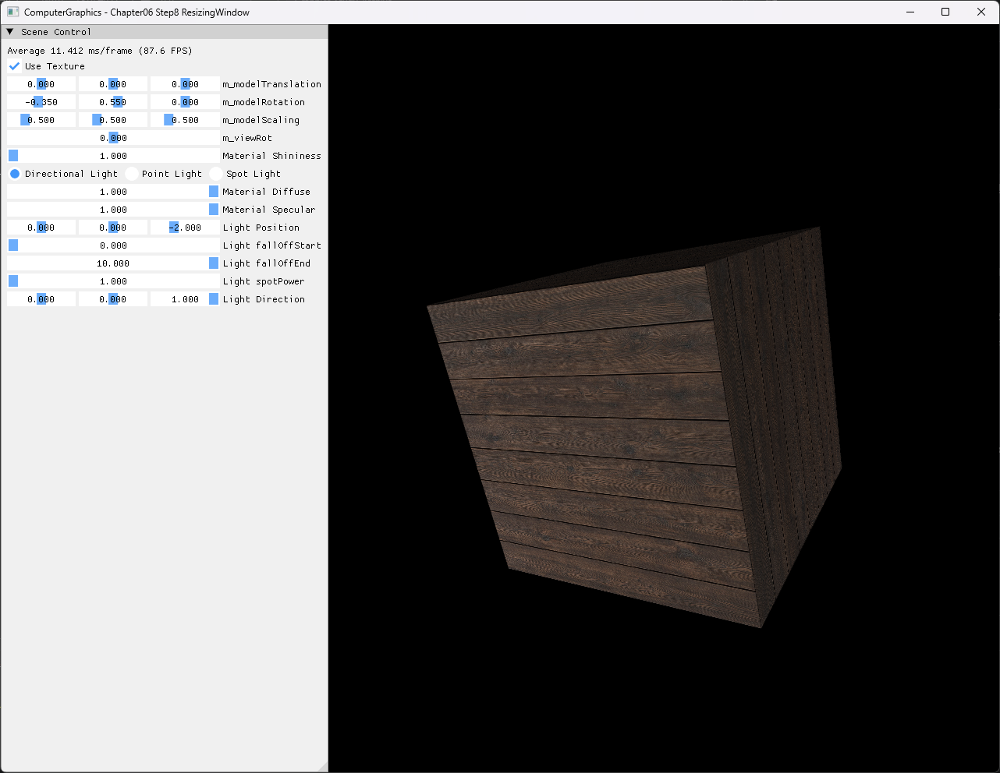
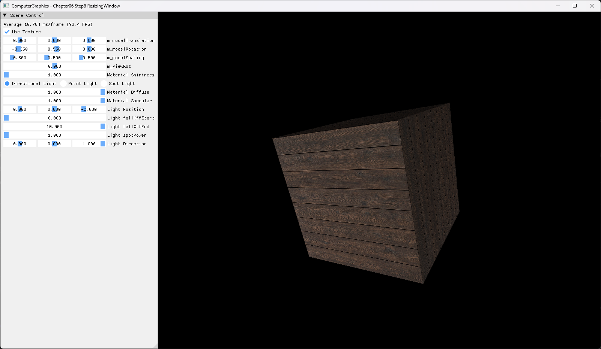
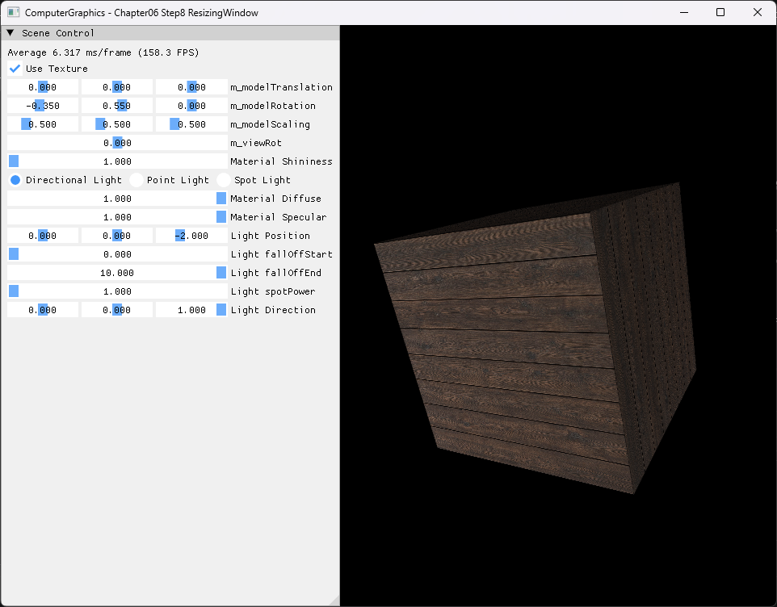

# Chapter06 Step8 ResizingWindow Demo

## 목적

Step8은 Step7의 panel·scene viewport 분리를 유지하면서 실제 window client size 변경에 맞춰 swap chain dependent resource와 projection을 다시 연결한다. Default, wide와 compact window에서 같은 box 비율과 textured lighting 결과가 유지되는지 확인한다.

## 책임 범위

- `WM_SIZE`에서 유효한 client size와 최소화·0×0 상태를 구분한다.
- Back buffer resize 전후의 RTV·depth resource lifetime과 재생성 순서를 설명한다.
- 새 client size, panel width, scene viewport와 projection aspect ratio를 연결한다.
- 일반 swap chain·viewport 개념은 [Swap Chain And Viewport](../../01_Topics/DirectX11Pipeline/SwapChainAndViewport.md)로 위임한다.
- build/run/capture 사실은 [Verification Index](../../02_Verification/Part2_Chapter05-08/verification-index.md)로 위임한다.
- Phong과 Blinn-Phong 비교는 Step9로 위임한다.

## 결과 미리보기







## 입력과 출력

| 구분 | 내용 |
| --- | --- |
| Window 입력 | Default 1280×960, wide 1600×900, compact 960×720 client size와 최소화·복원 |
| Scene 입력 | Step7 box geometry, generated 목재 texture, transform·projection·Light parameter |
| Resource | Client size에 맞춘 swap chain back buffer RTV와 depth texture·DSV |
| Viewport | Panel 오른쪽에서 시작하고 현재 client height를 사용하는 scene rectangle |
| 출력 | 세 window 크기에서 비율·depth·lighting을 유지하는 textured box |

## 구현 흐름

1. `WM_SIZE`에서 최소화와 0×0 크기를 제외한다.
2. Output merger에서 기존 render target과 depth target을 unbind한다.
3. RTV, DSV와 depth texture 참조를 해제한다.
4. `ResizeBuffers()`로 swap chain back buffer를 새 client size에 맞춘다.
5. 새 back buffer RTV와 같은 크기의 depth texture·DSV를 생성한다.
6. 현재 panel width로 scene viewport를 다시 계산한다.
7. Scene viewport의 aspect ratio로 projection을 갱신하고 rendering을 재개한다.

## 핵심 구현

### 최소화와 유효 크기 분리

최소화 과정의 `WM_SIZE`는 width와 height가 0일 수 있다. 이때 back buffer와 depth resource를 0×0으로 만들지 않고 마지막 유효 resource를 보존하며, 복원 후 전달된 양수 크기에서만 resize를 수행한다.

#### Resize 진입 의사코드

```cpp
// Pseudo C++: 최소화와 0x0 client size 제외
OnWindowSizeChanged(state, width, height)
{
    if (state == Minimized || width == 0 || height == 0)
    {
        pauseRendering = true;
        return;
    }

    pauseRendering = false;
    ResizeClientResources(width, height);
}
```

- [최소화와 client size 처리](../../../Part2_Chapter05-08/06_GraphicsPipeline_Step8_ResizingWindow/AppBase.cpp#L132-L151)

### Resize dependent resource lifetime

Swap chain back buffer를 참조하는 RTV와 output-merger binding이 남아 있으면 `ResizeBuffers()`가 실패할 수 있다. Step8은 target을 unbind하고 RTV·DSV·depth texture를 해제한 뒤 back buffer와 dependent view를 순서대로 재생성한다.

#### Resource 재생성 의사코드

```cpp
// Pseudo C++: swap chain dependent resource 재생성
bool ResizeClientResources(Size client)
{
    UnbindOutputTargets();
    ReleaseRenderAndDepthViews();

    if (!ResizeSwapChainBuffers(client))
    {
        return false;
    }
    if (!CreateRenderTargetView() || !CreateDepthBuffer(client))
    {
        return false;
    }

    return true;
}
```

- [Resize dependent resource 재생성](../../../Part2_Chapter05-08/06_GraphicsPipeline_Step8_ResizingWindow/AppBase.cpp#L486-L518)
- [Back buffer RTV 생성](../../../Part2_Chapter05-08/06_GraphicsPipeline_Step8_ResizingWindow/AppBase.cpp#L442-L456)
- [Depth texture와 DSV 생성](../../../Part2_Chapter05-08/06_GraphicsPipeline_Step8_ResizingWindow/AppBase.cpp#L458-L484)

### Viewport와 Projection 재정렬

새 back buffer 전체 크기와 panel 오른쪽의 scene viewport 크기는 서로 다르다. Step8은 현재 panel width를 client width에서 제외한 scene rectangle을 만들고 그 실제 `Width / Height`를 projection에 사용해 box가 stretch되지 않게 한다.

- [Scene viewport 계산](../../../Part2_Chapter05-08/06_GraphicsPipeline_Step8_ResizingWindow/AppBase.cpp#L619-L632)
- [Projection aspect 갱신](../../../Part2_Chapter05-08/06_GraphicsPipeline_Step8_ResizingWindow/ExampleApp.cpp#L223-L234)
- [Viewport binding과 scene draw](../../../Part2_Chapter05-08/06_GraphicsPipeline_Step8_ResizingWindow/ExampleApp.cpp#L254-L292)

## 시각 결과

Default 1280×960에서는 Step7과 같은 panel·scene 분리가 유지된다. Wide 1600×900에서는 scene의 가로 공간이 늘어나지만 box의 면 비율은 유지되고, compact 960×720에서도 panel 오른쪽의 좁아진 scene 안에 같은 box가 crop 없이 표시된다.

Debug와 Release에서 추가 크기 전환을 반복하고 최소화·복원했다. Black frame, stale frame, panel overlap, geometry stretch와 depth mismatch 없이 rendering이 다시 이어졌다. 세 screenshot은 서로 다른 bounds 자체가 설명 대상이며 같은 camera, geometry, Light, monitor와 capture 방식을 사용한다.

## 구현 범위와 한계

- Windowed swap chain의 client resize, 반복 resize와 최소화·복원을 다룬다.
- Device-lost 전체 복구, fullscreen, DPI와 multi-monitor 전환은 포함하지 않는다.
- Resize 실패 시 rendering을 중단하지만 이전 resource 상태로 rollback하지 않는다.
- Panel이 지나치게 넓으면 scene viewport는 최소 1px만 보장한다.
- Runtime shader와 texture load는 project 폴더 CWD에 의존한다.
- 기존 recorder는 bounds 변경을 오류로 처리하므로 resize video는 전용 opt-in capture mode가 마련될 때까지 보류한다.

## 검증

- [Part2 Chapter05-08 Verification](../../02_Verification/Part2_Chapter05-08/verification-index.md)
- Debug x64 build/run: 성공, 2026-08-02 현재 확인, project 폴더 CWD
- Release x64 build/run: 성공, 2026-08-02 현재 확인, project 폴더 CWD
- Resize: default·wide·compact와 추가 크기 전환 반복 후 rendering 유지
- Minimize/restore: 0×0 resource 생성 생략과 복원 후 rendering 재개
- Resource: Generated 목재 PNG load, Step5·Step5A·Step6·Step7과 동일 SHA-256
- Capture: PNG 1282×992, 1602×932, 962×752 기술·시각 검수 완료
- Video: 보류, 기존 recorder의 고정 bounds 계약과 Step8 resize 책임 충돌

## 관련 코드

- [Window size message 처리](../../../Part2_Chapter05-08/06_GraphicsPipeline_Step8_ResizingWindow/AppBase.cpp#L132-L151)
- [Resize resource lifetime](../../../Part2_Chapter05-08/06_GraphicsPipeline_Step8_ResizingWindow/AppBase.cpp#L486-L518)
- [Scene viewport 계산](../../../Part2_Chapter05-08/06_GraphicsPipeline_Step8_ResizingWindow/AppBase.cpp#L619-L632)
- [Projection과 scene draw](../../../Part2_Chapter05-08/06_GraphicsPipeline_Step8_ResizingWindow/ExampleApp.cpp#L223-L292)

## 관련 문서

- [Chapter06 Step8 Example README](../../../Part2_Chapter05-08/06_GraphicsPipeline_Step8_ResizingWindow/README.md)
- [이전 단계: Chapter06 Step7 ResizingViewport](07_ResizingViewport.md)
- 다음 단계: Chapter06 Step9 PhongVsBlinnPhong 문서화 대기
- [Swap Chain And Viewport Topic](../../01_Topics/DirectX11Pipeline/SwapChainAndViewport.md)
- [Verification Index](../../02_Verification/Part2_Chapter05-08/verification-index.md)
- [Demo Index](demo-index.md)
