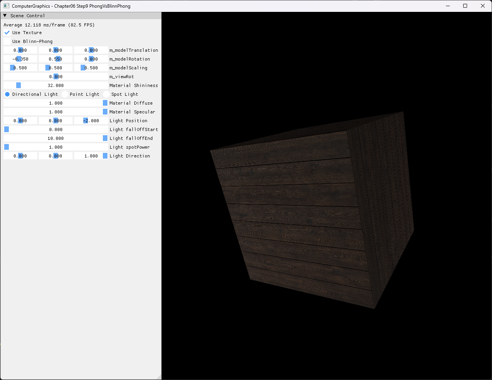

# Chapter06 Step9 PhongVsBlinnPhong Demo

## 목적

Step9은 같은 textured box, camera, Directional Light와 material 조건에서 Phong과 Blinn-Phong specular 계산을 전환해 reflection vector와 halfway vector 선택이 highlight에 미치는 차이를 확인한다.

## 책임 범위

- Step8의 resize-safe viewport·resource 기반 위에 추가된 shading model 선택만 설명한다.
- 동일 조건을 유지한 두 screenshot으로 specular vector와 exponent 선택의 결과를 비교한다.
- 일반 이론은 [Phong And Blinn-Phong](../../01_Topics/LightingAndShading/PhongAndBlinnPhong.md)으로 위임한다.
- build/run/capture 사실은 [Verification Index](../../02_Verification/Part2_Chapter05-08/verification-index.md)로 위임한다.
- Swap chain resize와 viewport 책임은 [Step8 ResizingWindow](08_ResizingWindow.md)로 위임한다.

## 결과 미리보기

### Phong



### Blinn-Phong


## 입력과 출력

| 구분 | 내용 |
| --- | --- |
| Geometry·camera | Step8과 같은 회전된 textured box와 perspective camera |
| Light·material | Directional Light, diffuse 1, specular 1, shininess UI 32 |
| Phong 입력 | Surface-to-light vector를 반사한 reflection vector |
| Blinn-Phong 입력 | View vector와 light vector 합으로 만든 halfway vector |
| 출력 | 동일 조건에서 각 specular model을 적용한 전체 창 screenshot |

## 구현 흐름

1. ImGui checkbox에서 현재 shading model을 선택한다.
2. CPU의 `bool` 상태를 32-bit constant buffer flag로 변환한다.
3. Pixel마다 normalized light, view와 surface normal을 준비한다.
4. Blinn-Phong이면 view·light 합의 길이를 검사하고 halfway vector를 만든다.
5. Phong이면 incoming light를 normal 기준으로 반사한 reflection vector를 만든다.
6. 각 vector와 normal 또는 view의 내적을 shininess exponent에 적용한다.
7. 같은 diffuse·light strength에 선택한 specular 항을 더해 texture와 합성한다.

## 핵심 구현

### CPU와 GPU 비교 상태 정렬

ImGui는 C++ `bool`을 직접 편집하지만 HLSL constant buffer의 scalar flag는 4-byte slot을 사용한다. Step9은 UI 상태와 GPU 전송 값을 분리하고 매 frame `0` 또는 `1`인 32-bit 값으로 변환한다.

#### 비교 flag 의사코드

```cpp
// Pseudo C++: UI 상태를 명시적인 GPU flag로 변환
UpdateShadingMode()
{
    gpuConstants.useBlinnPhong = uiUseBlinnPhong ? 1u : 0u;
    Upload(gpuConstants);
}
```

- [비교 상태 layout](../../../Part2_Chapter05-08/06_GraphicsPipeline_Step9_PhongVsBlinnPhong/ExampleApp.h#L65-L74)
- [비교 상태 GPU 전달](../../../Part2_Chapter05-08/06_GraphicsPipeline_Step9_PhongVsBlinnPhong/ExampleApp.cpp#L235-L240)
- [비교 checkbox](../../../Part2_Chapter05-08/06_GraphicsPipeline_Step9_PhongVsBlinnPhong/ExampleApp.cpp#L296-L301)

### Reflection vector와 Halfway vector

Phong은 반사된 light vector와 view vector의 정렬을 사용한다. Blinn-Phong은 light와 view의 중간 방향을 normal과 비교한다. 같은 UI shininess에서 highlight 폭을 가깝게 비교하기 위해 Blinn-Phong exponent에 2배 계수를 적용한다.

#### Specular 선택 의사코드

```cpp
// Pseudo C++: 같은 lighting 입력에서 specular vector 선택
EvaluateSpecular(light, view, normal, material, useBlinnPhong)
{
    if (useBlinnPhong)
    {
        halfway = SafeNormalize(view + light);
        factor = Pow(Max(Dot(halfway, normal), 0), material.shininess * 2);
    }
    else
    {
        reflected = Reflect(-light, normal);
        factor = Pow(Max(Dot(reflected, view), 0), material.shininess);
    }

    return material.specular * factor;
}
```

- [Phong·Blinn-Phong 분기](../../../Part2_Chapter05-08/06_GraphicsPipeline_Step9_PhongVsBlinnPhong/BasicPixelShader.hlsl#L16-L42)
- [Halfway zero-vector 방어](../../../Part2_Chapter05-08/06_GraphicsPipeline_Step9_PhongVsBlinnPhong/BasicPixelShader.hlsl#L23-L32)
- [Directional·Point·Spot 연결](../../../Part2_Chapter05-08/06_GraphicsPipeline_Step9_PhongVsBlinnPhong/BasicPixelShader.hlsl#L44-L111)

## 시각 결과

두 screenshot은 1282×992 전체 창, 같은 box transform, texture, camera, Directional Light, material diffuse·specular와 shininess 32를 사용한다. Checkbox 상태만 달라 UI에서 비교 조건과 선택 model을 함께 확인할 수 있다.

두 결과의 diffuse와 texture pattern은 유지되고 specular highlight의 분포만 달라진다. 이는 두 모델이 같은 표면과 광원에서도 서로 다른 비교 vector와 exponent를 사용한다는 점을 보여준다.

## 구현 범위와 한계

- 고전적인 local illumination의 specular 항 비교만 다룬다.
- Blinn-Phong exponent 2배는 highlight 폭을 위한 경험적 비교 조건이며 동일 exponent의 엄밀한 수학 비교가 아니다.
- Directional·Point·Spot helper는 공유하지만 capture는 변수 통제를 위해 Directional Light만 사용한다.
- PBR microfacet BRDF, Fresnel, roughness와 energy conservation은 포함하지 않는다.
- Generated 목재 texture는 Step5~8과 같은 SHA-256 asset을 사용한다.
- Video는 제외하며 checkbox 상태가 보이는 정적 screenshot 두 장을 비교 근거로 사용한다.

## 검증

- [Part2 Chapter05-08 Verification](../../02_Verification/Part2_Chapter05-08/verification-index.md)
- Debug x64 build/run: 성공, 2026-08-02 현재 확인, project 폴더 CWD
- Release x64 build/run: 성공, 2026-08-02 현재 확인, project 폴더 CWD
- Shading mode: Phong·Blinn-Phong checkbox 전환과 동일 조건 결과 확인
- Numerical stability: halfway zero vector, 0 거리와 falloff 분모 방어 확인
- Resize: 반복 resize와 minimize/restore 자동 sequence 통과
- Resource: Generated 목재 PNG load, Step5~8과 동일 SHA-256
- Capture: PNG 1282×992 두 장, metadata·기술·시각 검수 완료
- Video: 제외, 정적 mode 비교로 학습 차이 설명 가능

## 관련 코드

- [Constant buffer와 UI state](../../../Part2_Chapter05-08/06_GraphicsPipeline_Step9_PhongVsBlinnPhong/ExampleApp.h#L65-L74)
- [Mode 전달과 UI 선택](../../../Part2_Chapter05-08/06_GraphicsPipeline_Step9_PhongVsBlinnPhong/ExampleApp.cpp#L235-L240)
- [Specular model 비교](../../../Part2_Chapter05-08/06_GraphicsPipeline_Step9_PhongVsBlinnPhong/BasicPixelShader.hlsl#L16-L42)
- [Light 평가와 안전성](../../../Part2_Chapter05-08/06_GraphicsPipeline_Step9_PhongVsBlinnPhong/BasicPixelShader.hlsl#L44-L111)
- [Resize resource lifetime](../../../Part2_Chapter05-08/06_GraphicsPipeline_Step9_PhongVsBlinnPhong/AppBase.cpp#L485-L516)

## 관련 문서

- [Chapter06 Step9 Example README](../../../Part2_Chapter05-08/06_GraphicsPipeline_Step9_PhongVsBlinnPhong/README.md)
- [이전 단계: Chapter06 Step8 ResizingWindow Demo](08_ResizingWindow.md)
- [다음 단계: Chapter07 Step1 DrawingWireFrames Demo](07_01_DrawingWireFrames.md)
- [Phong And Blinn-Phong Topic](../../01_Topics/LightingAndShading/PhongAndBlinnPhong.md)
- [Verification Index](../../02_Verification/Part2_Chapter05-08/verification-index.md)
- [Demo Index](demo-index.md)
- [Publication Candidate List](../../05_Publication/candidate-list.md)
