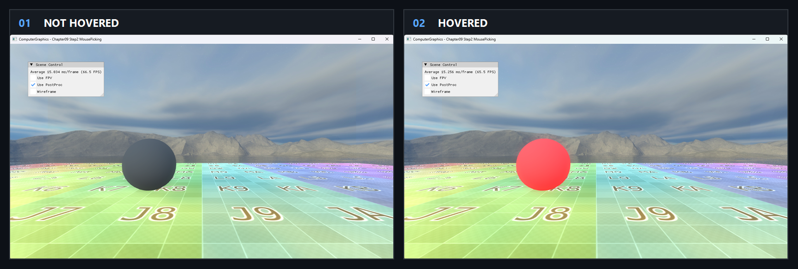

# Chapter09 Step2 MousePicking Demo

## 목적

GPU가 기록한 object ID color를 cursor 위치에서 읽어 hover object를 식별하는 경로를 보여준다.

## 책임 범위

- ID render target, MSAA resolve와 1×1 staging readback을 설명한다.
- Picking 이론은 [Picking And Screen Ray](../../01_Topics/AnimationAndPhysics/PickingAndScreenRay.md), 검증 사실은 [Verification](../../02_Verification/Part3_Chapter09/verification-index.md)에 위임한다.

## 결과 미리보기

### Hover 판정

`Not Hovered → Hovered` 순서로 왼쪽에서 오른쪽으로 본다.

- 입력 변화: Cursor를 배경에서 왼쪽 sphere 위로 이동한다.
- 관찰 지점: 선택되지 않은 기본 상태가 red highlight로 바뀐다.
- 구현 결과: Cursor pixel의 ID color readback이 object highlight state에 연결된다.

## 입력과 출력

| 구분 | 내용 |
| --- | --- |
| 입력 | Cursor pixel과 object별 ID color |
| 출력 | Readback color와 hover highlight state |

## 구현 흐름

1. Scene color와 object ID를 두 render target에 기록한다.
2. ID target을 single-sample texture로 resolve한다.
3. Cursor의 1×1 영역을 staging texture에 복사한다.
4. CPU가 color를 읽고 object highlight를 갱신한다.

## 핵심 구현

### ID Buffer Readback

화면에 보이는 geometry와 같은 draw에서 ID color를 만들고 필요한 한 pixel만 CPU로 가져온다.

- [Picking texture 구성](../../../Part3_Chapter09/09_UserInteraction_Step2_MousePicking/AppBase.cpp#L544-L630)
- [Cursor pixel readback](../../../Part3_Chapter09/09_UserInteraction_Step2_MousePicking/ExampleApp.cpp#L221-L316)

## 시각 결과

기본 PNG는 ground와 sphere의 ID 대상 관계를 보여준다. Hover PNG는 sphere 중심 cursor의 GPU readback 결과가 red highlight로 연결되는 상태를 보여준다.

## 구현 범위와 한계

- 동기 readback을 매 frame 수행한다.
- MSAA edge와 exact color 비교는 경계에서 불안정할 수 있다.
- Scene asset의 공개 권리 근거가 부족해 Publication은 `검토 필요`다.

## 검증

- [Verification Index](../../02_Verification/Part3_Chapter09/verification-index.md)

## 관련 코드

- [Highlight state 연결](../../../Part3_Chapter09/09_UserInteraction_Step2_MousePicking/ExampleApp.cpp#L317-L334)
- [Example README](../../../Part3_Chapter09/09_UserInteraction_Step2_MousePicking/README.md)

## 관련 문서

- [Picking And Screen Ray](../../01_Topics/AnimationAndPhysics/PickingAndScreenRay.md)
- [이전 Demo](09_01_FirstPersonView.md)
- [다음 Demo](09_03_MousePickingRayCollision.md)
- [Demo Index](demo-index.md)
