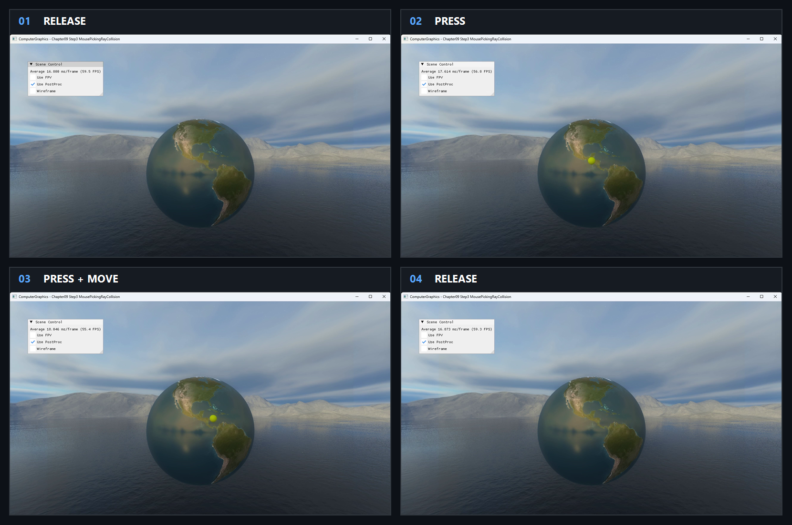

# Chapter09 Step3 MousePickingRayCollision Demo

## 목적

Cursor에서 만든 world-space ray와 bounding sphere의 CPU collision으로 object를 식별하는 경로를 보여준다.

## 책임 범위

- NDC 역변환, ray 구성과 bounding sphere hit를 설명한다.
- Picking 이론은 [Picking And Screen Ray](../../01_Topics/AnimationAndPhysics/PickingAndScreenRay.md), 검증 사실은 [Verification](../../02_Verification/Part3_Chapter09/verification-index.md)에 위임한다.

## 결과 미리보기

### Press lifecycle

`Release → Press → Press + Move → Release` 순서로 왼쪽 위에서 오른쪽 아래로 본다.

- 입력 변화: Earth sphere에서 pointer를 누른 채 이동한 뒤 release한다.
- 관찰 지점: Press 중 hit marker가 나타나 cursor ray를 따라 이동하고 release하면 사라진다.
- 구현 결과: World-space ray와 bounding sphere 교차 결과가 pointer capture lifecycle에 연결된다.

## 입력과 출력

| 구분 | 내용 |
| --- | --- |
| 입력 | Cursor NDC, inverse view-projection, bounding sphere |
| 출력 | Hit 여부, distance와 world-space hit marker |

## 구현 흐름

1. Cursor near/far NDC를 만든다.
2. Inverse view-projection으로 world near/far를 계산한다.
3. 두 점에서 normalized ray를 구성한다.
4. Bounding sphere intersection 결과로 selection과 marker를 갱신한다.

## 핵심 구현

### World Ray Collision

GPU ID readback 대신 CPU가 단순 bounding volume과 교차해 선택 여부와 거리를 얻는다.

- [Cursor NDC 변환](../../../Part3_Chapter09/09_UserInteraction_Step3_MousePickingRayCollision/AppBase.cpp#L141-L158)
- [Ray와 bounding sphere 교차](../../../Part3_Chapter09/09_UserInteraction_Step3_MousePickingRayCollision/ExampleApp.cpp#L110-L166)

## 시각 결과

Earth sphere는 picking 대상과 bounding volume의 위치를 명확히 보여준다. Release·press PNG와 selected local video는 pointer press, sphere 안쪽 marker 이동과 release 소멸을 순서대로 보여준다.

## 구현 범위와 한계

- Triangle surface가 아닌 bounding sphere 근사 교차다.
- Press 중에도 cursor ray가 sphere silhouette을 벗어나면 marker가 사라진다.
- Step3은 `_Solution` 기반이며 개인 고유 구현으로 주장하지 않는다.
- Earth와 cubemap 원본은 비공개 runtime dependency로 유지하고 직접 실행 visual은 승인된 Chapter09 Bundle 예외에 따라 `공개 가능`으로 판정한다.

## 검증

- [Verification Index](../../02_Verification/Part3_Chapter09/verification-index.md)

## 관련 코드

- [Hit marker 갱신](../../../Part3_Chapter09/09_UserInteraction_Step3_MousePickingRayCollision/ExampleApp.cpp#L141-L166)
- [Mouse capture와 release 복구](../../../Part3_Chapter09/09_UserInteraction_Step3_MousePickingRayCollision/AppBase.cpp#L248-L257)
- [Example README](../../../Part3_Chapter09/09_UserInteraction_Step3_MousePickingRayCollision/README.md)

## 관련 문서

- [Picking And Screen Ray](../../01_Topics/AnimationAndPhysics/PickingAndScreenRay.md)
- [이전 Demo](09_02_MousePicking.md)
- [다음 Demo](09_04_QuaternionRotation.md)
- [Demo Index](demo-index.md)
