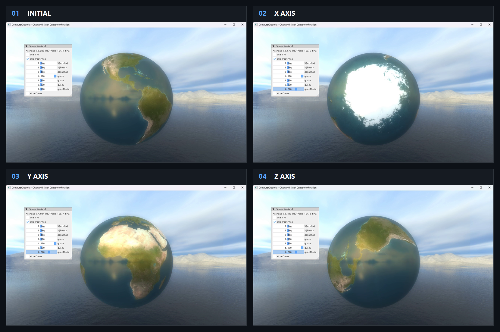

# Chapter09 Step4 QuaternionRotation Demo

## 목적

Axis-angle UI를 quaternion과 model rotation matrix로 변환하는 수치 기반 회전 단계를 보여준다.

## 책임 범위

- Axis normalization, half-angle quaternion과 matrix 적용을 설명한다.
- 일반 이론은 [Quaternion And Virtual Trackball](../../01_Topics/AnimationAndPhysics/QuaternionAndVirtualTrackball.md), 검증 사실은 [Verification](../../02_Verification/Part3_Chapter09/verification-index.md)에 위임한다.

## 결과 미리보기

### Axis별 회전

`Initial → X Axis → Y Axis → Z Axis` 순서로 왼쪽 위에서 오른쪽 아래로 본다.

- 입력 변화: X, Y와 Z axis를 각각 선택하고 `quatTheta`를 약 π/2까지 조절한다.
- 관찰 지점: 같은 sphere texture의 방향이 선택한 회전축에 따라 서로 다르게 바뀐다.
- 구현 결과: Axis-angle UI가 unit quaternion과 model rotation matrix로 변환된다.

## 입력과 출력

| 구분 | 내용 |
| --- | --- |
| 입력 | Rotation axis `(x, y, z)`와 angle `theta` |
| 출력 | Unit quaternion과 rotated model matrix |

## 구현 흐름

1. UI에서 axis와 angle을 읽는다.
2. Zero axis에는 안전한 기본 축을 사용한다.
3. Half-angle sin·cos로 quaternion을 만든다.
4. Quaternion matrix를 기존 translation과 합성한다.

## 핵심 구현

### Axis-Angle Conversion

회전축 정규화가 실패하는 입력을 방어하면서 axis-angle의 quaternion 표현을 직접 구성한다.

- [Zero axis fallback과 정규화](../../../Part3_Chapter09/09_UserInteraction_Step4_QuaternianRotation/ExampleApp.cpp#L119-L127)
- [Quaternion model transform](../../../Part3_Chapter09/09_UserInteraction_Step4_QuaternianRotation/ExampleApp.cpp#L128-L132)

## 시각 결과

UI는 quaternion axis와 angle을 노출하고 sphere texture 방향으로 회전 결과를 읽게 한다. X·Y·Z 축은 각각 별도 15초 selected local video에서 `quatTheta` 0→약 π/2 drag 결과를 확인한다. Raw 경로 spelling과 공개 표시 이름을 분리한다.

## 구현 범위와 한계

- Euler UI 값은 표시되지만 실제 model transform에는 사용하지 않는다.
- Slerp와 angular velocity는 구현하지 않는다.
- Earth와 cubemap 원본은 비공개 runtime dependency로 유지하고 직접 실행 visual은 승인된 Chapter09 Bundle 예외에 따라 `공개 가능`으로 판정한다.

## 검증

- [Verification Index](../../02_Verification/Part3_Chapter09/verification-index.md)

## 관련 코드

- [Axis-angle UI](../../../Part3_Chapter09/09_UserInteraction_Step4_QuaternianRotation/ExampleApp.cpp#L337-L360)
- [Example README](../../../Part3_Chapter09/09_UserInteraction_Step4_QuaternianRotation/README.md)

## 관련 문서

- [Quaternion And Virtual Trackball](../../01_Topics/AnimationAndPhysics/QuaternionAndVirtualTrackball.md)
- [이전 Demo](09_03_MousePickingRayCollision.md)
- [다음 Demo](09_05_VirtualTrackball.md)
- [Demo Index](demo-index.md)
