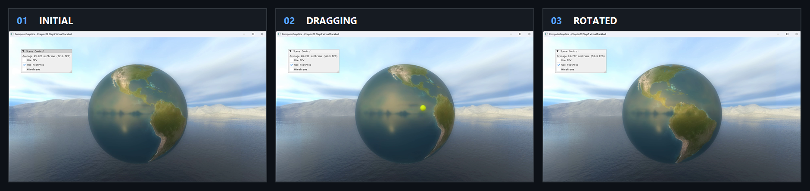

# Chapter09 Step5 VirtualTrackball Demo

## 목적

Sphere 표면의 pointer drag를 quaternion 회전으로 바꾸는 object-surface virtual trackball을 보여준다.

## 책임 범위

- Drag hit vector와 `FromToRotation` 기반 누적 회전을 설명한다.
- 일반 이론은 [Quaternion And Virtual Trackball](../../01_Topics/AnimationAndPhysics/QuaternionAndVirtualTrackball.md), 검증 사실은 [Verification](../../02_Verification/Part3_Chapter09/verification-index.md)에 위임한다.

## 결과 미리보기

### Surface drag 회전

`Initial → Dragging → Rotated` 순서로 왼쪽에서 오른쪽으로 본다.

- 입력 변화: Sphere 표면에서 pointer를 누른 채 연속 drag한다.
- 관찰 지점: Surface texture 방향이 drag 경로를 따라 바뀌고 종료 상태에 회전이 누적된다.
- 구현 결과: 시작·현재 hit vector 사이의 quaternion이 model rotation에 합성된다.

## 입력과 출력

| 구분 | 내용 |
| --- | --- |
| 입력 | Drag 시작·현재 cursor ray의 sphere hit point |
| 출력 | 두 surface vector 사이 quaternion과 누적 model rotation |

## 구현 흐름

1. Cursor ray와 sphere의 hit point를 구한다.
2. Drag 시작 hit vector를 저장한다.
3. 현재 hit vector와 이전 vector 사이 quaternion을 구한다.
4. Rotation을 model matrix에 합성하고 기준 vector를 갱신한다.

## 핵심 구현

### Surface Vector Rotation

Object 중심에서 hit point로 향하는 두 vector가 drag의 3D 회전량을 결정한다.

- [Sphere hit vector 구성](../../../Part3_Chapter09/09_UserInteraction_Step5_VirtualTrackball/ExampleApp.cpp#L120-L162)
- [From-to quaternion과 회전 합성](../../../Part3_Chapter09/09_UserInteraction_Step5_VirtualTrackball/ExampleApp.cpp#L163-L194)

## 시각 결과

Textured sphere의 표면 방향 변화가 회전을 판독하게 한다. Screenshot은 기본 상태를 기록하고 18.6초 selected local video는 sphere 안쪽의 연속 drag와 누적 orientation 변화를 보여준다.

## 구현 범위와 한계

- Cursor가 sphere silhouette 밖으로 나가면 회전 갱신이 멈춘다.
- Inertia와 axis constraint는 구현하지 않는다.
- Earth와 cubemap asset의 공개 권리 근거가 부족해 Publication은 `검토 필요`다.

## 검증

- [Verification Index](../../02_Verification/Part3_Chapter09/verification-index.md)

## 관련 코드

- [Mouse capture와 release 복구](../../../Part3_Chapter09/09_UserInteraction_Step5_VirtualTrackball/AppBase.cpp#L232-L247)
- [Example README](../../../Part3_Chapter09/09_UserInteraction_Step5_VirtualTrackball/README.md)

## 관련 문서

- [Quaternion And Virtual Trackball](../../01_Topics/AnimationAndPhysics/QuaternionAndVirtualTrackball.md)
- [이전 Demo](09_04_QuaternionRotation.md)
- [다음 Demo](09_06_MouseDragMove.md)
- [Demo Index](demo-index.md)
