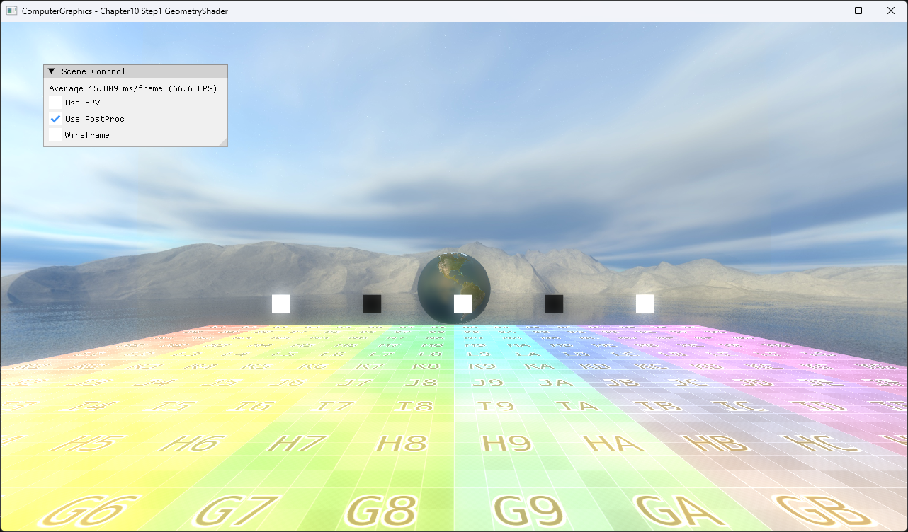

# Chapter10 Step1 GeometryShader Demo

## 목적

하나의 point를 geometry shader에서 quad로 확장하는 최소 primitive amplification 경로를 보여준다.

## 책임 범위

- Point input, quad strip 생성과 stream 경계를 설명한다.
- 일반 shader stage 책임은 [Shader Stage](../../01_Topics/DirectX11Pipeline/ShaderStage.md)로 위임한다.
- Build/run/capture 사실은 [Verification](../../02_Verification/Part3_Chapter10-13/verification-index.md)으로 위임한다.

## 결과 미리보기



화면 중앙의 point들이 흰색과 검은색 quad로 확장된다.

## 입력과 출력

| 구분 | 내용 |
| --- | --- |
| 입력 | `POINTLIST`, point position |
| 출력 | 네 vertex의 triangle strip quad |

## 구현 흐름

1. Vertex shader가 point position을 전달한다.
2. Geometry shader가 네 corner를 strip 순서로 만든다.
3. `RestartStrip()`으로 다음 point와 primitive 경계를 분리한다.

## 핵심 구현

```cpp
// Pseudo C++: point primitive 확장
for (auto corner : StripOrderedCorners)
{
    stream.Append(Project(point + corner));
}

stream.RestartStrip();
```

- [네 corner의 quad strip 생성](../../../Part3_Chapter10-13/10_GeometryPipeline_Step1_GeometryShader/BillboardPointsGeometryShader.hlsl#L29-L53)

## 시각 결과

기존 사각형 형태를 유지하면서 여섯 vertex의 list-like 출력 대신 네 vertex strip으로 topology 책임을 명확히 했다.

## 구현 범위와 한계

- 고정 크기 screen-facing quad만 포함한다.
- Camera-facing basis, texture array와 animation은 다음 단계가 담당한다.

## 검증

- [Verification Index](../../02_Verification/Part3_Chapter10-13/verification-index.md)

## 관련 코드

- [Example README](../../../Part3_Chapter10-13/10_GeometryPipeline_Step1_GeometryShader/README.md)
- [Point draw 경로](../../../Part3_Chapter10-13/10_GeometryPipeline_Step1_GeometryShader/BillboardPoints.cpp#L50-L76)

## 관련 문서

- [Geometry Shader And Billboards](../../01_Topics/ModelingAndGeometry/GeometryShaderAndBillboards.md)
- [Demo Index](demo-index.md)
- [다음 Demo](10_02_Billboards.md)
