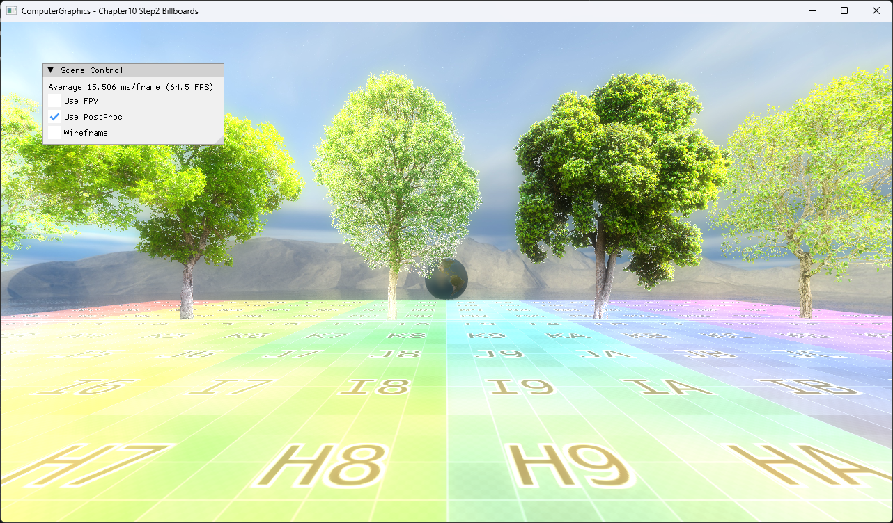

# Chapter10 Step2 Billboards Demo

## 목적

Point primitive를 camera-facing textured billboard로 확장하고 한 draw 경로에서 여러 tree variant를 출력한다.

## 책임 범위

- Camera-facing basis, texture array와 primitive ID 연결을 설명한다.
- 일반 개념은 [Geometry Shader And Billboards](../../01_Topics/ModelingAndGeometry/GeometryShaderAndBillboards.md)로 위임한다.
- 검증 사실은 [Verification](../../02_Verification/Part3_Chapter10-13/verification-index.md)으로 위임한다.

## 결과 미리보기

서로 다른 tree image가 같은 camera를 향하는 quad로 정렬된다.

## 입력과 출력

| 구분 | 내용 |
| --- | --- |
| 입력 | Point positions, camera basis, tree texture array |
| 출력 | Camera-facing textured quad 집합 |

## 구현 흐름

1. Camera basis에서 billboard model matrix를 만든다.
2. Geometry shader가 point를 quad로 확장한다.
3. Pixel shader가 primitive ID에 대응하는 array slice를 sampling한다.

## 핵심 구현

- [Camera-facing basis 생성](../../../Part3_Chapter10-13/10_GeometryPipeline_Step2_Billboards/Camera.cpp#L18-L31)
- [Texture array와 point draw 구성](../../../Part3_Chapter10-13/10_GeometryPipeline_Step2_Billboards/BillboardPoints.cpp#L8-L88)
- [Primitive별 texture sampling](../../../Part3_Chapter10-13/10_GeometryPipeline_Step2_Billboards/BillboardPointsPixelShader.hlsl#L1-L25)

## 시각 결과

Tree가 plane의 회전 방향을 드러내지 않고 camera를 향해 서 있으므로 foliage sprite의 silhouette을 읽을 수 있다.

## 구현 범위와 한계

- Transparent sorting과 overdraw 최적화는 포함하지 않는다.
- Tree texture는 강의 제공 runtime dependency로 유지하고 rendered evidence만 공개 후보로 사용한다.

## 검증

- [Verification Index](../../02_Verification/Part3_Chapter10-13/verification-index.md)

## 관련 코드

- [Example README](../../../Part3_Chapter10-13/10_GeometryPipeline_Step2_Billboards/README.md)
- [Billboard constant 갱신](../../../Part3_Chapter10-13/10_GeometryPipeline_Step2_Billboards/ExampleApp.cpp#L186-L194)

## 관련 문서

- [Geometry Shader And Billboards](../../01_Topics/ModelingAndGeometry/GeometryShaderAndBillboards.md)
- [Demo Index](demo-index.md)
- [이전 Demo](10_01_GeometryShader.md)
- [다음 Demo](10_03_NormalLines.md)
