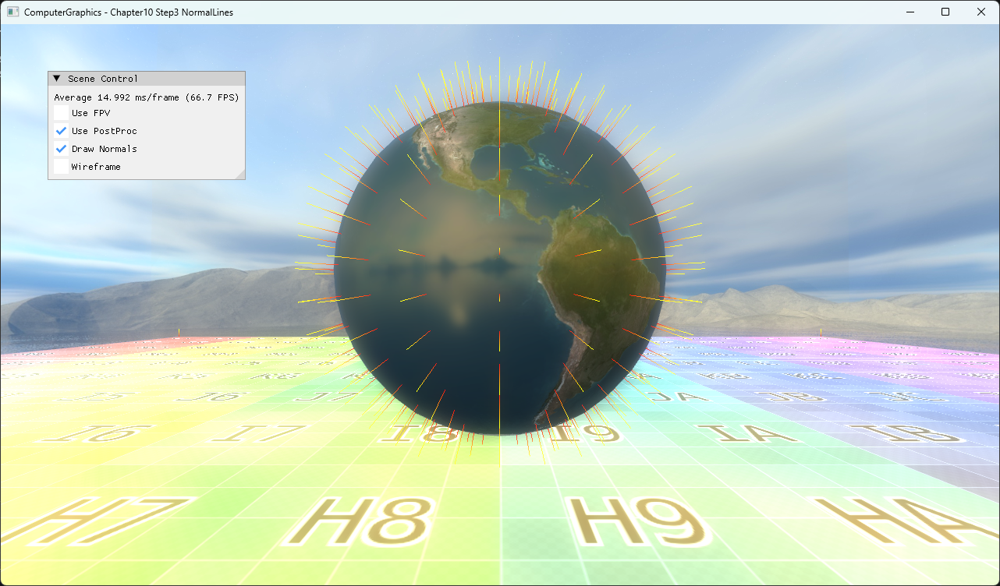

# Chapter10 Step3 NormalLines Demo

## 목적

Mesh vertex normal을 별도 line geometry로 확장해 surface 방향 정보를 진단한다.

## 책임 범위

- Surface draw와 diagnostic normal draw의 분리 및 line 생성 방식을 설명한다.
- Normal 이론은 [Vertex And Face Normals](../../01_Topics/ModelingAndGeometry/VertexAndFaceNormals.md)로 위임한다.
- 검증 사실은 [Verification](../../02_Verification/Part3_Chapter10-13/verification-index.md)으로 위임한다.

## 결과 미리보기

구 표면에서 바깥쪽으로 뻗는 선이 vertex normal의 방향과 분포를 보여준다.

## 입력과 출력

| 구분 | 내용 |
| --- | --- |
| 입력 | Vertex position과 normal |
| 출력 | Surface mesh와 diagnostic line stream |

## 구현 흐름

1. Surface mesh를 기존 pipeline으로 그린다.
2. Normal vertex shader가 position과 normal을 변환한다.
3. Geometry shader가 position에서 normal 방향의 line segment를 만든다.

## 핵심 구현

- [Normal shader와 diagnostic geometry 준비](../../../Part3_Chapter10-13/10_GeometryPipeline_Step3_NormalLines/BasicMeshGroup.cpp#L100-L143)
- [Position과 normal 기반 line 생성](../../../Part3_Chapter10-13/10_GeometryPipeline_Step3_NormalLines/NormalGeometryShader.hlsl#L29-L66)
- [Surface와 normal line draw 분리](../../../Part3_Chapter10-13/10_GeometryPipeline_Step3_NormalLines/BasicMeshGroup.cpp#L174-L202)

## 시각 결과

Normal 표시를 기본 On으로 두어 example title, UI 상태와 surface diagnostic 결과를 한 frame에서 판독한다.

## 구현 범위와 한계

- 표시 선은 diagnostic 용도이며 lighting vector가 아니다.
- Dense mesh에서는 line overlap으로 개별 normal 판독성이 낮아질 수 있다.

## 검증

- [Verification Index](../../02_Verification/Part3_Chapter10-13/verification-index.md)

## 관련 코드

- [Example README](../../../Part3_Chapter10-13/10_GeometryPipeline_Step3_NormalLines/README.md)
- [Normal 표시 UI](../../../Part3_Chapter10-13/10_GeometryPipeline_Step3_NormalLines/ExampleApp.cpp#L420-L436)

## 관련 문서

- [Vertex And Face Normals](../../01_Topics/ModelingAndGeometry/VertexAndFaceNormals.md)
- [Demo Index](demo-index.md)
- [이전 Demo](10_02_Billboards.md)
- [다음 Demo](10_04_Fireball.md)
