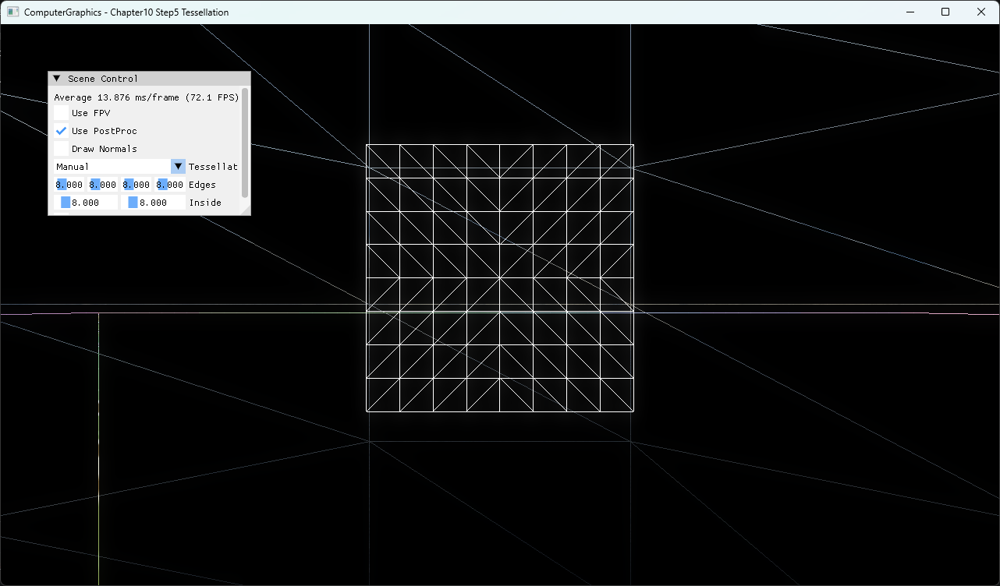

# Chapter10 Step5 Tessellation Demo

## 목적

Quad patch가 hull shader factor에 따라 세분되는 과정을 wireframe으로 보여준다. Manual은 원래 학습 경로이고 Distance Adaptive는 같은 pipeline의 사용자 확장으로 분리한다.

## 책임 범위

- 두 factor source와 hull·domain stage 연결을 설명한다.
- 일반 pipeline은 [Tessellation Pipeline](../../01_Topics/ModelingAndGeometry/TessellationPipeline.md)으로 위임한다.
- 검증 사실은 [Verification](../../02_Verification/Part3_Chapter10-13/verification-index.md)으로 위임한다.

## 결과 미리보기



UI의 edge·inside factor 8과 중앙 quad의 subdivision topology를 함께 본다.

## 입력과 출력

| 구분 | 내용 |
| --- | --- |
| 입력 | Quad control points, Manual factor 또는 camera distance |
| 출력 | Tessellated triangle domain과 transformed position |

## 구현 흐름

1. UI가 Manual 또는 Distance Adaptive mode를 선택한다.
2. Patch constant function이 edge와 inside factor를 계산한다.
3. Fixed-function tessellator가 domain sample을 생성한다.
4. Domain shader가 sample position을 world·view·projection으로 변환한다.

## 핵심 구현

```cpp
// Pseudo C++: factor source 분리
if (mode == Manual)
{
    factors = uiFactors;
}
else
{
    factors = DistanceAdaptiveFactors(camera, patch);
}
```

- [Manual과 Distance Adaptive factor 선택](../../../Part3_Chapter10-13/10_GeometryPipeline_Step5_Tessellation/TessellatedQuadHS.hlsl#L33-L76)
- [Domain position과 model transform](../../../Part3_Chapter10-13/10_GeometryPipeline_Step5_Tessellation/TessellatedQuadDS.hlsl#L32-L55)
- [Mode별 UI 구성](../../../Part3_Chapter10-13/10_GeometryPipeline_Step5_Tessellation/ExampleApp.cpp#L476-L505)

## 시각 결과

Manual factor가 직접 반영된 8×8 분할을 첫 화면에서 확인한다. Adaptive mode는 near/far distance 변화로 같은 factor 범위를 선택한다.

## 구현 범위와 한계

- Distance Adaptive는 patch center 거리만 사용한다.
- Screen-space error, silhouette metric과 crack avoidance는 다루지 않는다.

## 검증

- [Verification Index](../../02_Verification/Part3_Chapter10-13/verification-index.md)

## 관련 코드

- [Example README](../../../Part3_Chapter10-13/10_GeometryPipeline_Step5_Tessellation/README.md)
- [Patch와 shader binding](../../../Part3_Chapter10-13/10_GeometryPipeline_Step5_Tessellation/TessellatedQuad.cpp#L5-L66)

## 관련 문서

- [Tessellation Pipeline](../../01_Topics/ModelingAndGeometry/TessellationPipeline.md)
- [Demo Index](demo-index.md)
- [이전 Demo](10_04_Fireball.md)
