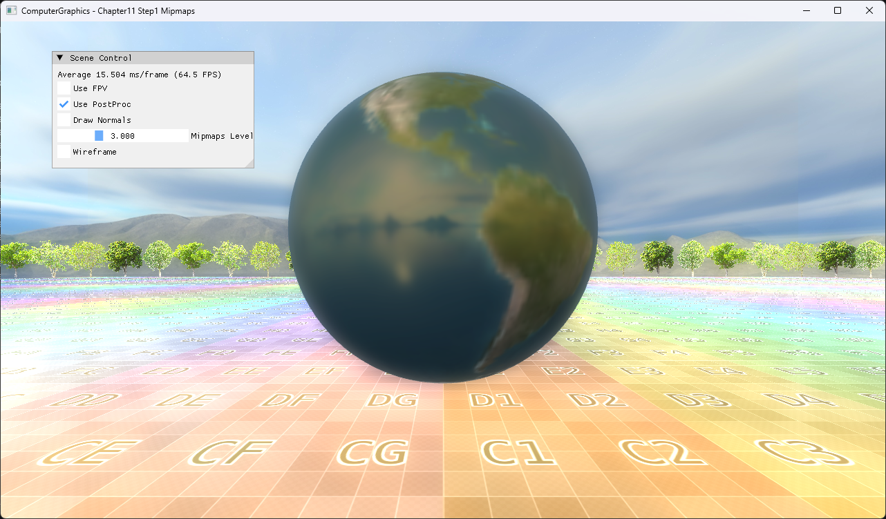

# Chapter11 Step1 Mipmaps Demo

## 목적

명시적인 mip level 선택이 texture detail과 축소 filtering 결과에 미치는 영향을 보여준다.

## 책임 범위

- Mip chain 중 지정 level을 선택하는 구현을 설명한다.
- 일반 texture sampling은 [Texture Sampling](../../01_Topics/TexturingAndMapping/TextureSampling.md)으로 위임한다.
- Build/run/capture 사실은 [Verification](../../02_Verification/Part3_Chapter10-13/verification-index.md)으로 위임한다.

## 결과 미리보기



UI의 `Mipmaps Level` 3.0과 sphere 표면의 완화된 detail을 함께 확인한다.

## 입력과 출력

| 구분 | 내용 |
| --- | --- |
| 입력 | UV, texture mip chain, selected mip level |
| 출력 | 선택한 LOD에서 sample한 surface color |

## 구현 흐름

1. Texture resource가 mip chain을 준비한다.
2. UI 값이 pixel constant buffer의 mip level로 전달된다.
3. Pixel shader가 `SampleLevel`로 지정 level을 읽는다.
4. Lighting 결과와 texture color를 결합한다.

## 핵심 구현

```cpp
// Pseudo C++: explicit mip selection
float level = ui.mipmapLevel;
float4 texel = texture.SampleLevel(sampler, uv, level);
return lighting * texel;
```

- [명시적 mip level sampling](../../../Part3_Chapter10-13/11_TexturingTechniques_Step1_Mipmaps/BasicPixelShader.hlsl#L95-L103)
- [Mipmaps Level UI](../../../Part3_Chapter10-13/11_TexturingTechniques_Step1_Mipmaps/ExampleApp.cpp#L461-L473)

## 시각 결과

Level 3은 level 0보다 고주파 texture detail을 줄인다. 이 예제는 자동 LOD가 아니라 지정 LOD를 사용하므로 slider 변화와 결과를 직접 대응할 수 있다.

## 구현 범위와 한계

- Trilinear와 anisotropic filtering 비교는 제외한다.
- Distance 기반 자동 mip 선택은 제외한다.

## 검증

- [Verification Index](../../02_Verification/Part3_Chapter10-13/verification-index.md)

## 관련 코드

- [Example README](../../../Part3_Chapter10-13/11_TexturingTechniques_Step1_Mipmaps/README.md)
- [Sphere texture와 기본 level](../../../Part3_Chapter10-13/11_TexturingTechniques_Step1_Mipmaps/ExampleApp.cpp#L61-L78)

## 관련 문서

- [Texture Sampling](../../01_Topics/TexturingAndMapping/TextureSampling.md)
- [Demo Index](demo-index.md)
- [다음 Demo](11_02_NormalMapping.md)
