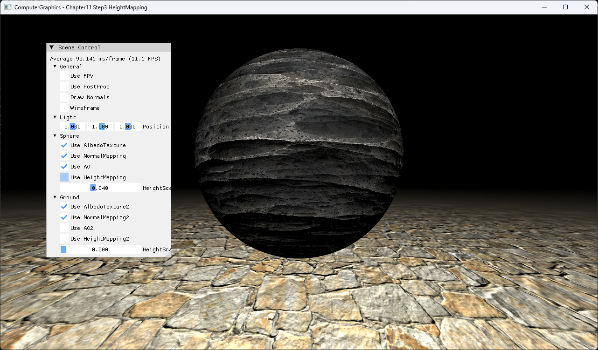
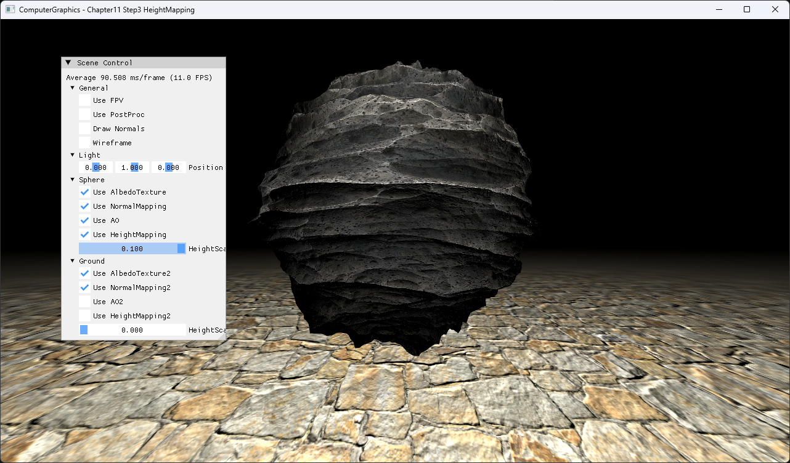

# Chapter11 Step3 HeightMapping Demo

## 목적

Height texture가 vertex 위치를 normal 방향으로 이동시켜 실제 surface silhouette을 바꾸는 displacement 경로를 보여준다.

## 책임 범위

- Vertex texture sampling과 displacement scale을 설명한다.
- 일반 이론은 [Height Mapping](../../01_Topics/TexturingAndMapping/HeightMapping.md)으로 위임한다.
- Build/run/capture 사실은 [Verification](../../02_Verification/Part3_Chapter10-13/verification-index.md)으로 위임한다.

## 결과 미리보기

### Height Mapping Off



Off 상태는 vertex displacement가 없는 기본 silhouette을 보여준다.

### Height Mapping On Scale 0.1



On 상태는 height texture가 vertex를 normal 방향으로 이동시켜 표면 요철과 silhouette 변화를 만든다.

대표 이미지는 Height Mapping On Scale 0.1 상태로 둔다. Sphere의 불규칙해진 silhouette을 함께 확인한다.

## 입력과 출력

| 구분 | 내용 |
| --- | --- |
| 입력 | Vertex position·normal·UV, height texture, height scale |
| 출력 | Normal 방향으로 이동한 vertex position |

## 구현 흐름

1. Vertex shader가 height texture를 level 0에서 sample한다.
2. Height와 scale을 곱해 displacement 크기를 만든다.
3. Vertex를 world normal 방향으로 이동한다.
4. 변형된 geometry를 rasterize하고 normal mapping lighting을 적용한다.

## 핵심 구현

```cpp
// Pseudo C++: vertex displacement
if (useHeightMap)
{
    float height = heightTexture.SampleLevel(sampler, uv, 0).r;
    position += normal * height * heightScale;
}
```

- [Height sample과 vertex displacement](../../../Part3_Chapter10-13/11_TexturingTechniques_Step3_HeightMapping/BasicVertexShader.hlsl#L40-L53)
- [Height mapping UI](../../../Part3_Chapter10-13/11_TexturingTechniques_Step3_HeightMapping/ExampleApp.cpp#L556-L568)

## 시각 결과

Normal mapping만 사용한 Step2와 달리 sphere의 외곽선이 실제로 변한다. Ground는 height mapping을 끈 상태로 두어 sphere displacement와 비교한다.

## 구현 범위와 한계

- Displacement 품질은 source mesh vertex density에 의존한다.
- Tessellation과 adaptive subdivision은 포함하지 않는다.

## 검증

- [Verification Index](../../02_Verification/Part3_Chapter10-13/verification-index.md)

## 관련 코드

- [Example README](../../../Part3_Chapter10-13/11_TexturingTechniques_Step3_HeightMapping/README.md)
- [Sphere height texture와 scale](../../../Part3_Chapter10-13/11_TexturingTechniques_Step3_HeightMapping/ExampleApp.cpp#L61-L101)

## 관련 문서

- [Height Mapping](../../01_Topics/TexturingAndMapping/HeightMapping.md)
- [Demo Index](demo-index.md)
- [이전 Demo](11_02_NormalMapping.md)
- [다음 Demo](11_04_HDRI.md)
