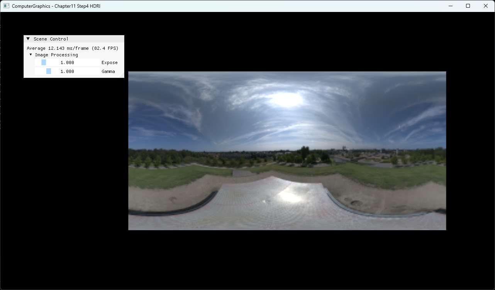

# Chapter11 Step4 HDRI Demo

## 목적

Floating-point EXR image를 읽고 exposure·gamma 변환으로 display 가능한 결과를 만드는 최소 HDRI 경로를 보여준다.

## 책임 범위

- EXR load, floating-point texture와 display mapping을 설명한다.
- 일반 이론은 [HDR Rendering Pipeline](../../01_Topics/TexturingAndMapping/HDRRenderingPipeline.md)으로 위임한다.
- Build/run/capture 사실은 [Verification](../../02_Verification/Part3_Chapter10-13/verification-index.md)으로 위임한다.

## 결과 미리보기



Exposure 1.0과 gamma 1.0에서 panorama의 밝은 태양과 어두운 지면을 한 frame에 표시한다.

## 입력과 출력

| 구분 | 내용 |
| --- | --- |
| 입력 | Floating-point EXR pixels, exposure, gamma |
| 출력 | LDR display color |

## 구현 흐름

1. DirectXTex EXR loader가 metadata와 pixels를 읽는다.
2. Load 실패는 runtime error로 전파한다.
3. Shader가 HDR color에 exposure를 적용한다.
4. Gamma 변환 후 back buffer에 표시한다.

## 핵심 구현

```cpp
// Pseudo C++: HDR display mapping
float3 mapped = 1.0 - exp(-hdrColor * exposure);
float3 display = pow(mapped, 1.0 / gamma);
return float4(display, 1.0);
```

- [EXR load와 실패 전파](../../../Part3_Chapter10-13/11_TexturingTechniques_Step4_HDRI/D3D11Utils.cpp#L223-L249)
- [Exposure와 gamma 변환](../../../Part3_Chapter10-13/11_TexturingTechniques_Step4_HDRI/BasicPixelShader.hlsl#L61-L78)

## 시각 결과

HDR panorama의 태양부는 높은 luminance를 유지하면서 주변 하늘과 지면도 판독된다. UI는 두 display parameter를 직접 노출한다.

## 구현 범위와 한계

- Auto exposure와 filmic operator 비교는 제외한다.
- EXR 원본은 공개 asset으로 승격하지 않는다.

## 검증

- [Verification Index](../../02_Verification/Part3_Chapter10-13/verification-index.md)

## 관련 코드

- [Example README](../../../Part3_Chapter10-13/11_TexturingTechniques_Step4_HDRI/README.md)
- [HDRI input 구성](../../../Part3_Chapter10-13/11_TexturingTechniques_Step4_HDRI/ExampleApp.cpp#L136-L159)

## 관련 문서

- [HDR Rendering Pipeline](../../01_Topics/TexturingAndMapping/HDRRenderingPipeline.md)
- [Demo Index](demo-index.md)
- [이전 Demo](11_03_HeightMapping.md)
- [다음 Demo](11_05_HDRPipeline.md)
