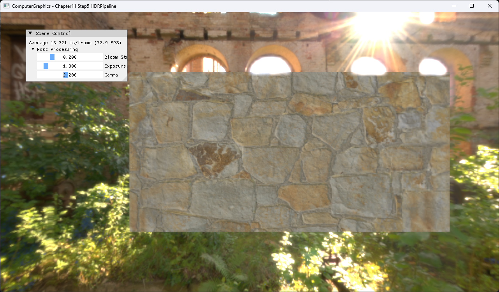
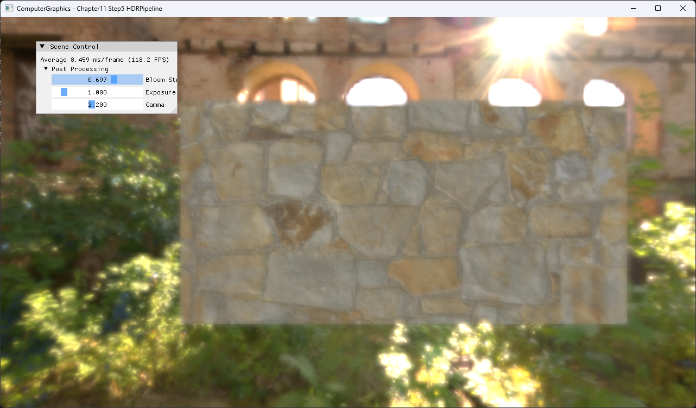

# Chapter11 Step5 HDRPipeline Demo

## 목적

HDR scene buffer에서 bloom pyramid를 만들고 exposure·gamma와 결합해 최종 display image를 만드는 post-process chain을 보여준다.

## 책임 범위

- Resolve, bloom downsample·upsample과 composite 순서를 설명한다.
- 일반 이론은 [HDR Rendering Pipeline](../../01_Topics/TexturingAndMapping/HDRRenderingPipeline.md)으로 위임한다.
- Build/run/capture 사실은 [Verification](../../02_Verification/Part3_Chapter10-13/verification-index.md)으로 위임한다.

## 결과 미리보기



비교 기준은 exposure 1.0, gamma 2.2를 유지하고 bloom strength만 바꾼 두 capture다.


Bloom strength 0은 HDR scene과 tone mapping 결과를 bloom 없이 보여준다.



Bloom strength 0.7은 밝은 창과 태양 주변의 glow가 composite에 더해지는 결과를 보여준다.

HDRI 방향 변화는 selected video evidence로 확인한다. 이 video는 Git history에 포함하지 않는다.

Bloom strength 0.2에서 태양과 창 주변의 밝은 영역이 확산되는 결과를 확인한다.

## 입력과 출력

| 구분 | 내용 |
| --- | --- |
| 입력 | Floating-point scene buffer, bloom strength, exposure, gamma |
| 출력 | Bloom과 tone mapping을 적용한 back buffer |

## 구현 흐름

1. MSAA HDR target을 single-sample floating-point buffer로 resolve한다.
2. 여러 해상도의 bloom buffer를 downsample한다.
3. 작은 level부터 다시 upsample해 넓은 glow를 만든다.
4. Scene과 bloom을 strength로 합성한다.
5. Exposure와 gamma를 적용해 display color를 만든다.

## 핵심 구현

```cpp
// Pseudo C++: HDR post-process chain
Resolve(sceneMSAA, sceneHDR);
BloomDown(sceneHDR, pyramid);
BloomUp(pyramid);
float3 combined = sceneHDR + bloom * bloomStrength;
return GammaEncode(ToneMap(combined, exposure), gamma);
```

- [HDR buffer resolve와 post-process 호출](../../../Part3_Chapter10-13/11_TexturingTechniques_Step5_HDRPipeline/ExampleApp.cpp#L439-L452)
- [Bloom pyramid 구성](../../../Part3_Chapter10-13/11_TexturingTechniques_Step5_HDRPipeline/PostProcess.cpp#L70-L118)
- [Post-process 실행 순서](../../../Part3_Chapter10-13/11_TexturingTechniques_Step5_HDRPipeline/PostProcess.cpp#L120-L153)
- [최종 composite](../../../Part3_Chapter10-13/11_TexturingTechniques_Step5_HDRPipeline/CombinePS.hlsl#L45-L65)

## 시각 결과

높은 luminance를 가진 태양과 창 주변이 주변 pixel로 퍼지며, 중앙 material plane은 상대적으로 안정된 범위를 유지한다.

## 구현 범위와 한계

- Auto exposure, temporal adaptation과 color grading은 제외한다.
- Rendered evidence만 공개하고 원본 HDRI·material texture는 직접 연결하지 않는다.

## 검증

- [Verification Index](../../02_Verification/Part3_Chapter10-13/verification-index.md)

## 관련 코드

- [Example README](../../../Part3_Chapter10-13/11_TexturingTechniques_Step5_HDRPipeline/README.md)
- [Post-process parameter UI](../../../Part3_Chapter10-13/11_TexturingTechniques_Step5_HDRPipeline/ExampleApp.cpp#L455-L471)

## 관련 문서

- [HDR Rendering Pipeline](../../01_Topics/TexturingAndMapping/HDRRenderingPipeline.md)
- [Demo Index](demo-index.md)
- [이전 Demo](11_04_HDRI.md)
