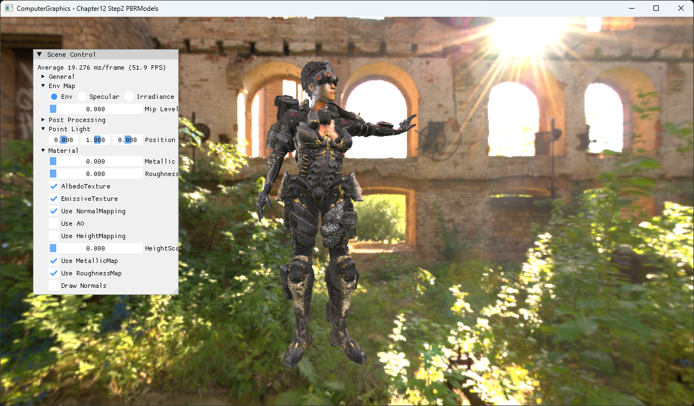

# Chapter12 Step2 PBRModels Demo

## 목적

Step1의 PBR pipeline을 Assimp로 불러온 character mesh와 여러 material texture에 적용한다.

## 책임 범위

- Model import와 PBR material binding의 연결을 설명한다.
- PBR 이론은 [PBR Material Model](../../01_Topics/PBRAndIBL/PBRMaterialModel.md)로 위임한다.
- Build/run/capture 사실은 [Verification](../../02_Verification/Part3_Chapter10-13/verification-index.md)으로 위임한다.

## 결과 미리보기



Imported character의 armor, fabric와 emissive detail이 같은 environment와 PBR shader에서 서로 다른 surface response를 만든다.

## 입력과 출력

| 구분 | 내용 |
| --- | --- |
| 입력 | FBX mesh, albedo·emissive·normal·metallic·roughness map, IBL resources |
| 출력 | Imported geometry에 적용된 multi-texture PBR result |

## 구현 흐름

1. Assimp로 FBX node와 mesh를 순회한다.
2. Vertex, index, tangent와 material texture 경로를 구성한다.
3. Mesh별 GPU buffer와 shader resource를 만든다.
4. Step1의 IBL·GGX shader를 imported geometry에 적용한다.
5. HDR result를 post-process해 표시한다.

## 핵심 구현

```cpp
// Pseudo C++: imported PBR model
meshes = LoadModel(path);
if (meshes.empty())
{
    return InitializationFailed;
}
BindPBRTextures(meshes);
RenderWithIBL(meshes);
```

- [Model load와 empty guard](../../../Part3_Chapter10-13/12_PBR_Step2_PBRModels/ExampleApp.cpp#L35-L57)
- [Assimp material extraction](../../../Part3_Chapter10-13/12_PBR_Step2_PBRModels/ModelLoader.cpp#L134-L208)
- [Mesh resource binding](../../../Part3_Chapter10-13/12_PBR_Step2_PBRModels/BasicMeshGroup.cpp#L51-L106)

## 시각 결과

금속 armor는 선명한 environment reflection을 보이고 비금속 표면은 diffuse response가 강하다. Emissive map은 주변 조명과 별개로 작은 발광 detail을 유지한다.

## 구현 범위와 한계

- Model import 실패는 초기화 실패로 처리하지만 상세 error UI는 제공하지 않는다.
- 원본 FBX, texture와 HDRI는 직접 공개 링크하지 않고 rendered evidence만 사용한다.

## 검증

- [Verification Index](../../02_Verification/Part3_Chapter10-13/verification-index.md)

## 관련 코드

- [Example README](../../../Part3_Chapter10-13/12_PBR_Step2_PBRModels/README.md)
- [Emissive PBR output](../../../Part3_Chapter10-13/12_PBR_Step2_PBRModels/BasicPS.hlsl#L131-L181)

## 관련 문서

- [Model File Import](../../01_Topics/ModelingAndGeometry/ModelFileImport.md)
- [Metallic Roughness Workflow](../../01_Topics/PBRAndIBL/MetallicRoughnessWorkflow.md)
- [Demo Index](demo-index.md)
- [이전 Demo](12_01_UnrealPBR.md)
