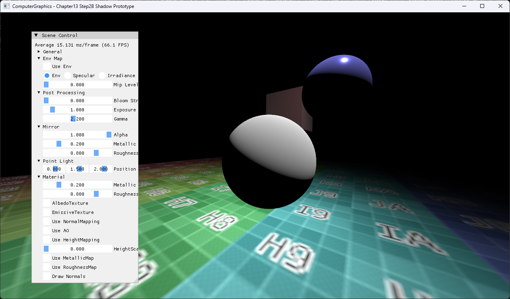

# Chapter13 Step2B Shadow Prototype Demo

## 목적

독립 DepthPass와 MainPass로 array shadow prototype을 구성한다.

## 책임 범위

- 주 PSO 계보와 별개인 실험 branch를 Step2B로 표시한다.
- 일반 이론은 [Shadow Mapping And Depth Bias](../../01_Topics/Shadows/ShadowMappingAndDepthBias.md)으로 위임한다.
- Build/run/capture 사실은 [Verification](../../02_Verification/Part3_Chapter10-13/verification-index.md)으로 위임한다.

## 결과 미리보기

Prototype shadow가 적용된 scene 결과를 확인한다.

## 입력과 출력

| 구분 | 내용 |
| --- | --- |
| 입력 | Light view-projection, depth texture array, scene geometry |
| 출력 | Prototype shadow가 적용된 scene |

## 구현 흐름

1. 필요한 scene resource와 pipeline state를 준비한다.
2. 주 PSO 계보와 별개인 실험 branch를 Step2B로 표시한다.
3. 결과를 HDR target과 post-process를 거쳐 표시한다.

## 핵심 구현

- [독립 DepthPass와 MainPass 기반 array shadow prototype](../../../Part3_Chapter10-13/13_LightAndShadow_Step2_Shadow/ExampleApp.cpp#L503-L571)

## 시각 결과

전체 창 capture에서 UI 기본값과 Prototype shadow가 적용된 scene의 대응을 확인한다.

## 구현 범위와 한계

- 정식 ShadowMapping 계보가 아니라 archive prototype이다.
- 출처 불완전 runtime asset은 직접 공개 링크하지 않는다.

## 검증

- [Verification Index](../../02_Verification/Part3_Chapter10-13/verification-index.md)

## 관련 코드

- [Example README](../../../Part3_Chapter10-13/13_LightAndShadow_Step2_Shadow/README.md)

## 관련 문서

- [Demo Index](demo-index.md)
- [이전 Demo](13_02_PipelineStateObject.md)
- [다음 Demo](13_03_DepthBufferAndFog.md)
