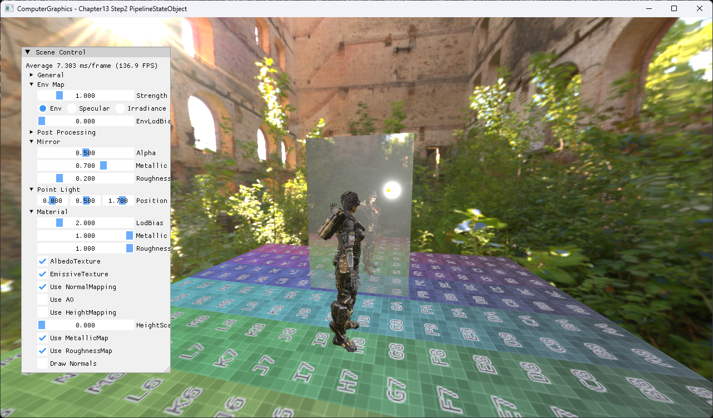

# Chapter13 Step2 PipelineStateObject Demo

## 목적

Shader와 fixed-function state를 PSO abstraction으로 묶는다.

## 책임 범위

- Step1과 같은 결과를 유지하면서 pipeline binding 책임을 구조화한다.
- 일반 이론은 [Topic](../../01_Topics/DirectX11Pipeline/StencilBufferAndMirrorRendering.md)으로 위임한다.
- Build/run/capture 사실은 [Verification](../../02_Verification/Part3_Chapter10-13/verification-index.md)으로 위임한다.

## 결과 미리보기

PSO 단위로 binding된 동일 mirror scene 결과를 확인한다.

## 입력과 출력

| 구분 | 내용 |
| --- | --- |
| 입력 | Shader, input layout, rasterizer·depth·blend state |
| 출력 | PSO 단위로 binding된 동일 mirror scene |

## 구현 흐름

1. 필요한 scene resource와 pipeline state를 준비한다.
2. Step1과 같은 결과를 유지하면서 pipeline binding 책임을 구조화한다.
3. 결과를 HDR target과 post-process를 거쳐 표시한다.

## 핵심 구현

- [Shader와 fixed-function state의 PSO abstraction](../../../Part3_Chapter10-13/13_LightAndShadow_Step2_PipelineStateObject/ExampleApp.cpp#L241-L324)

## 시각 결과

전체 창 capture에서 UI 기본값과 PSO 단위로 binding된 동일 mirror scene의 대응을 확인한다.

## 구현 범위와 한계

- D3D12 native PSO가 아니라 DirectX11 state 묶음이다.
- 출처 불완전 runtime asset은 직접 공개 링크하지 않는다.

## 검증

- [Verification Index](../../02_Verification/Part3_Chapter10-13/verification-index.md)

## 관련 코드

- [Example README](../../../Part3_Chapter10-13/13_LightAndShadow_Step2_PipelineStateObject/README.md)

## 관련 문서

- [Demo Index](demo-index.md)
- [이전 Demo](13_01_Mirror.md)
- [다음 Demo](13_02B_ShadowPrototype.md)
