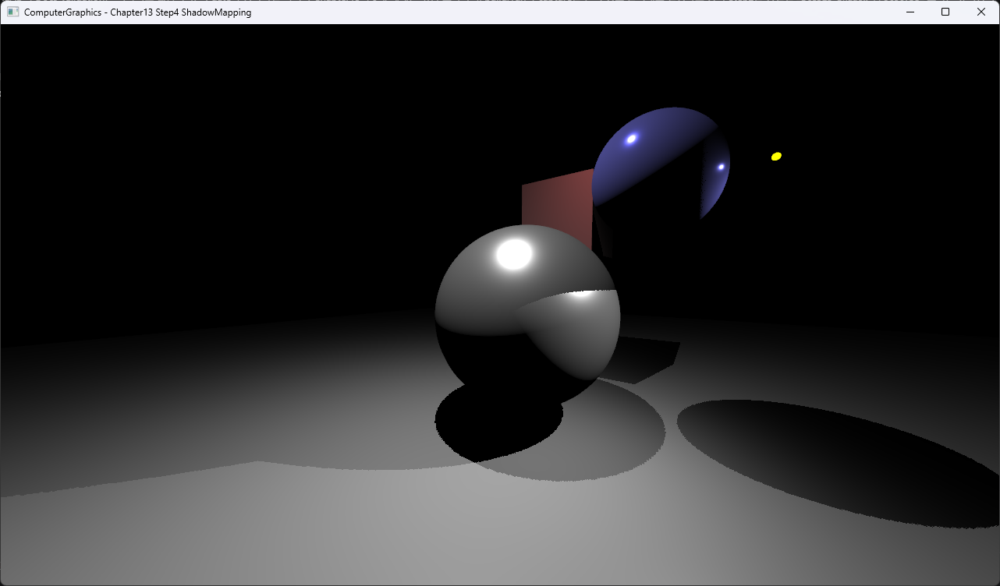

# Chapter13 Step4 ShadowMapping Demo

## 목적

Light-space depth 비교로 hard shadow를 만든다.

## 책임 범위

- Camera depth와 별개로 light depth map과 shadow coordinate를 추가한다.
- 일반 이론은 [Topic](../../01_Topics/Shadows/ShadowMappingAndDepthBias.md)으로 위임한다.
- Build/run/capture 사실은 [Verification](../../02_Verification/Part3_Chapter10-13/verification-index.md)으로 위임한다.

## 결과 미리보기

Binary hard shadow 결과를 확인한다.

## 입력과 출력

| 구분 | 내용 |
| --- | --- |
| 입력 | Light depth map, light-space position, fixed bias |
| 출력 | Binary hard shadow |

## 구현 흐름

1. 필요한 scene resource와 pipeline state를 준비한다.
2. Camera depth와 별개로 light depth map과 shadow coordinate를 추가한다.
3. 결과를 HDR target과 post-process를 거쳐 표시한다.

## 핵심 구현

- [Light-space depth 비교 기반 hard shadow](../../../Part3_Chapter10-13/13_LightAndShadow_Step4_ShadowMapping/BasicPS.hlsl#L158-L180)

## 시각 결과

전체 창 capture에서 UI 기본값과 Binary hard shadow의 대응을 확인한다.

## 구현 범위와 한계

- Bias는 0.001 고정이며 slope-scale 조정은 제외한다.
- 출처 불완전 runtime asset은 직접 공개 링크하지 않는다.

## 검증

- [Verification Index](../../02_Verification/Part3_Chapter10-13/verification-index.md)

## 관련 코드

- [Example README](../../../Part3_Chapter10-13/13_LightAndShadow_Step4_ShadowMapping/README.md)

## 관련 문서

- [Demo Index](demo-index.md)
- [이전 Demo](13_03_DepthBufferAndFog.md)
- [다음 Demo](13_05_SoftShadowPCF.md)
