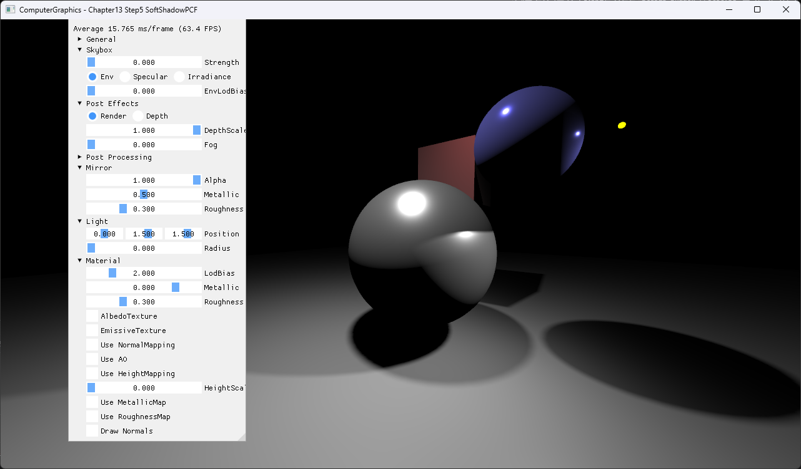

# Chapter13 Step5 SoftShadowPCF Demo

## 목적

여러 depth comparison sample을 평균해 shadow edge를 부드럽게 만든다.

## 책임 범위

- Step4의 단일 hard comparison을 64-sample PCF kernel로 확장한다.
- 일반 이론은 [Topic](../../01_Topics/Shadows/PercentageCloserFilteringAndPCSS.md)으로 위임한다.
- Build/run/capture 사실은 [Verification](../../02_Verification/Part3_Chapter10-13/verification-index.md)으로 위임한다.

## 결과 미리보기

고정 폭의 filtered shadow 결과를 확인한다.

## 입력과 출력

| 구분 | 내용 |
| --- | --- |
| 입력 | Shadow map, fixed disk kernel, receiver depth |
| 출력 | 고정 폭의 filtered shadow |

## 구현 흐름

1. 필요한 scene resource와 pipeline state를 준비한다.
2. Step4의 단일 hard comparison을 64-sample PCF kernel로 확장한다.
3. 결과를 HDR target과 post-process를 거쳐 표시한다.

## 핵심 구현

- [Depth comparison sample 평균 기반 PCF](../../../Part3_Chapter10-13/13_LightAndShadow_Step5_SoftShadowPCF/BasicPS.hlsl#L215-L275)

## 시각 결과

전체 창 capture에서 UI 기본값과 고정 폭의 filtered shadow의 대응을 확인한다.

## 구현 범위와 한계

- Kernel 폭과 sample 수가 고정되어 거리에 따른 penumbra는 없다.
- 출처 불완전 runtime asset은 직접 공개 링크하지 않는다.

## 검증

- [Verification Index](../../02_Verification/Part3_Chapter10-13/verification-index.md)

## 관련 코드

- [Example README](../../../Part3_Chapter10-13/13_LightAndShadow_Step5_SoftShadowPCF/README.md)

## 관련 문서

- [Demo Index](demo-index.md)
- [이전 Demo](13_04_ShadowMapping.md)
- [다음 Demo](13_06_SoftShadowPCSS.md)
