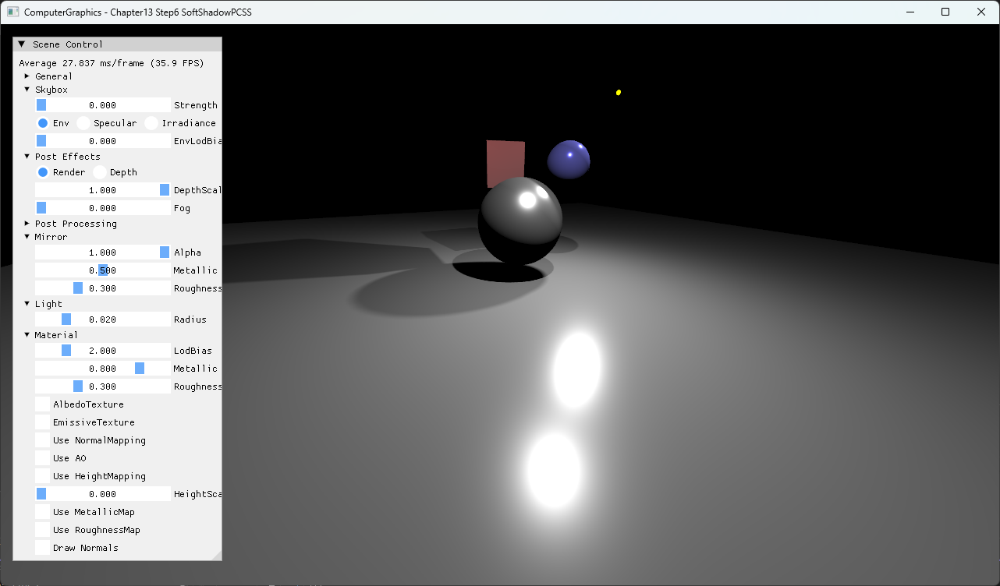
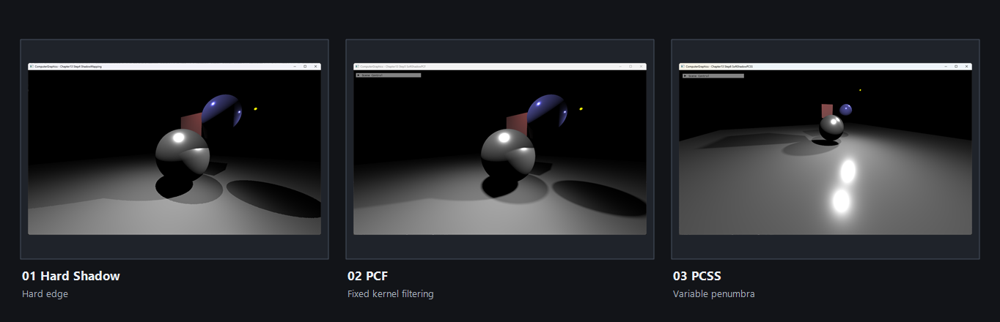

# Chapter13 Step6 SoftShadowPCSS Demo

## 목적

Blocker search와 penumbra 추정으로 가변 폭 PCF를 적용한다.

## 책임 범위

- Step5의 고정 kernel을 receiver-blocker 관계에 따른 PCSS kernel로 바꾼다.
- 일반 이론은 [Percentage Closer Filtering And PCSS](../../01_Topics/Shadows/PercentageCloserFilteringAndPCSS.md)으로 위임한다.
- Build/run/capture 사실은 [Verification](../../02_Verification/Part3_Chapter10-13/verification-index.md)으로 위임한다.

## 결과 미리보기

거리에 따라 폭이 달라지는 soft shadow 결과를 확인한다.

### Shadow Filtering Progression

Hard shadow, fixed-kernel PCF와 variable penumbra PCSS를 한 화면에서 비교한다.

## 입력과 출력

| 구분 | 내용 |
| --- | --- |
| 입력 | Shadow map, light size, blocker search |
| 출력 | 거리에 따라 폭이 달라지는 soft shadow |

## 구현 흐름

1. 필요한 scene resource와 pipeline state를 준비한다.
2. Step5의 고정 kernel을 receiver-blocker 관계에 따른 PCSS kernel로 바꾼다.
3. 결과를 HDR target과 post-process를 거쳐 표시한다.

## 핵심 구현

- [Blocker search와 penumbra 추정 기반 가변 폭 PCF](../../../Part3_Chapter10-13/13_LightAndShadow_Step6_SoftShadowPCSS/BasicPS.hlsl#L146-L236)

## 시각 결과

전체 창 capture에서 blocker search와 penumbra 추정이 만든 variable penumbra를 hard shadow·PCF 결과와 비교한다.

## 구현 범위와 한계

- Light frustum과 near-plane 가정이 고정된 approximation이다.
- 출처 불완전 runtime asset은 직접 공개 링크하지 않는다.

## 검증

- [Verification Index](../../02_Verification/Part3_Chapter10-13/verification-index.md)

## 관련 코드

- [Example README](../../../Part3_Chapter10-13/13_LightAndShadow_Step6_SoftShadowPCSS/README.md)

## 관련 문서

- [Demo Index](demo-index.md)
- [이전 Demo](13_05_SoftShadowPCF.md)
- [다음 Demo](13_07_Halo.md)
