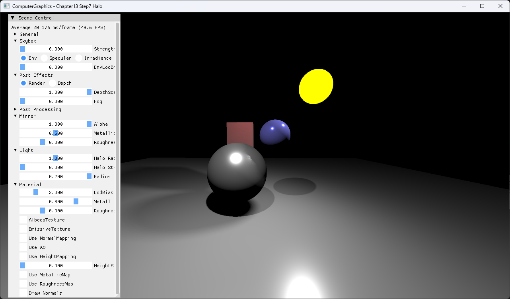
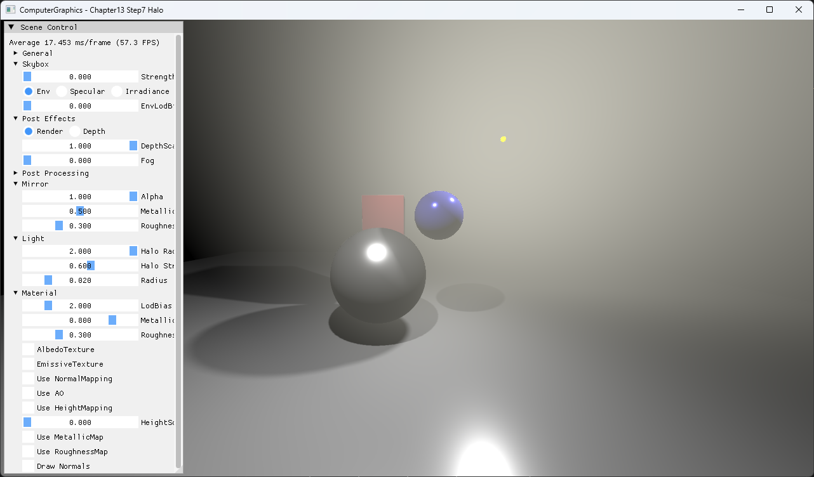

# Chapter13 Step7 Halo Demo

## 목적

Depth-aware post effect로 밝은 light 주변의 halo를 합성한다.

## 책임 범위

- PCSS scene에 screen-space depth-aware halo pass를 추가한다.
- 일반 이론은 [Post Processing And Bloom](../../01_Topics/DirectX11Pipeline/PostProcessingAndBloom.md)으로 위임한다.
- Build/run/capture 사실은 [Verification](../../02_Verification/Part3_Chapter10-13/verification-index.md)으로 위임한다.

## 결과 미리보기

### Halo Strength 0.0

### Halo Strength 0.6

Halo Strength가 screen-space halo composite의 기여도를 바꾸는 것을 확인한다.

## 입력과 출력

| 구분 | 내용 |
| --- | --- |
| 입력 | Scene color, depth, halo center·radius·strength |
| 출력 | Occlusion을 고려한 screen-space halo |

## 구현 흐름

1. 필요한 scene resource와 pipeline state를 준비한다.
2. PCSS scene에 screen-space depth-aware halo pass를 추가한다.
3. 결과를 HDR target과 post-process를 거쳐 표시한다.

## 핵심 구현

- [Depth-aware post effect 기반 halo composite](../../../Part3_Chapter10-13/13_LightAndShadow_Step7_Halo/PostEffectsPS.hlsl#L79-L153)

## 시각 결과

전체 창 capture에서 Halo Strength Off/On에 따른 bright light 주변 post effect 합성 차이를 확인한다.

## 구현 범위와 한계

- Volumetric light가 아닌 screen-space approximation이다.
- 출처 불완전 runtime asset은 직접 공개 링크하지 않는다.

## 검증

- [Verification Index](../../02_Verification/Part3_Chapter10-13/verification-index.md)

## 관련 코드

- [Example README](../../../Part3_Chapter10-13/13_LightAndShadow_Step7_Halo/README.md)

## 관련 문서

- [Demo Index](demo-index.md)
- [이전 Demo](13_06_SoftShadowPCSS.md)
- [다음 Demo](13_08_UnrealSphereLight.md)
