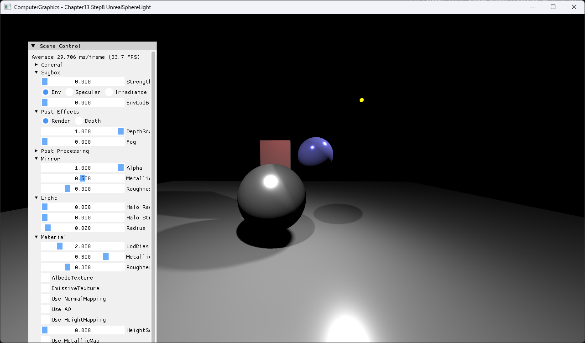

# Chapter13 Step8 UnrealSphereLight Demo

## 목적

Sphere 위 representative point로 area-light response를 근사한다.

## 책임 범위

- Point light 위치를 sphere radius와 reflection 방향에 따라 보정한다.
- 일반 이론은 [Topic](../../01_Topics/LightingAndShading/AreaLightApproximation.md)으로 위임한다.
- Build/run/capture 사실은 [Verification](../../02_Verification/Part3_Chapter10-13/verification-index.md)으로 위임한다.

## 결과 미리보기

Radius 영향을 반영한 broad highlight와 lighting 결과를 확인한다.

## 입력과 출력

| 구분 | 내용 |
| --- | --- |
| 입력 | Sphere light center·radius, surface position·normal |
| 출력 | Radius 영향을 반영한 broad highlight와 lighting |

## 구현 흐름

1. 필요한 scene resource와 pipeline state를 준비한다.
2. Point light 위치를 sphere radius와 reflection 방향에 따라 보정한다.
3. 결과를 HDR target과 post-process를 거쳐 표시한다.

## 핵심 구현

- [Sphere representative point 기반 area-light response](../../../Part3_Chapter10-13/13_LightAndShadow_Step8_UnrealSphereLight/BasicPS.hlsl#L293-L333)

## 시각 결과

전체 창 capture에서 UI 기본값과 Radius 영향을 반영한 broad highlight와 lighting의 대응을 확인한다.

## 구현 범위와 한계

- Unreal의 전체 sphere-light 모델과 동일하지 않은 approximation이다.
- 출처 불완전 runtime asset은 직접 공개 링크하지 않는다.

## 검증

- [Verification Index](../../02_Verification/Part3_Chapter10-13/verification-index.md)

## 관련 코드

- [Example README](../../../Part3_Chapter10-13/13_LightAndShadow_Step8_UnrealSphereLight/README.md)

## 관련 문서

- [Demo Index](demo-index.md)
- [이전 Demo](13_07_Halo.md)
