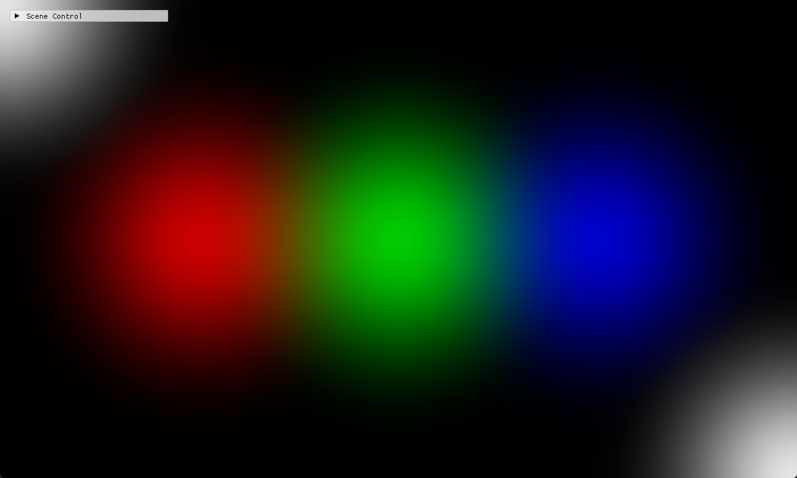

# Chapter14 Ex1402 Blur Demo

## 목적

Compute shader blur pass가 SRV/UAV ping-pong texture를 반복 갱신해 RGB energy를 확산하는 결과를 확인한다.

## 책임 범위

- `Ex1402_Blur`의 staging texture 초기값, compute blur 반복과 capture timing 기준을 설명한다.
- 일반 이론은 [Compute Shader And Resource Flow](../../01_Topics/ComputeAndSimulation/ComputeShaderAndResourceFlow.md)으로 위임한다.
- Build/run/capture 사실은 [Verification Index](../../02_Verification/Part4_Chapter14-20/verification-index.md)으로 위임한다.
- public 후보 판단은 [Publication Candidate List](../../05_Publication/candidate-list.md)로 위임한다.

## 결과 미리보기

5000ms 안정화 대기 이후 RGB blur visual을 확인한다. 초기 capture는 white frame에 가까웠으므로 이 screenshot을 tracked 대표 후보로 사용한다.

## 입력과 출력

| 구분 | 내용 |
| --- | --- |
| 입력 | command argument `1402`, high-intensity RGB staging texture |
| 출력 | 1000회 blur pass 뒤 확산된 RGB blur tracked screenshot 후보 |

## 구현 흐름

1. Float back buffer와 1280×768 render size를 설정한다.
2. Staging texture에 red, green, blue 고강도 seed 값을 넣는다.
3. Texture A/B와 SRV/UAV를 생성한다.
4. Render에서 staging texture를 texture A로 복사한다.
5. Compute blur pass를 반복 실행하고 texture A를 back buffer로 복사한다.

## 핵심 구현

- [Blur texture와 shader 준비](../../../Part4_Chapter14-20/Ex1402_Blur.cpp#L15-L78)
- [1000회 compute blur와 back buffer 복사](../../../Part4_Chapter14-20/Ex1402_Blur.cpp#L84-L116)
- [RGB seed staging texture 생성](../../../Part4_Chapter14-20/Ex1402_Blur.cpp#L119-L178)

## 시각 결과

이 Step은 Chapter14 최소 evidence set의 대표 blur visual 후보다. 5000ms 안정화 대기, collapsed capture UI, centered window와 visible client area 기준으로 1280×768 screenshot을 승격했다.

## 구현 범위와 한계

- 5000ms 이전 capture는 white frame에 가까워 대표 visual로 사용하지 않는다.
- 현재 문서는 static screenshot 후보만 다루며 timing 재검수는 Verification에 둔다.
- Release 현재 재검증은 별도 범위다.

## 검증

- Debug x64 build/run 성공
- 5000ms 안정화 대기에서 RGB blur tracked screenshot 후보 확인
- PNG RGBA non-interlaced, text metadata chunk 없음

## 관련 코드

- [ExampleDocs](../../../Part4_Chapter14-20/ExampleDocs/14_02_Blur.md)
- [Example selection entry point](../../../Part4_Chapter14-20/main.cpp)

## 관련 문서

- [Demo Index](demo-index.md)
- [Known Issue VI-006](../../02_Verification/known-issues.md)
