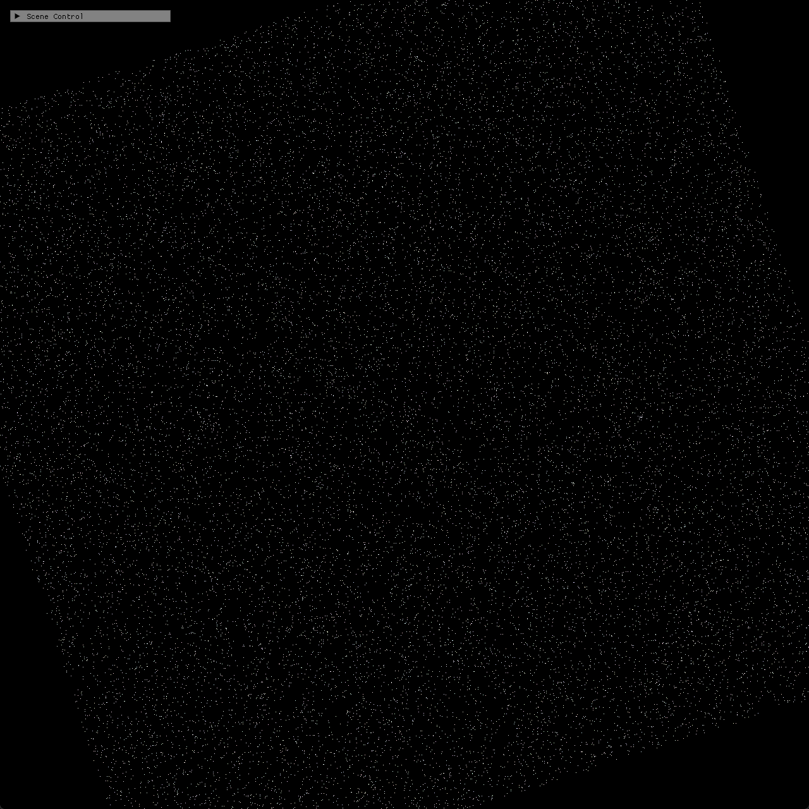

# Chapter14 Ex1404 StructuredBuffer Demo

## 목적

StructuredBuffer particle data를 compute shader에서 갱신하고 vertex buffer 없이 point cloud로 렌더링한다.

## 책임 범위

- `Ex1404_StructuredBuffer`의 structured buffer SRV/UAV 흐름과 tracked screenshot을 설명한다.
- Build/run/capture 사실은 [Verification](../../02_Verification/Part4_Chapter14-20/verification-index.md)으로 위임한다.
- public 후보 판단은 [Publication Candidate List](../../05_Publication/candidate-list.md)로 위임한다.

## 결과 미리보기

25600개 particle이 structured buffer를 통해 point cloud로 표시된다.

## 입력과 출력

| 구분 | 내용 |
| --- | --- |
| 입력 | command argument `1404`, particle position/color structured buffer |
| 출력 | taskbar-free 1280×1280 centered client-visible point cloud screenshot |

## 구현 흐름

1. CPU에서 particle position과 color를 deterministic seed로 준비한다.
2. Structured buffer를 GPU resource로 초기화한다.
3. Compute shader가 particle buffer UAV를 갱신한다.
4. Vertex shader가 같은 buffer를 SRV로 읽는다.
5. Vertex buffer 없이 point list draw로 particle 수만큼 렌더링한다.

## 핵심 구현

- [Particle structured buffer 준비](../../../Part4_Chapter14-20/Ex1404_StructuredBuffer.cpp#L26-L65)
- [StructuredBuffer update와 point draw](../../../Part4_Chapter14-20/Ex1404_StructuredBuffer.cpp#L80-L119)

## 시각 결과

`Ex1404`는 Chapter14 확장 evidence set의 structured buffer visual이다. `Ex1405`와 point cloud는 유사하지만, 이 Step은 단일 structured buffer SRV/UAV update와 draw 흐름을 보여준다.

## 구현 범위와 한계

- Screenshot은 centered client-visible fixed UI 후보로 승격했다.
- Particle motion의 시간 변화는 static capture만 사용한다.
- Release 현재 재검증은 별도 범위다.

## 검증

- [Verification Index](../../02_Verification/Part4_Chapter14-20/verification-index.md)
- Debug x64 build/run 성공
- PNG RGBA non-interlaced, text metadata chunk 없음

## 관련 코드

- [ExampleDocs](../../../Part4_Chapter14-20/ExampleDocs/14_04_StructuredBuffer.md)
- [Example selection entry point](../../../Part4_Chapter14-20/main.cpp)

## 관련 문서

- [Demo Index](demo-index.md)
- [Compute Shader And Resource Flow](../../01_Topics/ComputeAndSimulation/ComputeShaderAndResourceFlow.md)
- [WorkLog WU-Part4](../../04_WorkLogs/work-units/WU-Part4.md)
